# Flowchart Sistem POS (Point of Sale)

> Dokumentasi flowchart lengkap untuk aplikasi kasir berbasis **PHP Native (custom MVC)**.
> Format: **Mermaid** (auto-render di GitHub, VS Code + ekstensi Mermaid, atau [mermaid.live](https://mermaid.live) untuk export PNG/SVG).
> Disusun berdasarkan logika kode aktual pada `app/controllers/*` (sinkron dengan branch `main`).

---

## Daftar Isi

- [Master Flowchart (Overview Sistem)](#master-flowchart-overview-sistem)
- **Detail per Modul:**
  1. [Sistem Utama (Entry Point)](#1-sistem-utama-entry-point)
  2. [Login](#2-login)
  3. [Logout](#3-logout)
  4. [Dashboard Admin](#4-dashboard-admin)
  5. [Dashboard Kasir](#5-dashboard-kasir)
  6. [CRUD Kategori](#6-crud-kategori)
  7. [CRUD Supplier](#7-crud-supplier)
  8. [CRUD Barang](#8-crud-barang)
  9. [Cetak Label Barcode](#9-cetak-label-barcode)
  10. [CRUD User / Kasir](#10-crud-user--kasir)
  11. [Restock (Stok Masuk & Keluar)](#11-restock-stok-masuk--keluar)
  12. [Transaksi Penjualan (POS)](#12-transaksi-penjualan-pos)
  13. [Cetak Struk (HTML & PDF)](#13-cetak-struk-html--pdf)
  14. [Riwayat Transaksi (Detail, Edit, Batal)](#14-riwayat-transaksi-detail-edit-batal)
  15. [Laporan & Export Excel](#15-laporan--export-excel)
  16. [Profil Kasir](#16-profil-kasir)

---

## Master Flowchart (Overview Sistem)

> Diagram tingkat tinggi: alur user antar modul dari awal sampai akhir sesi.

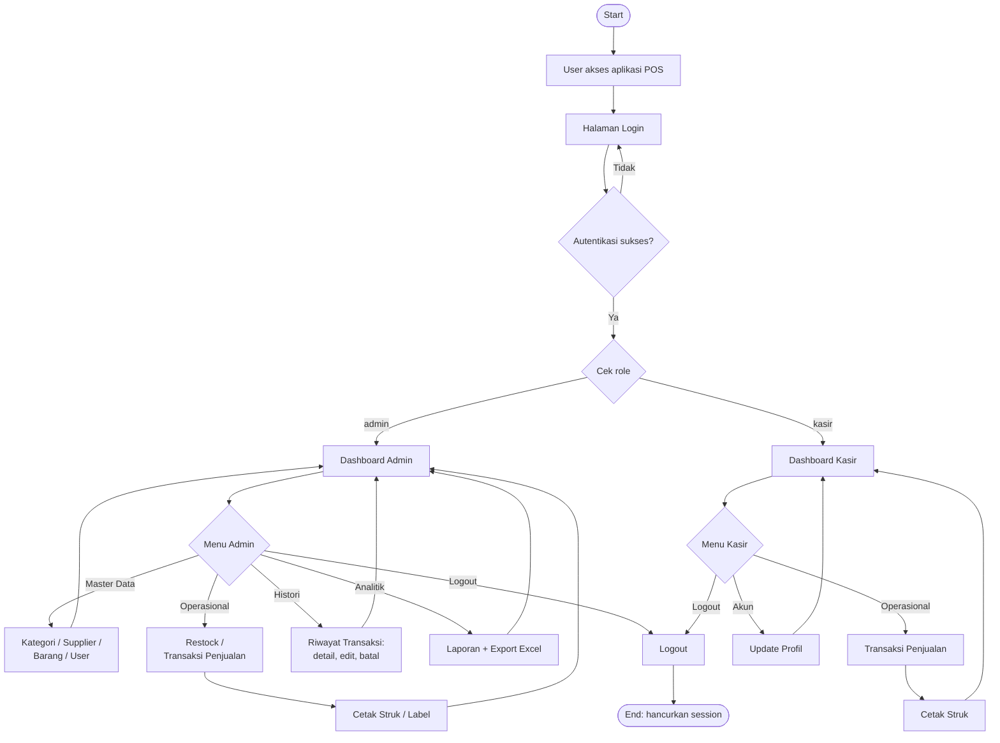
```mermaid
flowchart TD
    A([Start]) --> B[User akses aplikasi POS]
    B --> C[Halaman Login]
    C --> D{Autentikasi sukses?}
    D -- Tidak --> C
    D -- Ya --> E{Cek role}

    E -- admin --> ADM[Dashboard Admin]
    E -- kasir --> KSR[Dashboard Kasir]

    ADM --> ADMM{Menu Admin}
    ADMM -- Master Data --> MD[Kategori / Supplier /<br/>Barang / User]
    ADMM -- Operasional --> OP[Restock /<br/>Transaksi Penjualan]
    ADMM -- Histori --> HS[Riwayat Transaksi:<br/>detail, edit, batal]
    ADMM -- Analitik --> LP[Laporan + Export Excel]
    ADMM -- Logout --> LO[Logout]

    KSR --> KSRM{Menu Kasir}
    KSRM -- Operasional --> KOP[Transaksi Penjualan]
    KSRM -- Akun --> KP[Update Profil]
    KSRM -- Logout --> LO

    MD --> ADM
    OP --> OPS[Cetak Struk / Label] --> ADM
    HS --> ADM
    LP --> ADM

    KOP --> KOPS[Cetak Struk] --> KSR
    KP --> KSR

    LO --> Z([End: hancurkan session])
```

---

## 1. Sistem Utama (Entry Point)

Alur routing → middleware → controller → response.

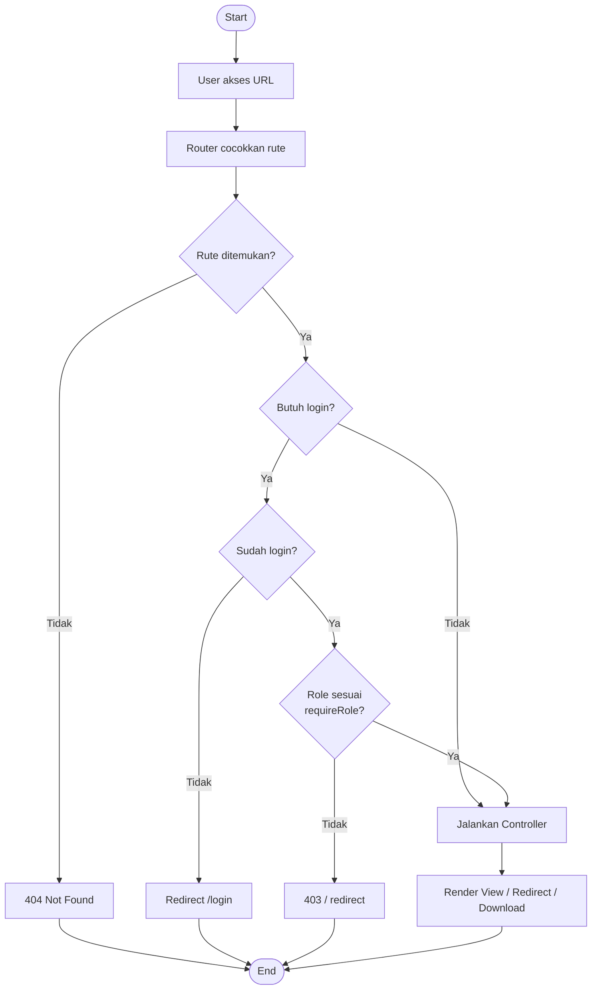
```mermaid
flowchart TD
    A([Start]) --> B[User akses URL]
    B --> C[Router cocokkan rute]
    C --> D{Rute ditemukan?}
    D -- Tidak --> E[404 Not Found] --> Z([End])
    D -- Ya --> F{Butuh login?}
    F -- Tidak --> G[Jalankan Controller]
    F -- Ya --> H{Sudah login?}
    H -- Tidak --> I[Redirect /login] --> Z
    H -- Ya --> J{Role sesuai<br/>requireRole?}
    J -- Tidak --> K[403 / redirect] --> Z
    J -- Ya --> G
    G --> L[Render View / Redirect / Download]
    L --> Z
```

---

## 2. Login

**File:** `app/controllers/AuthController.php`

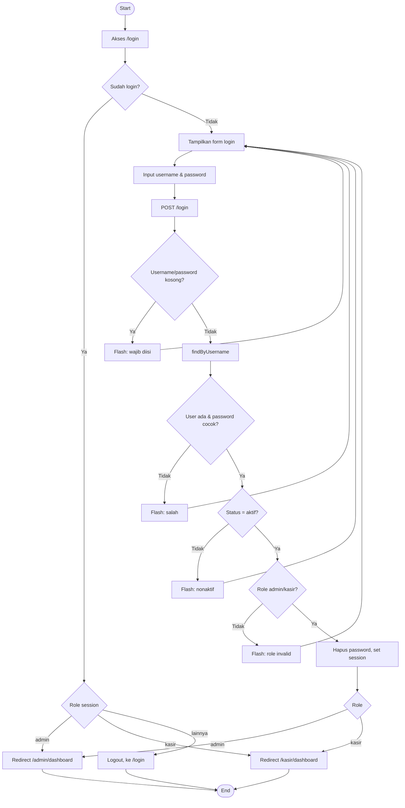
```mermaid
flowchart TD
    A([Start]) --> B[Akses /login]
    B --> C{Sudah login?}
    C -- Ya --> D{Role session}
    D -- admin --> E[Redirect /admin/dashboard]
    D -- kasir --> F[Redirect /kasir/dashboard]
    D -- lainnya --> G[Logout, ke /login]
    C -- Tidak --> H[Tampilkan form login]
    H --> I[Input username & password]
    I --> J[POST /login]
    J --> K{Username/password kosong?}
    K -- Ya --> L[Flash: wajib diisi] --> H
    K -- Tidak --> M[findByUsername]
    M --> N{User ada & password cocok?}
    N -- Tidak --> O[Flash: salah] --> H
    N -- Ya --> P{Status = aktif?}
    P -- Tidak --> Q[Flash: nonaktif] --> H
    P -- Ya --> R{Role admin/kasir?}
    R -- Tidak --> S[Flash: role invalid] --> H
    R -- Ya --> T[Hapus password, set session]
    T --> U{Role}
    U -- admin --> E
    U -- kasir --> F
    E --> Z([End])
    F --> Z
    G --> Z
```

---

## 3. Logout

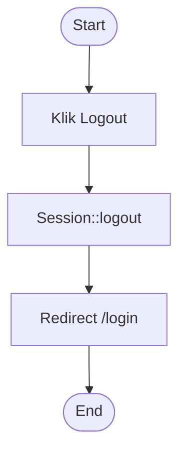
```mermaid
flowchart TD
    A([Start]) --> B[Klik Logout]
    B --> C[Session::logout]
    C --> D[Redirect /login]
    D --> E([End])
```

---

## 4. Dashboard Admin

**File:** `app/controllers/AdminController.php`

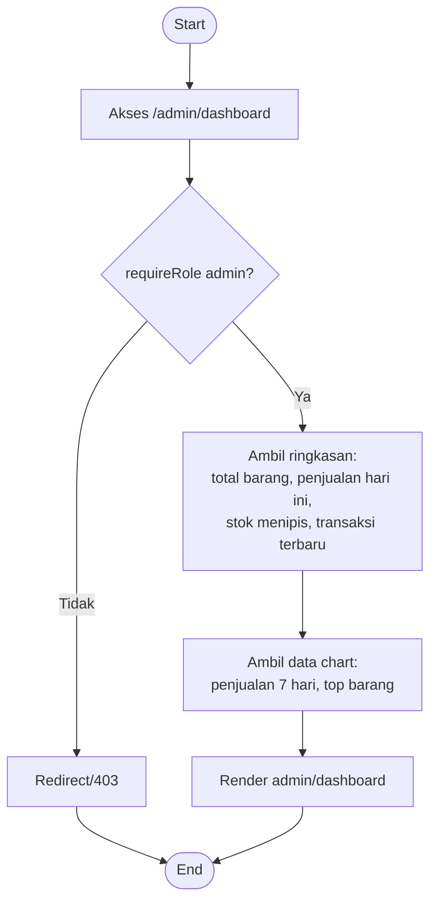
```mermaid
flowchart TD
    A([Start]) --> B[Akses /admin/dashboard]
    B --> C{requireRole admin?}
    C -- Tidak --> D[Redirect/403] --> Z([End])
    C -- Ya --> E[Ambil ringkasan:<br/>total barang, penjualan hari ini,<br/>stok menipis, transaksi terbaru]
    E --> F[Ambil data chart:<br/>penjualan 7 hari, top barang]
    F --> G[Render admin/dashboard] --> Z
```

---

## 5. Dashboard Kasir

**File:** `app/controllers/KasirController.php`

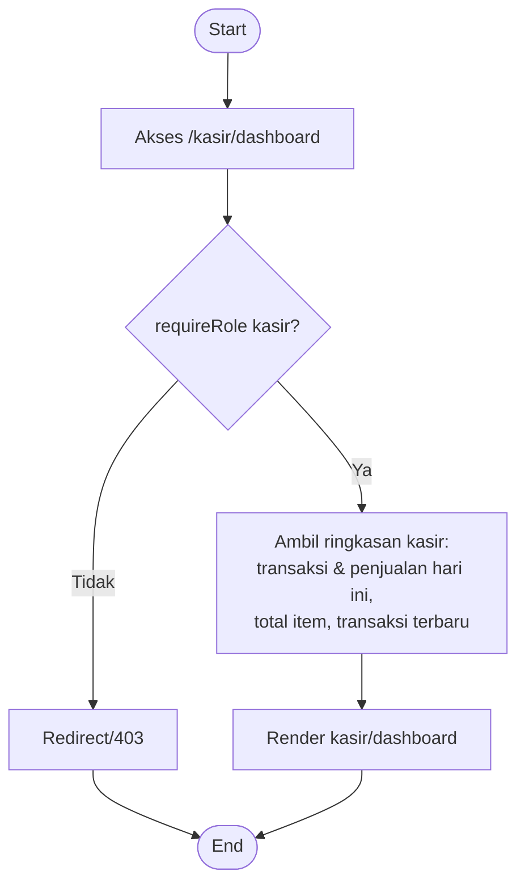
```mermaid
flowchart TD
    A([Start]) --> B[Akses /kasir/dashboard]
    B --> C{requireRole kasir?}
    C -- Tidak --> D[Redirect/403] --> Z([End])
    C -- Ya --> E[Ambil ringkasan kasir:<br/>transaksi & penjualan hari ini,<br/>total item, transaksi terbaru]
    E --> F[Render kasir/dashboard] --> Z
```

---

## 6. CRUD Kategori

**File:** `app/controllers/KategoriController.php`

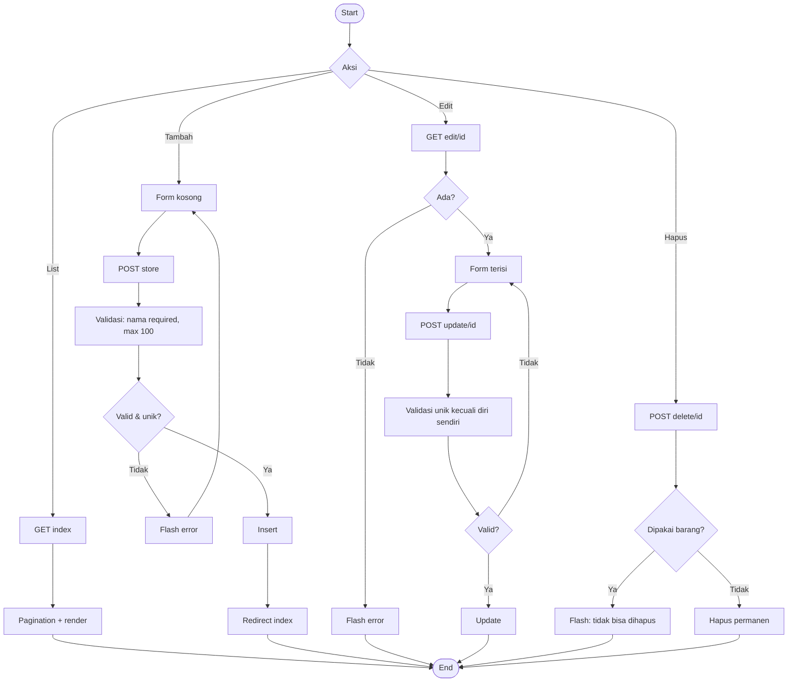
```mermaid
flowchart TD
    A([Start]) --> B{Aksi}
    B -- List --> C[GET index] --> C1[Pagination + render] --> Z([End])

    B -- Tambah --> D[Form kosong] --> D1[POST store]
    D1 --> D2[Validasi: nama required, max 100]
    D2 --> D3{Valid & unik?}
    D3 -- Tidak --> D4[Flash error] --> D
    D3 -- Ya --> D5[Insert] --> D6[Redirect index] --> Z

    B -- Edit --> E[GET edit/id]
    E --> E1{Ada?}
    E1 -- Tidak --> E2[Flash error] --> Z
    E1 -- Ya --> E3[Form terisi] --> E4[POST update/id]
    E4 --> E5[Validasi unik kecuali diri sendiri]
    E5 --> E6{Valid?}
    E6 -- Tidak --> E3
    E6 -- Ya --> E7[Update] --> Z

    B -- Hapus --> F[POST delete/id]
    F --> F1{Dipakai barang?}
    F1 -- Ya --> F2[Flash: tidak bisa dihapus] --> Z
    F1 -- Tidak --> F3[Hapus permanen] --> Z
```

---

## 7. CRUD Supplier

**File:** `app/controllers/SupplierController.php`

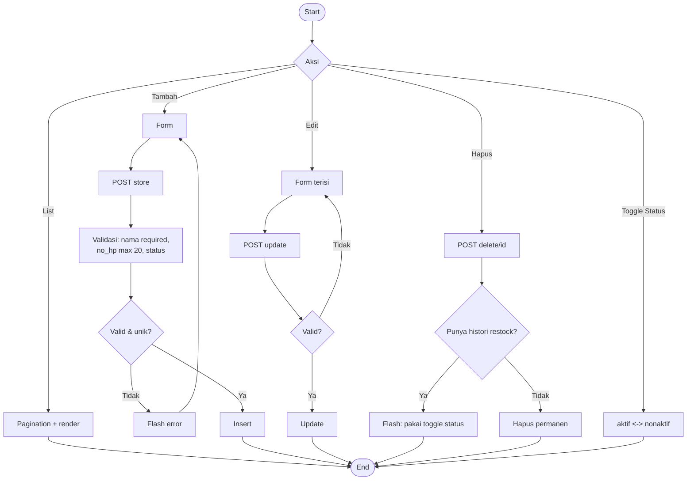
```mermaid
flowchart TD
    A([Start]) --> B{Aksi}
    B -- List --> C[Pagination + render] --> Z([End])

    B -- Tambah --> D[Form] --> D1[POST store]
    D1 --> D2[Validasi: nama required,<br/>no_hp max 20, status]
    D2 --> D3{Valid & unik?}
    D3 -- Tidak --> D4[Flash error] --> D
    D3 -- Ya --> D5[Insert] --> Z

    B -- Edit --> E[Form terisi] --> E1[POST update] --> E2{Valid?}
    E2 -- Tidak --> E
    E2 -- Ya --> E3[Update] --> Z

    B -- Hapus --> F[POST delete/id]
    F --> F1{Punya histori restock?}
    F1 -- Ya --> F2[Flash: pakai toggle status] --> Z
    F1 -- Tidak --> F3[Hapus permanen] --> Z

    B -- Toggle Status --> G[aktif <-> nonaktif] --> Z
```

---

## 8. CRUD Barang

**File:** `app/controllers/BarangController.php`

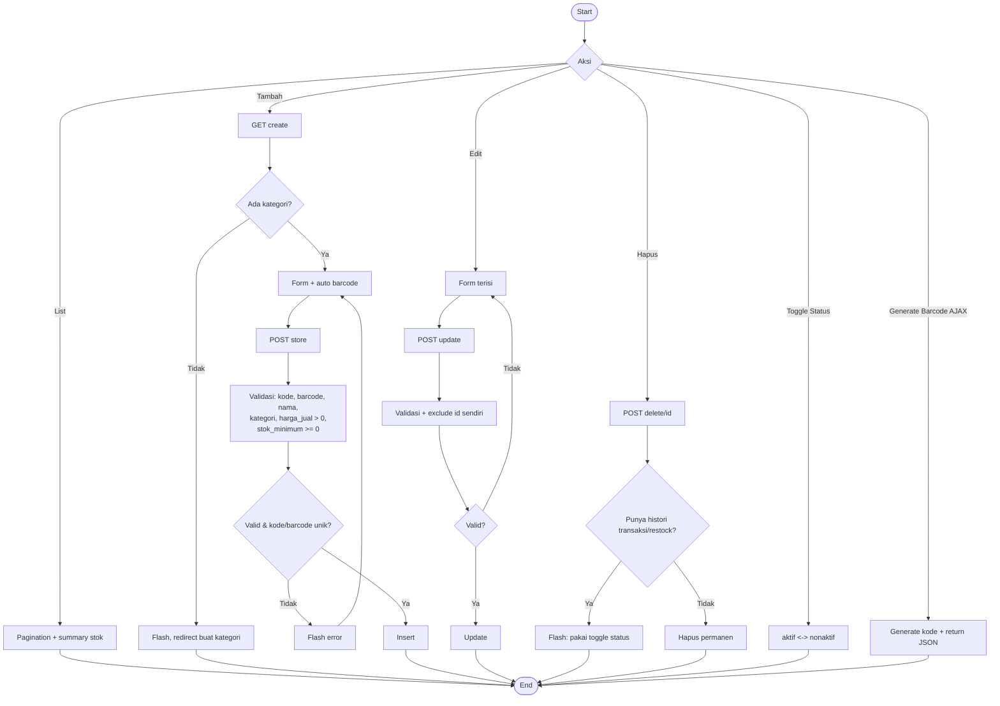
```mermaid
flowchart TD
    A([Start]) --> B{Aksi}
    B -- List --> C[Pagination + summary stok] --> Z([End])

    B -- Tambah --> D[GET create]
    D --> D1{Ada kategori?}
    D1 -- Tidak --> D2[Flash, redirect buat kategori] --> Z
    D1 -- Ya --> D3[Form + auto barcode] --> D4[POST store]
    D4 --> D5[Validasi: kode, barcode, nama,<br/>kategori, harga_jual > 0,<br/>stok_minimum >= 0]
    D5 --> D6{Valid & kode/barcode unik?}
    D6 -- Tidak --> D7[Flash error] --> D3
    D6 -- Ya --> D8[Insert] --> Z

    B -- Edit --> E[Form terisi] --> E1[POST update]
    E1 --> E2[Validasi + exclude id sendiri]
    E2 --> E3{Valid?}
    E3 -- Tidak --> E
    E3 -- Ya --> E4[Update] --> Z

    B -- Hapus --> F[POST delete/id]
    F --> F1{Punya histori transaksi/restock?}
    F1 -- Ya --> F2[Flash: pakai toggle status] --> Z
    F1 -- Tidak --> F3[Hapus permanen] --> Z

    B -- Toggle Status --> G[aktif <-> nonaktif] --> Z
    B -- Generate Barcode AJAX --> H[Generate kode + return JSON] --> Z
```

---

## 9. Cetak Label Barcode

**File:** `app/controllers/BarangController.php`

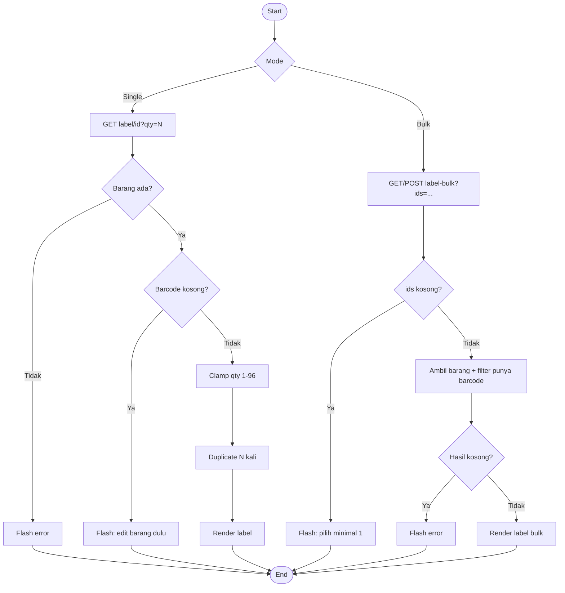
```mermaid
flowchart TD
    A([Start]) --> B{Mode}
    B -- Single --> C[GET label/id?qty=N]
    C --> C1{Barang ada?}
    C1 -- Tidak --> C2[Flash error] --> Z([End])
    C1 -- Ya --> C3{Barcode kosong?}
    C3 -- Ya --> C4[Flash: edit barang dulu] --> Z
    C3 -- Tidak --> C5[Clamp qty 1-96] --> C6[Duplicate N kali] --> C7[Render label] --> Z

    B -- Bulk --> D[GET/POST label-bulk?ids=...]
    D --> D1{ids kosong?}
    D1 -- Ya --> D2[Flash: pilih minimal 1] --> Z
    D1 -- Tidak --> D3[Ambil barang + filter punya barcode]
    D3 --> D4{Hasil kosong?}
    D4 -- Ya --> D5[Flash error] --> Z
    D4 -- Tidak --> D6[Render label bulk] --> Z
```

---

## 10. CRUD User / Kasir

**File:** `app/controllers/UserController.php`

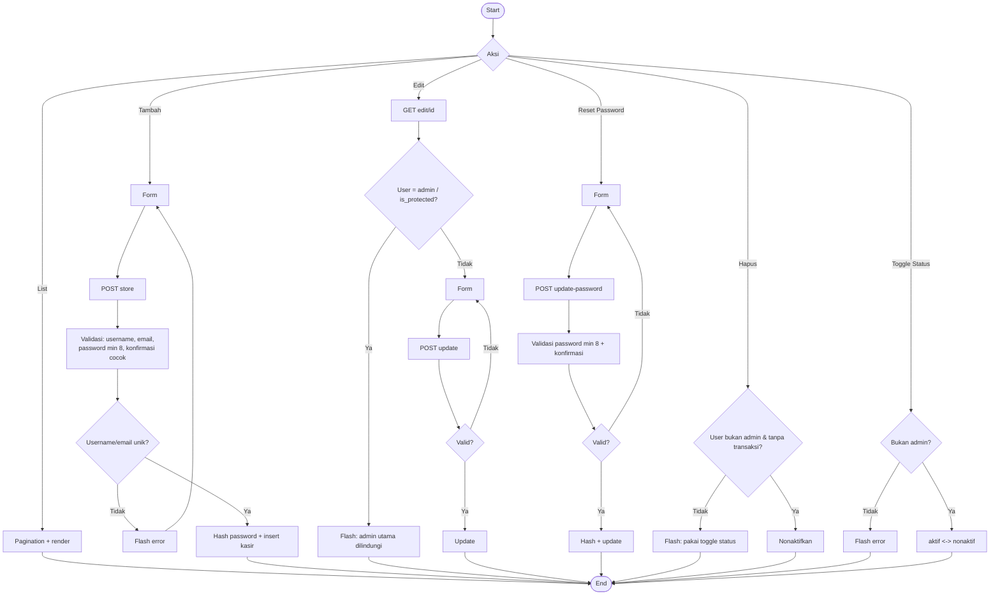
```mermaid
flowchart TD
    A([Start]) --> B{Aksi}
    B -- List --> C[Pagination + render] --> Z([End])

    B -- Tambah --> D[Form] --> D1[POST store]
    D1 --> D2[Validasi: username, email,<br/>password min 8, konfirmasi cocok]
    D2 --> D3{Username/email unik?}
    D3 -- Tidak --> D4[Flash error] --> D
    D3 -- Ya --> D5[Hash password + insert kasir] --> Z

    B -- Edit --> E[GET edit/id]
    E --> E1{User = admin / is_protected?}
    E1 -- Ya --> E2[Flash: admin utama dilindungi] --> Z
    E1 -- Tidak --> E3[Form] --> E4[POST update] --> E5{Valid?}
    E5 -- Tidak --> E3
    E5 -- Ya --> E6[Update] --> Z

    B -- Reset Password --> F[Form] --> F1[POST update-password]
    F1 --> F2[Validasi password min 8 + konfirmasi]
    F2 --> F3{Valid?}
    F3 -- Tidak --> F
    F3 -- Ya --> F4[Hash + update] --> Z

    B -- Hapus --> G{User bukan admin & tanpa transaksi?}
    G -- Tidak --> G1[Flash: pakai toggle status] --> Z
    G -- Ya --> G2[Nonaktifkan] --> Z

    B -- Toggle Status --> H{Bukan admin?}
    H -- Tidak --> H1[Flash error] --> Z
    H -- Ya --> H2[aktif <-> nonaktif] --> Z
```

---

## 11. Restock (Stok Masuk & Keluar)

**File:** `app/controllers/RestockController.php`

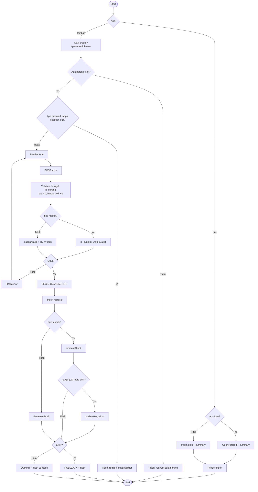
```mermaid
flowchart TD
    A([Start]) --> B{Aksi}
    B -- List --> C{Ada filter?}
    C -- Ya --> C1[Query filtered + summary]
    C -- Tidak --> C2[Pagination + summary]
    C1 --> C3[Render index]
    C2 --> C3
    C3 --> Z([End])

    B -- Tambah --> D[GET create?tipe=masuk/keluar]
    D --> D1{Ada barang aktif?}
    D1 -- Tidak --> D2[Flash, redirect buat barang] --> Z
    D1 -- Ya --> D3{tipe masuk & tanpa supplier aktif?}
    D3 -- Ya --> D4[Flash, redirect buat supplier] --> Z
    D3 -- Tidak --> D5[Render form] --> D6[POST store]

    D6 --> V1[Validasi: tanggal, id_barang,<br/>qty > 0, harga_beli > 0]
    V1 --> V2{tipe masuk?}
    V2 -- Ya --> V3[id_supplier wajib & aktif]
    V2 -- Tidak --> V4[alasan wajib + qty <= stok]
    V3 --> V5{Valid?}
    V4 --> V5
    V5 -- Tidak --> V6[Flash error] --> D5
    V5 -- Ya --> T1[BEGIN TRANSACTION]
    T1 --> T2[Insert restock]
    T2 --> T3{tipe masuk?}
    T3 -- Ya --> T4[increaseStock] --> T5{harga_jual_baru diisi?}
    T5 -- Ya --> T6[updateHargaJual] --> T9{Error?}
    T5 -- Tidak --> T9
    T3 -- Tidak --> T8[decreaseStock] --> T9
    T9 -- Ya --> T10[ROLLBACK + flash] --> Z
    T9 -- Tidak --> T11[COMMIT + flash success] --> Z
```

---

## 12. Transaksi Penjualan (POS)

**File:** `app/controllers/TransaksiController.php` (`store`)
**Inti aplikasi.** Dipakai admin & kasir, logic sama, endpoint beda.

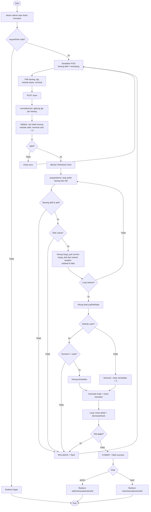
```mermaid
flowchart TD
    A([Start]) --> B[Akses /admin atau /kasir transaksi]
    B --> C{requireRole valid?}
    C -- Tidak --> D[Redirect /login] --> Z([End])
    C -- Ya --> E[Tampilkan POS:<br/>barang aktif + keranjang]
    E --> F[Pilih barang, qty,<br/>metode bayar, nominal]
    F --> G[POST store]
    G --> H[normalizeCart: gabung qty per barang]
    H --> I[Validasi: cart tidak kosong,<br/>metode valid, nominal cash > 0]
    I --> J{Valid?}
    J -- Tidak --> K[Flash error] --> E
    J -- Ya --> L[BEGIN TRANSACTION]
    L --> M[prepareItems: loop ambil barang dari DB]
    M --> N{Barang aktif & ada?}
    N -- Tidak --> O[ROLLBACK + flash] --> E
    N -- Ya --> P{Stok cukup?}
    P -- Tidak --> O
    P -- Ya --> Q[Hitung harga_jual current,<br/>harga_beli dari restock terakhir,<br/>subtotal & laba]
    Q --> R{Loop selesai?}
    R -- Tidak --> M
    R -- Ya --> S[Hitung total jual/beli/laba]
    S --> T{Metode cash?}
    T -- Ya --> U{Nominal >= total?}
    U -- Tidak --> O
    U -- Ya --> V[Hitung kembalian]
    T -- Tidak --> W[Nominal = total, kembalian = 0]
    V --> X[Generate kode + insert transaksi]
    W --> X
    X --> Y[Loop: insert detail + decreaseStock]
    Y --> Y1{Ada gagal?}
    Y1 -- Ya --> O
    Y1 -- Tidak --> Y2[COMMIT + flash success]
    Y2 --> Y3{Role}
    Y3 -- admin --> Y4[Redirect /admin/transaksi/struk/id]
    Y3 -- kasir --> Y5[Redirect /kasir/transaksi/struk/id]
    Y4 --> Z
    Y5 --> Z
```

---

## 13. Cetak Struk (HTML & PDF)

**File:** `app/controllers/TransaksiController.php`

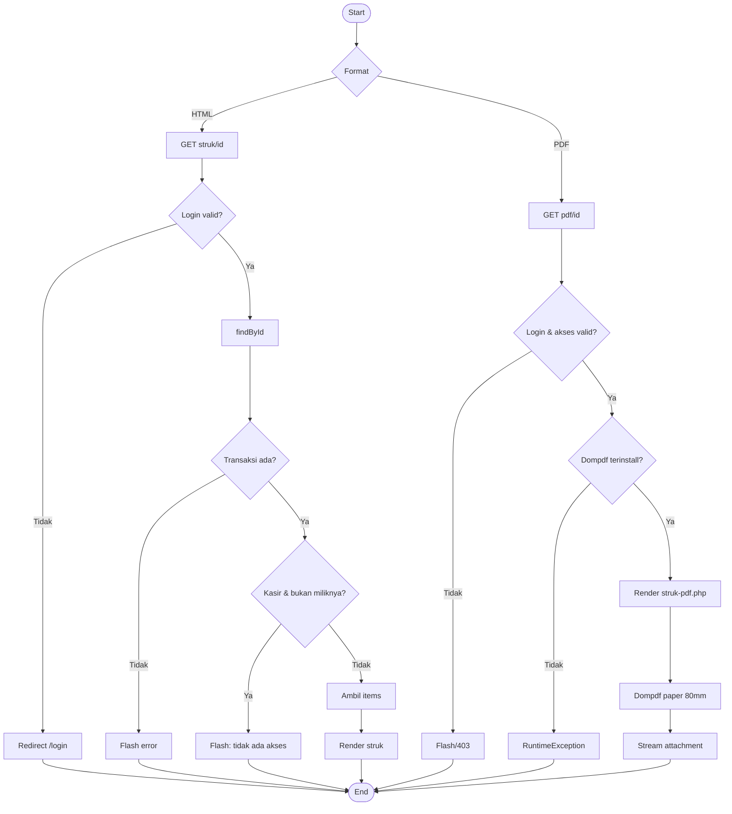
```mermaid
flowchart TD
    A([Start]) --> B{Format}
    B -- HTML --> C[GET struk/id]
    C --> C1{Login valid?}
    C1 -- Tidak --> C2[Redirect /login] --> Z([End])
    C1 -- Ya --> C3[findById]
    C3 --> C4{Transaksi ada?}
    C4 -- Tidak --> C5[Flash error] --> Z
    C4 -- Ya --> C6{Kasir & bukan miliknya?}
    C6 -- Ya --> C7[Flash: tidak ada akses] --> Z
    C6 -- Tidak --> C8[Ambil items] --> C9[Render struk] --> Z

    B -- PDF --> D[GET pdf/id]
    D --> D1{Login & akses valid?}
    D1 -- Tidak --> D2[Flash/403] --> Z
    D1 -- Ya --> D3{Dompdf terinstall?}
    D3 -- Tidak --> D4[RuntimeException] --> Z
    D3 -- Ya --> D5[Render struk-pdf.php] --> D6[Dompdf paper 80mm]
    D6 --> D7[Stream attachment] --> Z
```

---

## 14. Riwayat Transaksi (Detail, Edit, Batal)

**File:** `app/controllers/RiwayatController.php`

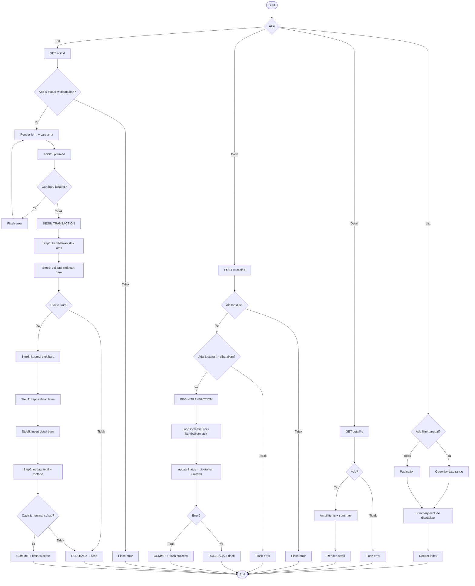
```mermaid
flowchart TD
    A([Start]) --> B{Aksi}
    B -- List --> C{Ada filter tanggal?}
    C -- Ya --> C1[Query by date range]
    C -- Tidak --> C2[Pagination]
    C1 --> C3[Summary exclude dibatalkan]
    C2 --> C3
    C3 --> C4[Render index] --> Z([End])

    B -- Detail --> D[GET detail/id]
    D --> D1{Ada?}
    D1 -- Tidak --> D2[Flash error] --> Z
    D1 -- Ya --> D3[Ambil items + summary] --> D4[Render detail] --> Z

    B -- Batal --> E[POST cancel/id]
    E --> E1{Alasan diisi?}
    E1 -- Tidak --> E2[Flash error] --> Z
    E1 -- Ya --> E3{Ada & status != dibatalkan?}
    E3 -- Tidak --> E4[Flash error] --> Z
    E3 -- Ya --> E5[BEGIN TRANSACTION]
    E5 --> E6[Loop increaseStock kembalikan stok]
    E6 --> E7[updateStatus = dibatalkan + alasan]
    E7 --> E8{Error?}
    E8 -- Ya --> E9[ROLLBACK + flash] --> Z
    E8 -- Tidak --> E10[COMMIT + flash success] --> Z

    B -- Edit --> F[GET edit/id]
    F --> F1{Ada & status != dibatalkan?}
    F1 -- Tidak --> F2[Flash error] --> Z
    F1 -- Ya --> F3[Render form + cart lama] --> F4[POST update/id]
    F4 --> F5{Cart baru kosong?}
    F5 -- Ya --> F6[Flash error] --> F3
    F5 -- Tidak --> F7[BEGIN TRANSACTION]
    F7 --> F8[Step1: kembalikan stok lama]
    F8 --> F9[Step2: validasi stok cart baru]
    F9 --> F10{Stok cukup?}
    F10 -- Tidak --> F11[ROLLBACK + flash] --> Z
    F10 -- Ya --> F12[Step3: kurangi stok baru]
    F12 --> F13[Step4: hapus detail lama]
    F13 --> F14[Step5: insert detail baru]
    F14 --> F15[Step6: update total + metode]
    F15 --> F16{Cash & nominal cukup?}
    F16 -- Tidak --> F11
    F16 -- Ya --> F17[COMMIT + flash success] --> Z
```

---

## 15. Laporan & Export Excel

**File:** `app/controllers/LaporanController.php`

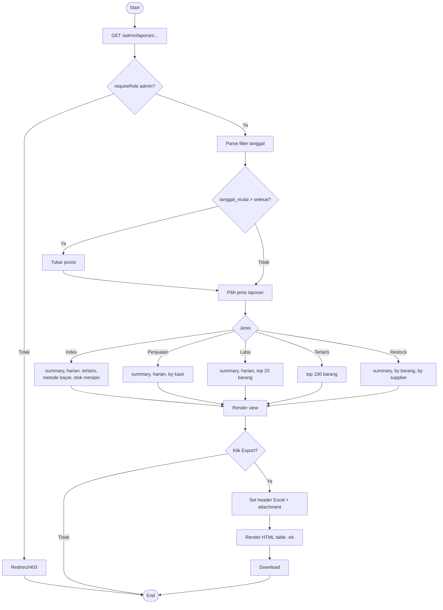
```mermaid
flowchart TD
    A([Start]) --> B[GET /admin/laporan/...]
    B --> C{requireRole admin?}
    C -- Tidak --> D[Redirect/403] --> Z([End])
    C -- Ya --> E[Parse filter tanggal]
    E --> F{tanggal_mulai > selesai?}
    F -- Ya --> F1[Tukar posisi] --> G
    F -- Tidak --> G[Pilih jenis laporan]
    G --> H{Jenis}
    H -- Index --> I[summary, harian, terlaris,<br/>metode bayar, stok menipis]
    H -- Penjualan --> J[summary, harian, by kasir]
    H -- Laba --> K[summary, harian, top 20 barang]
    H -- Terlaris --> L[top 100 barang]
    H -- Restock --> M[summary, by barang, by supplier]
    I --> N[Render view]
    J --> N
    K --> N
    L --> N
    M --> N
    N --> O{Klik Export?}
    O -- Tidak --> Z
    O -- Ya --> P[Set header Excel + attachment]
    P --> Q[Render HTML table .xls] --> R[Download] --> Z
```

---

## 16. Profil Kasir

**File:** `app/controllers/KasirController.php`

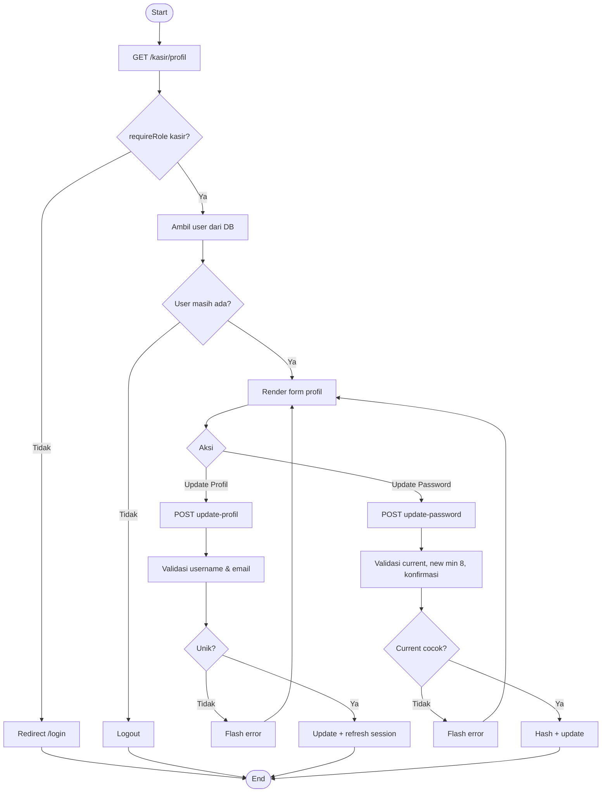
```mermaid
flowchart TD
    A([Start]) --> B[GET /kasir/profil]
    B --> C{requireRole kasir?}
    C -- Tidak --> D[Redirect /login] --> Z([End])
    C -- Ya --> E[Ambil user dari DB]
    E --> F{User masih ada?}
    F -- Tidak --> G[Logout] --> Z
    F -- Ya --> H[Render form profil]
    H --> I{Aksi}
    I -- Update Profil --> J[POST update-profil]
    J --> J1[Validasi username & email]
    J1 --> J2{Unik?}
    J2 -- Tidak --> J3[Flash error] --> H
    J2 -- Ya --> J4[Update + refresh session] --> Z
    I -- Update Password --> K[POST update-password]
    K --> K1[Validasi current, new min 8, konfirmasi]
    K1 --> K2{Current cocok?}
    K2 -- Tidak --> K3[Flash error] --> H
    K2 -- Ya --> K4[Hash + update] --> Z
```

---

## Konvensi Simbol

| Mermaid | Bentuk | Arti |
|---|---|---|
| `A([Text])` | Oval | Start / End |
| `A[Text]` | Persegi | Proses |
| `A{Text}` | Belah ketupat | Decision |
| `-->` | Panah | Alur |
| `-- label -->` | Panah label | Kondisi (Ya/Tidak) |

## Cara Render
- **Online:** [mermaid.live](https://mermaid.live) → paste → export PNG/SVG
- **VS Code:** ekstensi *Markdown Preview Mermaid Support* → `Ctrl+Shift+V`
- **GitHub:** auto-render di tampilan repo

---

**Versi:** 1.0 | **Sinkron dengan:** branch `main`
**Next:** Use Case → Activity → Sequence → Class → ERD → DFD → SRS → User Story → Black Box → UAT
