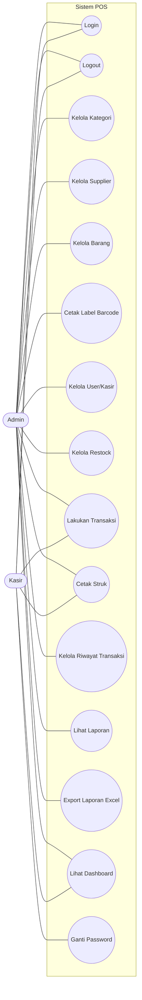
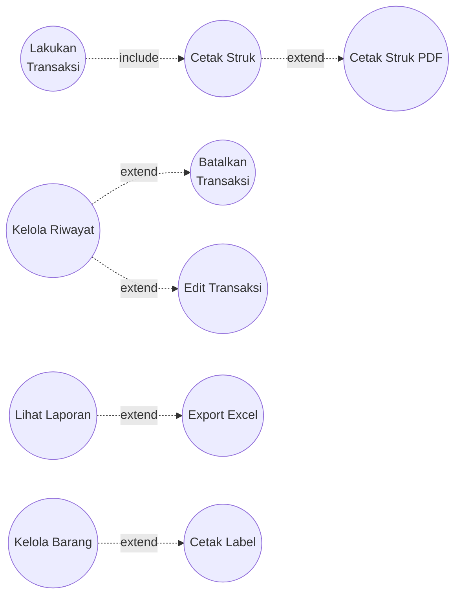
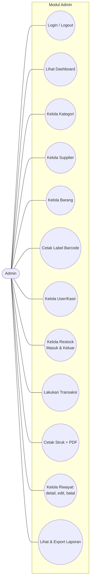
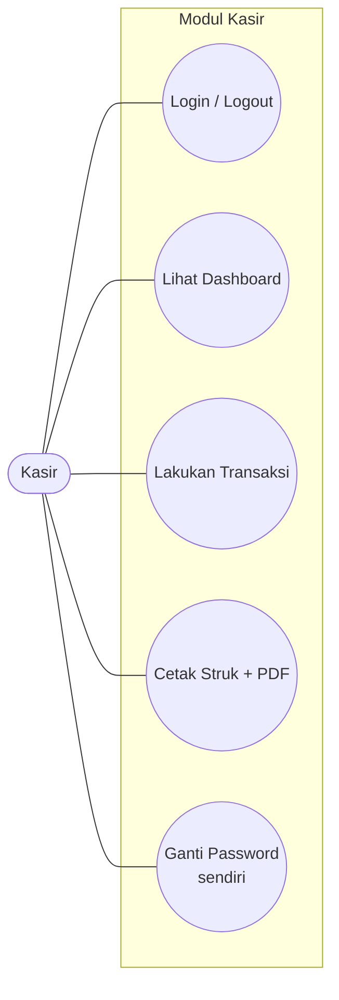

# Use Case Diagram - Sistem POS

> Use Case Diagram + Spesifikasi untuk aplikasi kasir berbasis **PHP Native (custom MVC)**.
> Disusun berdasarkan endpoint & logika aktual pada `app/controllers/*` (sinkron dengan branch `main`).
> Format diagram: **Mermaid** (render di GitHub / VS Code / [mermaid.live](https://mermaid.live)).

---

## Daftar Isi

- [Aktor](#aktor)
- [Use Case Diagram (Keseluruhan)](#use-case-diagram-keseluruhan)
- [Use Case Diagram per Aktor](#use-case-diagram-per-aktor)
  - [Admin](#a-admin)
  - [Kasir](#b-kasir)
- [Daftar Use Case](#daftar-use-case)
- [Spesifikasi Use Case (Detail)](#spesifikasi-use-case-detail)

---

## Aktor

| Aktor | Deskripsi |
|---|---|
| **Admin** | Pemilik / pengelola toko. Akses penuh: master data (barang, kategori, supplier, user), restock, transaksi, riwayat (edit & batal), dan laporan. |
| **Kasir** | Petugas penjualan. Akses terbatas: melakukan transaksi penjualan, mencetak struk, dan mengganti password sendiri. |

> Catatan: Admin **juga bisa** melakukan transaksi penjualan (endpoint `/admin/transaksi`), jadi sebagian use case dipakai bersama (generalisasi).

---

## Use Case Diagram (Keseluruhan)

### Relasi `<<include>>` & `<<extend>>`

**Penjelasan relasi:**
- **Lakukan Transaksi `<<include>>` Cetak Struk** → setiap transaksi sukses selalu diarahkan ke halaman struk.
- **Cetak Struk `<<extend>>` Cetak Struk PDF** → opsi tambahan download PDF (butuh Dompdf).
- **Kelola Riwayat `<<extend>>` Batalkan / Edit Transaksi** → aksi opsional dari daftar riwayat.
- **Lihat Laporan `<<extend>>` Export Excel** → opsi tambahan unduh `.xls`.
- **Kelola Barang `<<extend>>` Cetak Label Barcode** → opsi tambahan dari data barang.

---

## Use Case Diagram per Aktor

### A. Admin

### B. Kasir

---

## Daftar Use Case

| ID | Use Case | Aktor | Controller |
|---|---|---|---|
| UC-01 | Login | Admin, Kasir | `AuthController` |
| UC-02 | Logout | Admin, Kasir | `AuthController` |
| UC-03 | Lihat Dashboard | Admin, Kasir | `AdminController`, `KasirController` |
| UC-04 | Kelola Kategori | Admin | `KategoriController` |
| UC-05 | Kelola Supplier | Admin | `SupplierController` |
| UC-06 | Kelola Barang | Admin | `BarangController` |
| UC-07 | Cetak Label Barcode | Admin | `BarangController` |
| UC-08 | Kelola User/Kasir | Admin | `UserController` |
| UC-09 | Kelola Restock | Admin | `RestockController` |
| UC-10 | Lakukan Transaksi | Admin, Kasir | `TransaksiController` |
| UC-11 | Cetak Struk (HTML & PDF) | Admin, Kasir | `TransaksiController` |
| UC-12 | Kelola Riwayat Transaksi | Admin | `RiwayatController` |
| UC-13 | Lihat Laporan | Admin | `LaporanController` |
| UC-14 | Export Laporan Excel | Admin | `LaporanController` |
| UC-15 | Ganti Password | Kasir | `KasirController` |

---

## Spesifikasi Use Case (Detail)

> Format: ID, Nama, Aktor, Prakondisi, Alur Utama, Alur Alternatif, Pascakondisi.

---

### UC-01: Login

| Field | Keterangan |
|---|---|
| **Aktor** | Admin, Kasir |
| **Deskripsi** | User masuk ke sistem dengan username & password. |
| **Prakondisi** | User belum login & punya akun aktif. |

**Alur Utama:**
1. User membuka halaman `/login`.
2. User memasukkan username & password, lalu submit.
3. Sistem memvalidasi input tidak kosong.
4. Sistem mencari user berdasarkan username.
5. Sistem memverifikasi password (hash).
6. Sistem memastikan status akun = `aktif`.
7. Sistem memastikan role = `admin` atau `kasir`.
8. Sistem menyimpan data user ke session (tanpa password).
9. Sistem mengarahkan ke dashboard sesuai role.

**Alur Alternatif:**
- 3a. Input kosong → flash error "Username dan password wajib diisi", kembali ke form.
- 5a. User tidak ditemukan / password salah → flash error "Username atau password salah".
- 6a. Status nonaktif → flash error "Akun kamu sedang nonaktif".
- 7a. Role tidak valid → flash error "Role akun tidak valid".

**Pascakondisi:** Session login terbentuk, user berada di dashboard.

---

### UC-02: Logout

| Field | Keterangan |
|---|---|
| **Aktor** | Admin, Kasir |
| **Prakondisi** | User sudah login. |

**Alur Utama:**
1. User mengklik tombol Logout.
2. Sistem menghancurkan session.
3. Sistem mengarahkan ke `/login`.

**Pascakondisi:** Session hilang, user keluar dari sistem.

---

### UC-03: Lihat Dashboard

| Field | Keterangan |
|---|---|
| **Aktor** | Admin, Kasir |
| **Prakondisi** | User sudah login. |

**Alur Utama (Admin):**
1. Admin membuka `/admin/dashboard`.
2. Sistem menampilkan ringkasan: total barang, penjualan hari ini, stok menipis, transaksi terbaru, chart penjualan 7 hari, dan barang terlaris.

**Alur Utama (Kasir):**
1. Kasir membuka `/kasir/dashboard`.
2. Sistem menampilkan ringkasan: transaksi & penjualan hari ini, total item, transaksi terbaru milik kasir.

**Pascakondisi:** Dashboard tampil sesuai role.

---

### UC-04: Kelola Kategori

| Field | Keterangan |
|---|---|
| **Aktor** | Admin |
| **Prakondisi** | Login sebagai admin. |

**Alur Utama:**
1. Admin membuka daftar kategori (dengan pagination).
2. Admin memilih aksi: Tambah / Edit / Hapus.
3. **Tambah/Edit:** isi nama (wajib, max 100, unik) → simpan.
4. **Hapus:** sistem cek apakah kategori dipakai barang.

**Alur Alternatif:**
- 3a. Nama kosong/duplikat → flash error, kembali ke form.
- 4a. Kategori masih dipakai barang → flash error "tidak bisa dihapus".

**Pascakondisi:** Data kategori tersimpan/terupdate/terhapus.

---

### UC-05: Kelola Supplier

| Field | Keterangan |
|---|---|
| **Aktor** | Admin |
| **Prakondisi** | Login sebagai admin. |

**Alur Utama:**
1. Admin membuka daftar supplier.
2. Aksi: Tambah / Edit / Hapus / Toggle Status.
3. **Tambah/Edit:** isi nama (wajib), kontak, no_hp (max 20), status → simpan.
4. **Hapus:** cek histori restock.
5. **Toggle Status:** balik aktif ↔ nonaktif.

**Alur Alternatif:**
- 3a. Validasi gagal/nama duplikat → flash error.
- 4a. Punya histori restock → flash error "pakai toggle status".

**Pascakondisi:** Data supplier diperbarui.

---

### UC-06: Kelola Barang

| Field | Keterangan |
|---|---|
| **Aktor** | Admin |
| **Prakondisi** | Login sebagai admin, minimal ada 1 kategori. |

**Alur Utama:**
1. Admin membuka daftar barang (pagination + ringkasan stok).
2. Aksi: Tambah / Edit / Hapus / Toggle Status.
3. **Tambah:** sistem cek ada kategori; tampilkan form + barcode auto-generate; validasi kode/barcode/nama/kategori/harga_jual > 0/stok_minimum ≥ 0; pastikan kode & barcode unik → simpan.
4. **Edit:** sama dengan tambah, kecuali validasi unik mengecualikan ID sendiri.
5. **Hapus:** cek histori transaksi/restock.
6. **Toggle Status:** balik aktif ↔ nonaktif.

**Alur Alternatif:**
- 3a. Belum ada kategori → flash error, redirect ke buat kategori.
- 3b. Validasi gagal / kode/barcode duplikat → flash error.
- 5a. Punya histori → flash error "pakai toggle status".

**Pascakondisi:** Data barang diperbarui.

---

### UC-07: Cetak Label Barcode

| Field | Keterangan |
|---|---|
| **Aktor** | Admin |
| **Prakondisi** | Barang punya barcode. |

**Alur Utama:**
1. Admin memilih cetak label (single atau bulk).
2. **Single:** input qty (clamp 1-96), sistem duplikasi label N kali.
3. **Bulk:** pilih beberapa barang (by ids), sistem filter hanya yang punya barcode.
4. Sistem menampilkan halaman label siap cetak.

**Alur Alternatif:**
- 2a. Barcode kosong → flash error "edit barang dulu".
- 3a. Tidak ada barang dipilih / tidak ada yang punya barcode → flash error.

**Pascakondisi:** Halaman label barcode tampil & siap diprint.

---

### UC-08: Kelola User/Kasir

| Field | Keterangan |
|---|---|
| **Aktor** | Admin |
| **Prakondisi** | Login sebagai admin. |

**Alur Utama:**
1. Admin membuka daftar user.
2. Aksi: Tambah / Edit / Reset Password / Hapus / Toggle Status.
3. **Tambah:** username, email, password (min 8) + konfirmasi, status → hash & simpan sebagai kasir.
4. **Edit:** validasi username/email unik.
5. **Reset Password:** password baru min 8 + konfirmasi.
6. **Hapus:** nonaktifkan jika punya transaksi.
7. **Toggle Status:** balik aktif ↔ nonaktif.

**Alur Alternatif:**
- 4a/6a/7a. Target adalah admin / `is_protected` → flash error "admin utama dilindungi".
- 3a. Username/email duplikat → flash error.

**Pascakondisi:** Data user diperbarui.

---

### UC-09: Kelola Restock

| Field | Keterangan |
|---|---|
| **Aktor** | Admin |
| **Prakondisi** | Login sebagai admin, ada barang aktif. |

**Alur Utama:**
1. Admin membuka daftar restock (filter tanggal/tipe + summary).
2. Admin memilih tambah dengan tipe `masuk` atau `keluar`.
3. **Masuk:** wajib supplier aktif, qty > 0, harga_beli > 0, opsional harga_jual_baru.
4. **Keluar:** wajib alasan, qty ≤ stok tersedia.
5. Sistem menyimpan dalam DB transaction:
   - Masuk → `increaseStock`, update harga jual jika diisi.
   - Keluar → `decreaseStock`.

**Alur Alternatif:**
- 2a. Belum ada barang aktif → redirect buat barang.
- 3a. Tipe masuk tanpa supplier aktif → redirect buat supplier.
- 5a. Gagal/stok kurang → ROLLBACK + flash error.

**Pascakondisi:** Stok barang terupdate, histori restock tersimpan.

---

### UC-10: Lakukan Transaksi (POS) — `<<include>>` Cetak Struk

| Field | Keterangan |
|---|---|
| **Aktor** | Admin, Kasir |
| **Prakondisi** | Login, ada barang aktif berstok. |

**Alur Utama:**
1. Aktor membuka halaman POS (daftar barang aktif).
2. Aktor menambah barang ke keranjang, atur qty.
3. Aktor memilih metode bayar (cash/qris/transfer/ewallet) & isi nominal (jika cash).
4. Aktor submit transaksi.
5. Sistem menormalkan keranjang & validasi (cart tidak kosong, metode valid, nominal cash > 0).
6. Sistem membuka DB transaction, **menghitung ulang harga dari database** (harga jual current + harga beli dari restock terakhir).
7. Sistem memvalidasi stok tiap item.
8. Jika cash: pastikan nominal ≥ total, hitung kembalian.
9. Sistem generate kode transaksi, simpan transaksi + detail, kurangi stok.
10. Commit → arahkan ke halaman struk (UC-11).

**Alur Alternatif:**
- 5a. Validasi gagal → flash error, kembali ke POS.
- 6a/7a. Barang nonaktif/tidak ada / stok kurang → ROLLBACK + flash error.
- 8a. Nominal cash kurang → ROLLBACK + flash error.

**Pascakondisi:** Transaksi tersimpan, stok berkurang, struk tampil.

---

### UC-11: Cetak Struk (HTML & PDF) — `<<extend>>` Cetak PDF

| Field | Keterangan |
|---|---|
| **Aktor** | Admin, Kasir |
| **Prakondisi** | Transaksi sudah tersimpan. |

**Alur Utama:**
1. Sistem menampilkan struk (kode, item, total, bayar, kembalian).
2. Aktor dapat mencetak (browser print) atau download PDF.
3. **PDF:** sistem render via Dompdf (paper 80mm), stream sebagai attachment.

**Alur Alternatif:**
- 1a. Transaksi tidak ditemukan → flash error.
- 1b. Kasir mengakses struk milik orang lain → flash error "tidak ada akses".
- 3a. Dompdf belum terinstall → RuntimeException.

**Pascakondisi:** Struk tampil / file PDF terunduh.

---

### UC-12: Kelola Riwayat Transaksi — `<<extend>>` Edit, Batal

| Field | Keterangan |
|---|---|
| **Aktor** | Admin |
| **Prakondisi** | Login sebagai admin. |

**Alur Utama:**
1. Admin membuka riwayat transaksi (filter tanggal + summary, exclude dibatalkan).
2. Admin melihat detail transaksi.
3. **Batalkan:** wajib alasan; sistem kembalikan stok semua item, ubah status → `dibatalkan` (DB transaction).
4. **Edit:** ganti item/qty; sistem kembalikan stok lama, validasi & kurangi stok baru, ganti detail, update total (6 langkah dalam DB transaction).

**Alur Alternatif:**
- 3a. Alasan kosong → flash error.
- 3b. Sudah dibatalkan → flash error.
- 4a. Cart baru kosong / stok kurang / nominal cash kurang → ROLLBACK + flash error.

**Pascakondisi:** Status/detail transaksi & stok terupdate konsisten.

---

### UC-13: Lihat Laporan

| Field | Keterangan |
|---|---|
| **Aktor** | Admin |
| **Prakondisi** | Login sebagai admin. |

**Alur Utama:**
1. Admin memilih jenis laporan: ringkasan, penjualan, laba, barang terlaris, atau restock.
2. Admin mengatur filter tanggal (mulai–selesai).
3. Sistem menampilkan data sesuai jenis & filter.

**Alur Alternatif:**
- 2a. tanggal_mulai > tanggal_selesai → sistem menukar otomatis.

**Pascakondisi:** Laporan tampil.

---

### UC-14: Export Laporan Excel

| Field | Keterangan |
|---|---|
| **Aktor** | Admin |
| **Prakondisi** | Sedang melihat laporan. |

**Alur Utama:**
1. Admin mengklik Export.
2. Sistem set header `Content-Type` Excel + attachment.
3. Sistem render tabel HTML sebagai file `.xls` → download.

**Pascakondisi:** File `.xls` terunduh.

---

### UC-15: Ganti Password (Kasir)

| Field | Keterangan |
|---|---|
| **Aktor** | Kasir |
| **Prakondisi** | Login sebagai kasir. |

**Alur Utama:**
1. Kasir membuka halaman profil (info akun tampil read-only).
2. Kasir mengisi password lama, password baru (min 8), dan konfirmasi.
3. Sistem memvalidasi: password lama harus cocok, password baru min 8 karakter, konfirmasi sama dengan password baru.
4. Sistem meng-hash & menyimpan password baru.

**Alur Alternatif:**
- 1a. Akun sudah tidak ada di DB → logout otomatis.
- 3a. Password lama salah → flash error "Password saat ini salah".
- 3b. Validasi password baru/konfirmasi gagal → flash error.
- 4a. Gagal simpan → flash error "Password gagal diperbarui".

**Pascakondisi:** Password kasir terupdate.

> Catatan: Profil kasir **tidak** menyediakan edit username/email. Perubahan data akun (username, email, status) hanya dilakukan oleh Admin melalui UC-08.

---

**Versi:** 1.0 | **Sinkron dengan:** branch `main`
**Next:** Activity Diagram → Sequence Diagram → Class Diagram → ERD → DFD → SRS → User Story → Black Box → UAT
