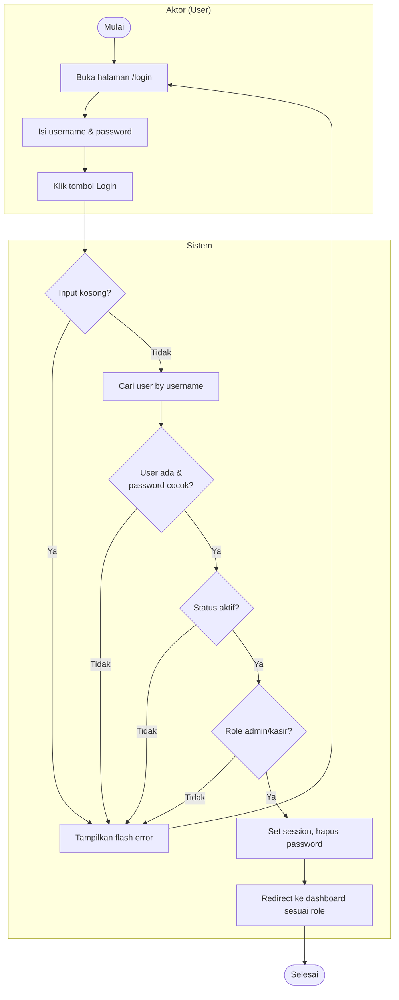
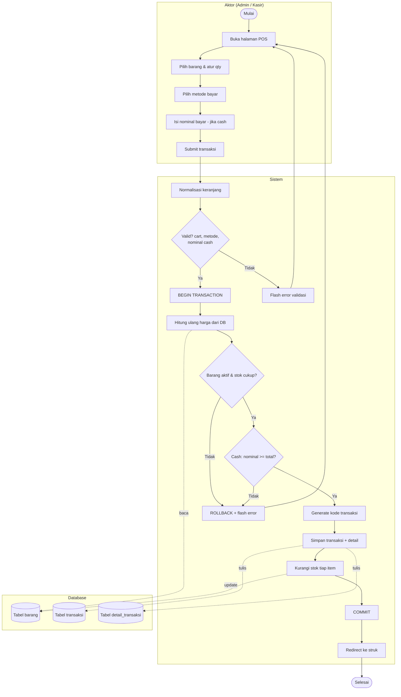
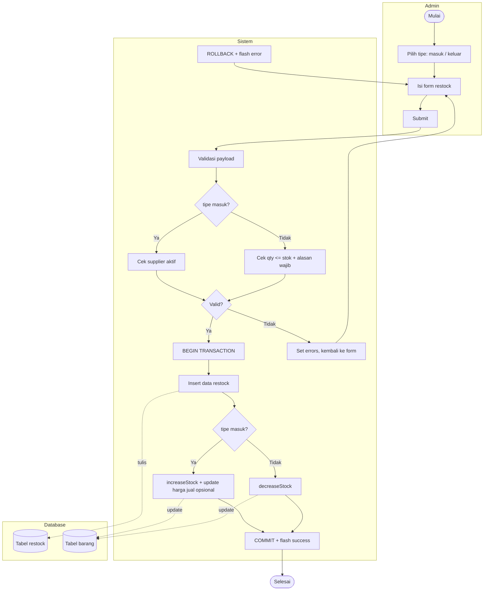
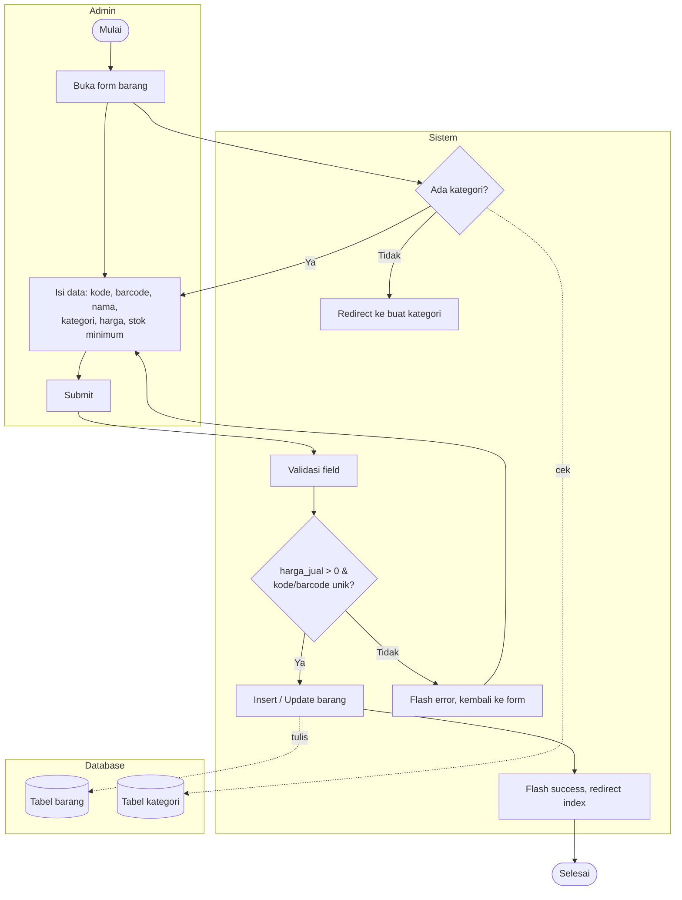
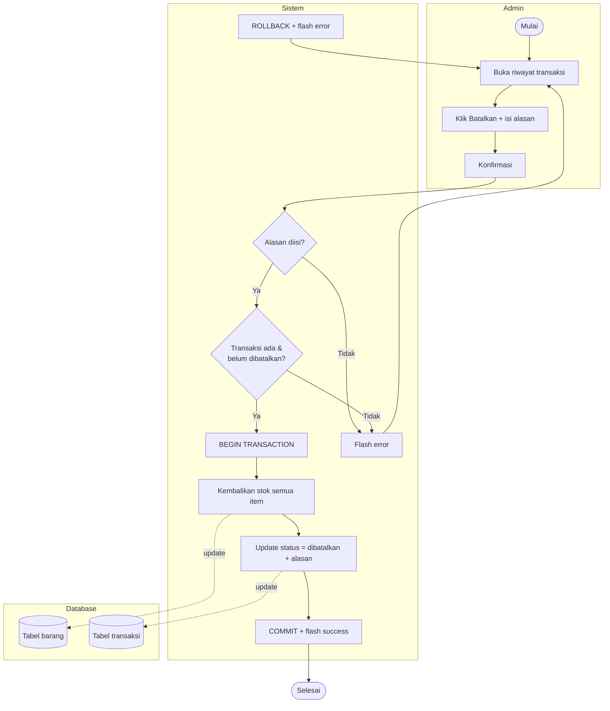
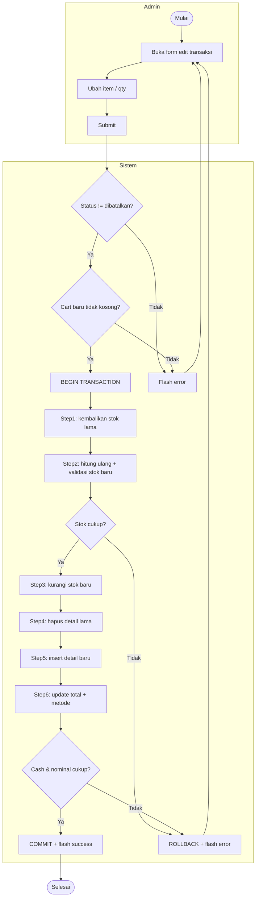
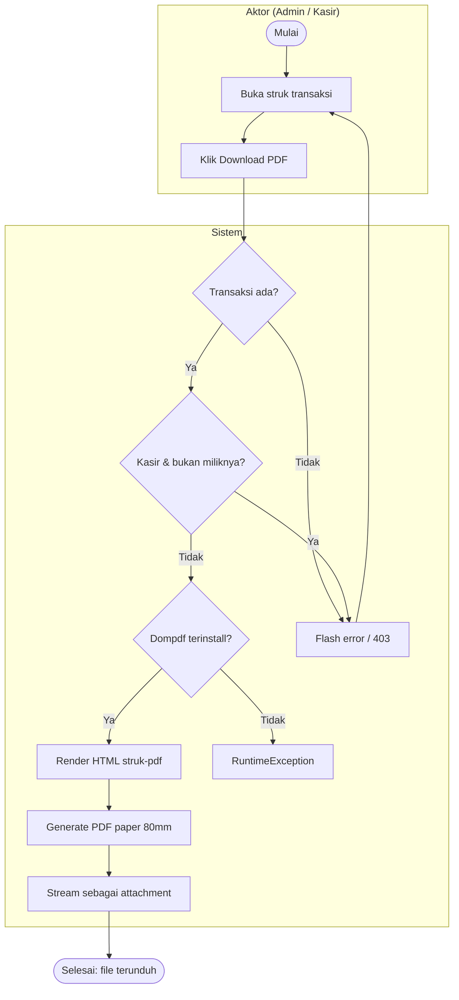
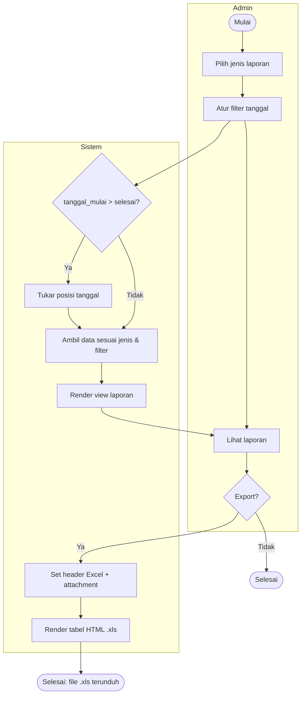
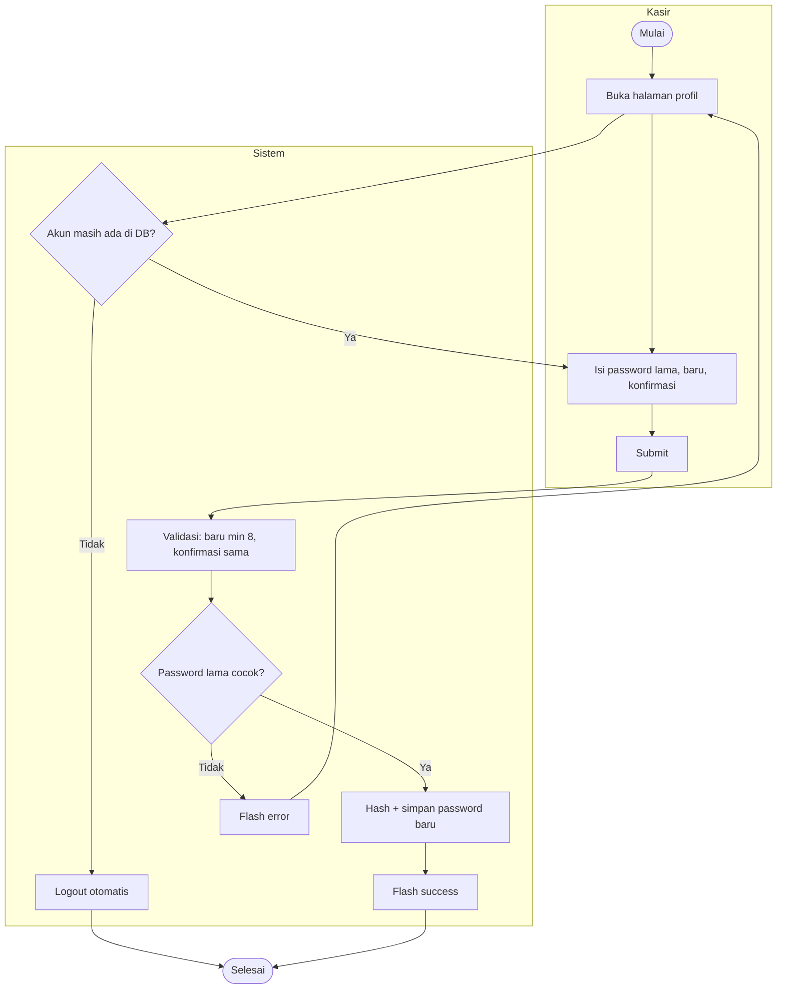

# Activity Diagram - Sistem POS

> Activity Diagram untuk aplikasi kasir berbasis **PHP Native (custom MVC)**.
> Disusun berdasarkan logika kode aktual pada `app/controllers/*` (sinkron dengan branch `main`).
> Format: **Mermaid** (render di GitHub / VS Code / [mermaid.live](https://mermaid.live)).
>
> Activity Diagram fokus pada **alur aktivitas** antara aktor dan sistem, lengkap dengan
> percabangan (decision), aksi paralel, dan pemisahan tanggung jawab (swimlane via subgraph).

---

## Daftar Isi

1. [Login](#1-login)
2. [Transaksi Penjualan (POS)](#2-transaksi-penjualan-pos)
3. [Restock Stok (Masuk & Keluar)](#3-restock-stok-masuk--keluar)
4. [Tambah / Edit Barang](#4-tambah--edit-barang)
5. [Batalkan Transaksi (Refund)](#5-batalkan-transaksi-refund)
6. [Edit Transaksi](#6-edit-transaksi)
7. [Cetak Struk PDF](#7-cetak-struk-pdf)
8. [Lihat & Export Laporan](#8-lihat--export-laporan)
9. [Ganti Password Kasir](#9-ganti-password-kasir)

> Catatan notasi: Mermaid tidak punya bentuk activity-diagram khusus, jadi swimlane
> direpresentasikan dengan `subgraph` (kolom Aktor vs Sistem vs Database).
> Titik mulai `([Start])`, titik akhir `([End])`, decision `{ }`, fork/join dijelaskan via teks.

---

## 1. Login

---

## 2. Transaksi Penjualan (POS)

> Aktivitas inti. Melibatkan Aktor (Admin/Kasir), Sistem, dan Database dengan DB transaction.

---

## 3. Restock Stok (Masuk & Keluar)

---

## 4. Tambah / Edit Barang

---

## 5. Batalkan Transaksi (Refund)

---

## 6. Edit Transaksi

> Proses 6 langkah dalam satu DB transaction: kembalikan stok lama → validasi → kurangi stok baru → ganti detail → update total.

---

## 7. Cetak Struk PDF

---

## 8. Lihat & Export Laporan

---

## 9. Ganti Password Kasir

---

## Konvensi Activity Diagram

| Elemen | Representasi Mermaid | Arti |
|---|---|---|
| Initial node | `([Mulai])` | Titik awal aktivitas |
| Final node | `([Selesai])` | Titik akhir aktivitas |
| Action | `[Teks]` | Aksi / aktivitas |
| Decision | `{Teks}` | Percabangan kondisi |
| Swimlane | `subgraph` | Pemisahan tanggung jawab (Aktor / Sistem / Database) |
| Object flow | `-.label.->` | Interaksi baca/tulis ke database |

> Untuk diagram baku UML (fork/join bar, swimlane vertikal asli), gunakan tools seperti
> draw.io / StarUML / Visual Paradigm dan adaptasi dari struktur di atas.

---

**Versi:** 1.0 | **Sinkron dengan:** branch `main`
**Next:** Sequence Diagram → Class Diagram → ERD → DFD → SRS → User Story → Black Box → UAT
