# Sequence Diagram - Sistem POS

> Sequence Diagram untuk aplikasi kasir berbasis **PHP Native (custom MVC)**.
> Disusun berdasarkan logika kode aktual pada `app/controllers/*` (sinkron dengan branch `main`).
> Format: **Mermaid** (render di GitHub / VS Code / [mermaid.live](https://mermaid.live)).
>
> Sequence Diagram menunjukkan **urutan interaksi antar objek/komponen** secara kronologis:
> Aktor → Router → Middleware → Controller → Model → Database → View → Response.

---

## Daftar Isi

1. [Login](#1-login)
2. [Logout](#2-logout)
3. [Lihat Dashboard Admin](#3-lihat-dashboard-admin)
4. [Transaksi Penjualan (POS)](#4-transaksi-penjualan-pos)
5. [Cetak Struk PDF](#5-cetak-struk-pdf)
6. [Restock Stok Masuk](#6-restock-stok-masuk)
7. [Restock Stok Keluar](#7-restock-stok-keluar)
8. [Tambah Barang](#8-tambah-barang)
9. [Batalkan Transaksi](#9-batalkan-transaksi)
10. [Edit Transaksi](#10-edit-transaksi)
11. [Lihat Laporan + Export Excel](#11-lihat-laporan--export-excel)
12. [Ganti Password Kasir](#12-ganti-password-kasir)

---

## 1. Login

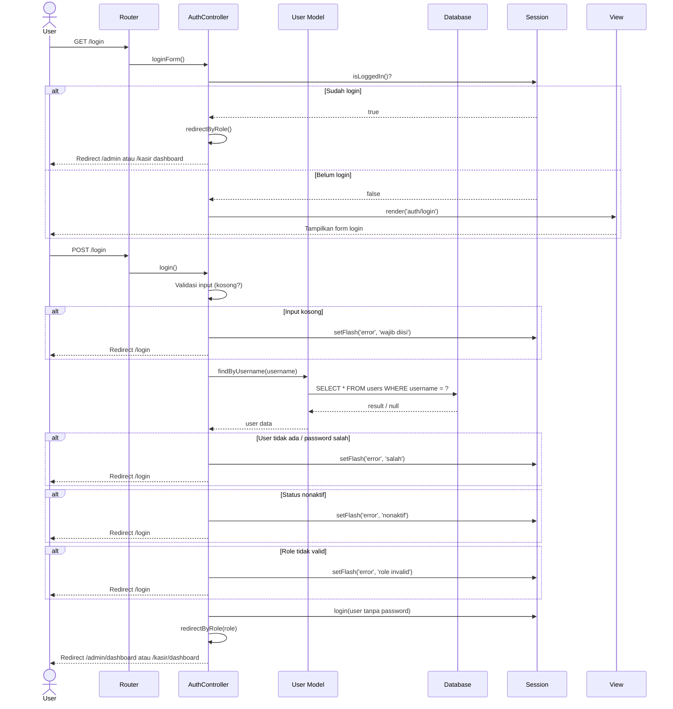

---

## 2. Logout

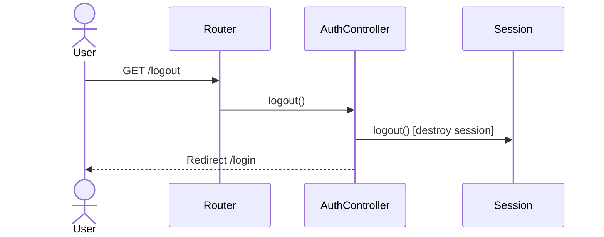

---

## 3. Lihat Dashboard Admin

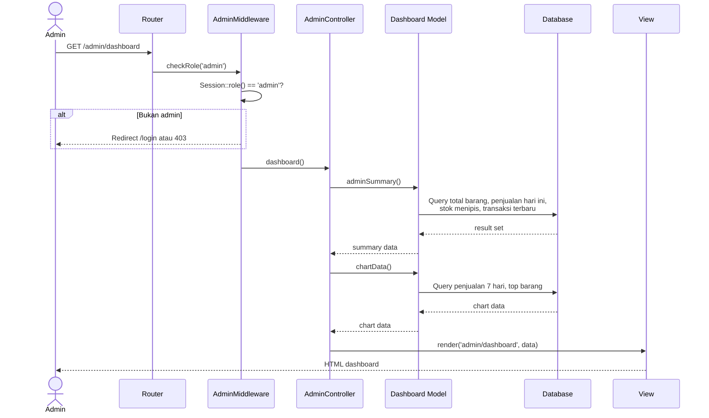

---

## 4. Transaksi Penjualan (POS)

> Sequence terpanjang — mencakup validasi, DB transaction, hitung harga real-time dari DB.

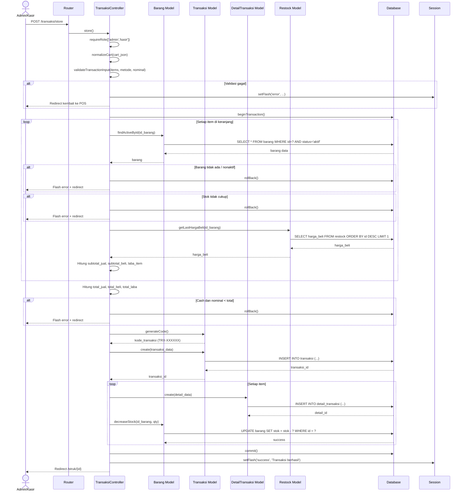

---

## 5. Cetak Struk PDF

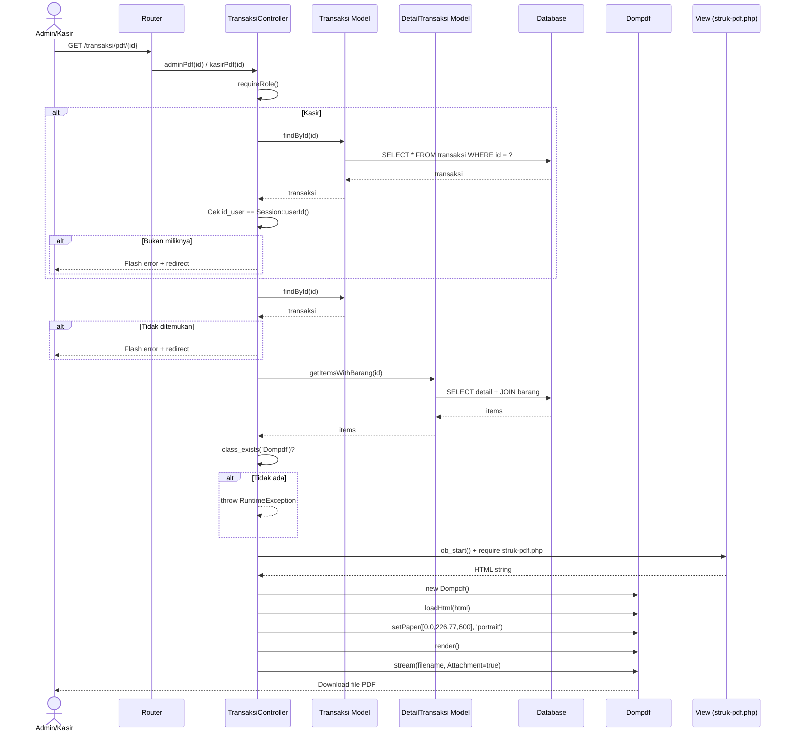

---

## 6. Restock Stok Masuk

```mermaid
sequenceDiagram
    actor A as Admin
    participant R as Router
    participant C as RestockController
    participant BM as Barang Model
    participant SM as Supplier Model
    participant RM as Restock Model
    participant DB as Database
    participant S as Session

    A->>R: POST /admin/restock/store (tipe=masuk)
    R->>C: store()
    C->>C: requireRole('admin')
    C->>C: validatePayload(data)

    C->>BM: findActiveById(id_barang)
    BM->>DB: SELECT FROM barang
    DB-->>BM: barang
    BM-->>C: barang

    C->>SM: findById(id_supplier)
    SM->>DB: SELECT FROM supplier
    DB-->>SM: supplier
    SM-->>C: supplier
    alt Supplier tidak aktif
        C->>S: set errors
        C-->>A: Redirect ke form
    end

    alt Validasi gagal
        C->>S: set errors
        C-->>A: Redirect ke form
    end

    C->>DB: beginTransaction()
    C->>RM: create(restock_data)
    RM->>DB: INSERT INTO restock (...)
    DB-->>RM: restock_id
    C->>BM: increaseStock(id_barang, qty)
    BM->>DB: UPDATE barang SET stok = stok + ?
    DB-->>BM: success

    alt harga_jual_baru diisi
        C->>BM: updateHargaJual(id_barang, harga)
        BM->>DB: UPDATE barang SET harga_jual = ?
        DB-->>BM: success
    end

    C->>DB: commit()
    C->>S: setFlash('success', 'Restock berhasil')
    C-->>A: Redirect /admin/restock
```

---

## 7. Restock Stok Keluar

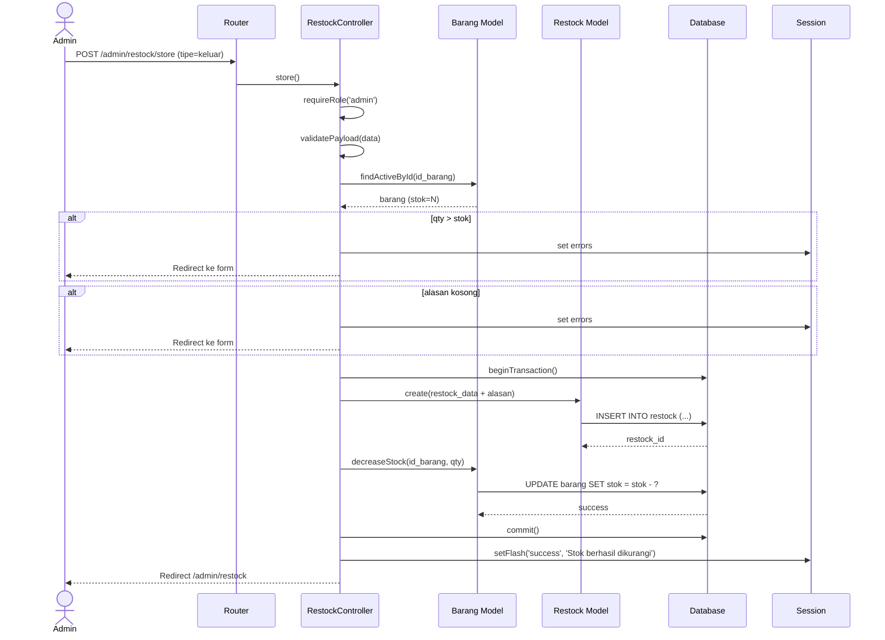

---

## 8. Tambah Barang

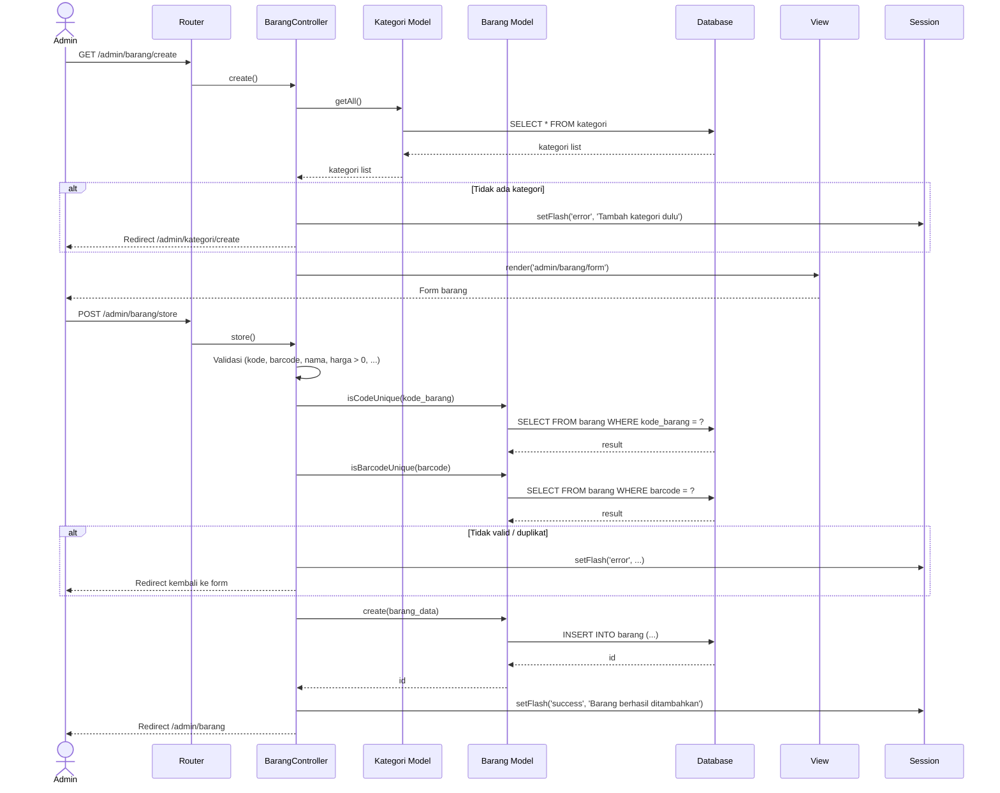

---

## 9. Batalkan Transaksi

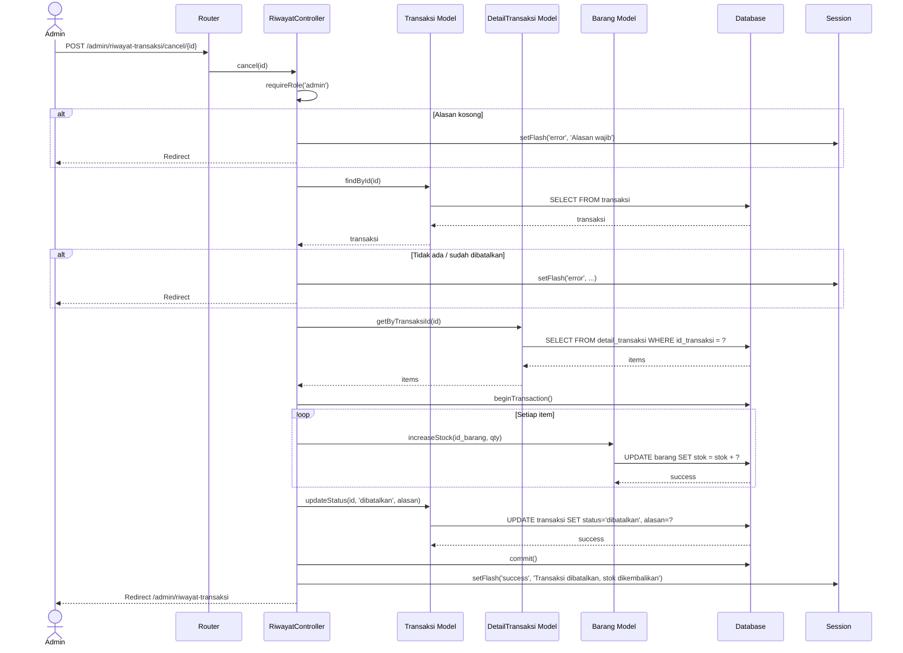

---

## 10. Edit Transaksi

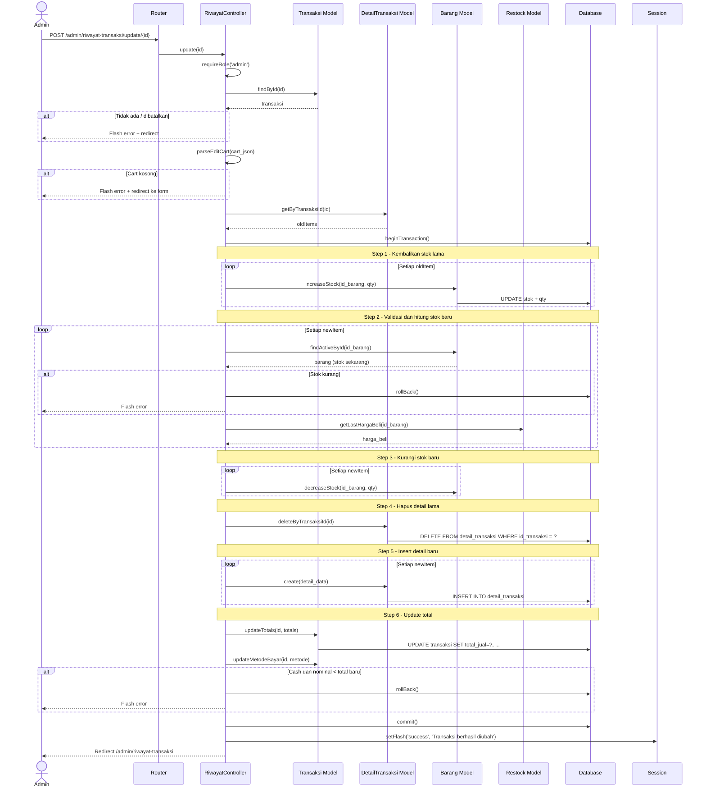

---

## 11. Lihat Laporan + Export Excel

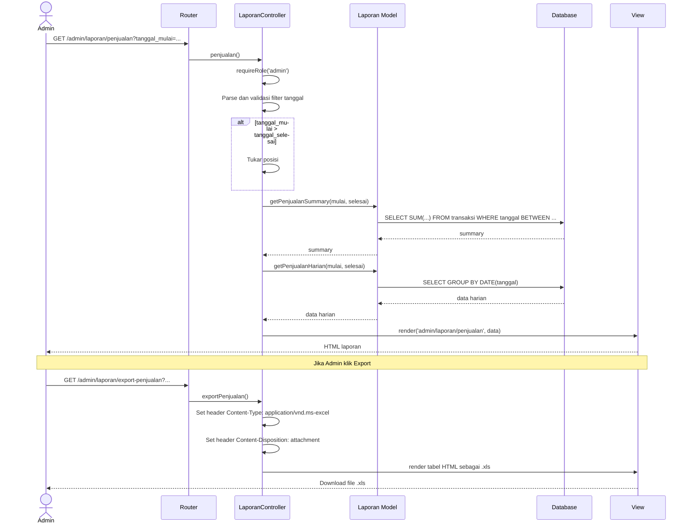

---

## 12. Ganti Password Kasir

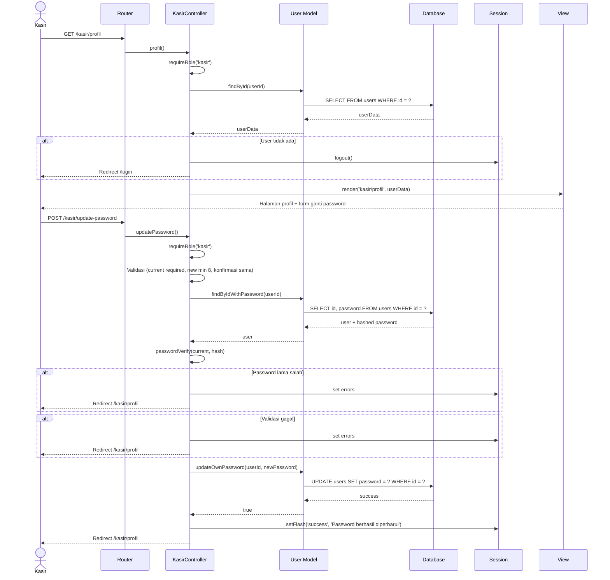

---

## Konvensi Komponen Sequence Diagram

| Komponen | Representasi | Deskripsi |
|---|---|---|
| Actor | `actor U as User` | User yang berinteraksi dengan sistem |
| Participant | `participant C as Controller` | Komponen sistem (Router, Controller, Model, dll) |
| Solid arrow (`->>`) | Synchronous message | Request / pemanggilan method |
| Dashed arrow (`-->>`) | Return message | Response / return value |
| `alt...else...end` | Alternative fragment | Percabangan kondisi |
| `loop...end` | Loop fragment | Iterasi |
| `Note over` | Note | Keterangan tahapan |

---

**Versi:** 1.0 | **Sinkron dengan:** branch `main`
**Next:** Class Diagram → ERD → DFD → SRS → User Story → Black Box → UAT
