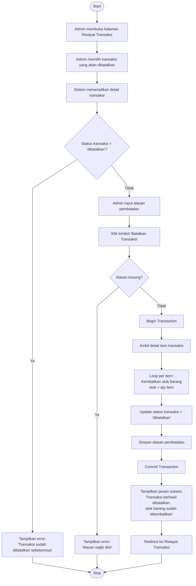

# Activity Diagram - Pembatalan Transaksi (Refund)

```mermaid
%%{ init: { 'flowchart': { 'curve': 'linear' } } }%%
flowchart TD
    A([Start]) --> B[Admin membuka halaman Riwayat Transaksi]
    B --> C[Admin memilih transaksi yang akan dibatalkan]
    C --> D[Sistem menampilkan detail transaksi]
    D --> E{Status transaksi = 'dibatalkan'?}

    E -->|Ya| F[Tampilkan error:<br/>'Transaksi sudah dibatalkan sebelumnya']
    F --> Z([Stop])

    E -->|Tidak| G[Admin input alasan pembatalan]
    G --> H[Klik tombol 'Batalkan Transaksi']
    H --> I{Alasan kosong?}

    I -->|Ya| J[Tampilkan error:<br/>'Alasan wajib diisi']
    J --> Z

    I -->|Tidak| K[Begin Transaction]
    K --> L[Ambil detail item transaksi]
    L --> M[Loop per item:<br/>Kembalikan stok barang<br/>stok + qty item]
    M --> N[Update status transaksi = 'dibatalkan']
    N --> O[Simpan alasan pembatalan]
    O --> P[Commit Transaction]
    P --> Q[Tampilkan pesan sukses:<br/>'Transaksi berhasil dibatalkan,<br/>stok barang sudah dikembalikan']
    Q --> R[Redirect ke Riwayat Transaksi]
    R --> Z
```
