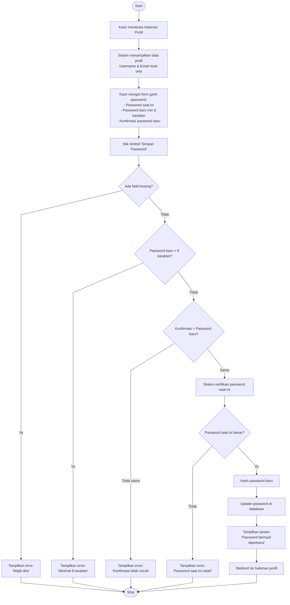

# Activity Diagram - Reset Password Kasir (Halaman Profil)

## Catatan Penting

> **Kasir TIDAK BISA mengubah username maupun email.**
> Fitur tersebut hanya tersedia bagi Admin via menu User Management.
