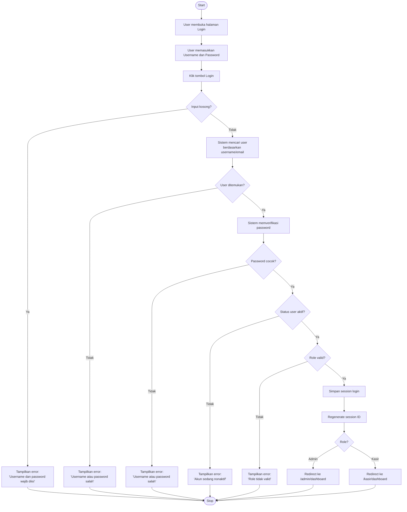

# Activity Diagram - Proses Login

```mermaid
flowchart TD
    A([Start]) --> B[User membuka halaman Login]
    B --> C[User memasukkan Username dan Password]
    C --> D[Klik tombol Login]
    D --> E{Input kosong?}

    E -->|Ya| F[Tampilkan error:<br/>'Username dan password wajib diisi']
    F --> Z([Stop])

    E -->|Tidak| G[Sistem mencari user<br/>berdasarkan username/email]
    G --> H{User ditemukan?}

    H -->|Tidak| I[Tampilkan error:<br/>'Username atau password salah']
    I --> Z

    H -->|Ya| J[Sistem memverifikasi password]
    J --> K{Password cocok?}

    K -->|Tidak| L[Tampilkan error:<br/>'Username atau password salah']
    L --> Z

    K -->|Ya| M{Status user aktif?}

    M -->|Tidak| N[Tampilkan error:<br/>'Akun sedang nonaktif']
    N --> Z

    M -->|Ya| O{Role valid?}

    O -->|Tidak| P[Tampilkan error:<br/>'Role tidak valid']
    P --> Z

    O -->|Ya| Q[Simpan session login]
    Q --> R[Regenerate session ID]
    R --> S{Role?}

    S -->|Admin| T[Redirect ke /admin/dashboard]
    S -->|Kasir| U[Redirect ke /kasir/dashboard]

    T --> Z
    U --> Z
```
