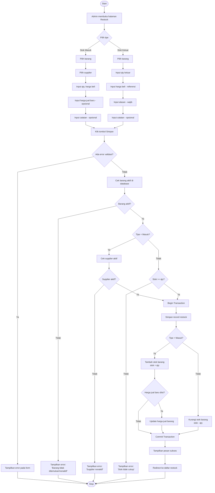

# Activity Diagram - Proses Restock (Stok Masuk/Keluar)

```mermaid
%%{ init: { 'flowchart': { 'curve': 'linear' } } }%%
flowchart TD
    A([Start]) --> B[Admin membuka halaman Restock]
    B --> C{Pilih tipe}

    C -->|Stok Masuk| D1[Pilih barang]
    D1 --> D2[Pilih supplier]
    D2 --> D3[Input qty, harga beli]
    D3 --> D4[Input harga jual baru - opsional]
    D4 --> D5[Input catatan - opsional]
    D5 --> E[Klik tombol Simpan]

    C -->|Stok Keluar| F1[Pilih barang]
    F1 --> F2[Input qty keluar]
    F2 --> F3[Input harga beli - referensi]
    F3 --> F4[Input alasan - wajib]
    F4 --> F5[Input catatan - opsional]
    F5 --> E

    E --> G{Ada error validasi?}
    G -->|Ya| H[Tampilkan error pada form]
    H --> Z([Stop])

    G -->|Tidak| I[Cek barang aktif di database]
    I --> J{Barang aktif?}
    J -->|Tidak| K[Tampilkan error:<br/>'Barang tidak ditemukan/nonaktif']
    K --> Z

    J -->|Ya| L{Tipe = Masuk?}

    L -->|Ya| M[Cek supplier aktif]
    M --> N{Supplier aktif?}
    N -->|Tidak| O[Tampilkan error:<br/>'Supplier nonaktif']
    O --> Z
    N -->|Ya| Q

    L -->|Tidak| P{Stok >= qty?}
    P -->|Tidak| P1[Tampilkan error:<br/>'Stok tidak cukup']
    P1 --> Z
    P -->|Ya| Q

    Q[Begin Transaction] --> R[Simpan record restock]

    R --> S{Tipe = Masuk?}
    S -->|Ya| T[Tambah stok barang<br/>stok + qty]
    T --> U{Harga jual baru diisi?}
    U -->|Ya| V[Update harga jual barang]
    U -->|Tidak| W
    V --> W

    S -->|Tidak| X[Kurangi stok barang<br/>stok - qty]
    X --> W

    W[Commit Transaction] --> Y[Tampilkan pesan sukses]
    Y --> Y1[Redirect ke daftar restock]
    Y1 --> Z
```
