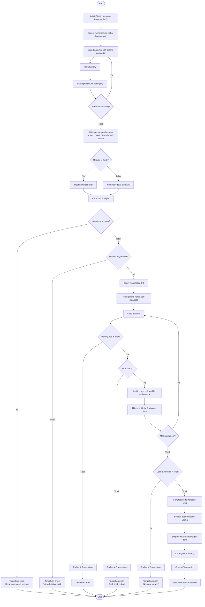

# Activity Diagram - Proses Transaksi Penjualan

```mermaid
flowchart TD
    A([Start]) --> B[Admin/Kasir membuka halaman POS]
    B --> C[Sistem menampilkan daftar barang aktif]
    C --> D[Scan barcode / pilih barang dari daftar]
    D --> E[Tentukan qty]
    E --> F[Barang masuk ke keranjang]
    F --> G{Masih ada barang?}
    G -->|Ya| D
    G -->|Tidak| H[Pilih metode pembayaran<br/>Cash / QRIS / Transfer / E-Wallet]
    
    H --> I{Metode = Cash?}
    I -->|Ya| J[Input nominal bayar]
    I -->|Tidak| K[Nominal = total otomatis]
    J --> L[Klik tombol 'Bayar']
    K --> L

    L --> M{Keranjang kosong?}
    M -->|Ya| N[Tampilkan error:<br/>'Keranjang masih kosong']
    N --> Z([Stop])

    M -->|Tidak| O{Metode bayar valid?}
    O -->|Tidak| P[Tampilkan error:<br/>'Metode tidak valid']
    P --> Z

    O -->|Ya| Q[Begin Transaction DB]
    Q --> R[Hitung ulang harga dari database]
    R --> S[Loop per item]
    
    S --> T{Barang ada & aktif?}
    T -->|Tidak| U[Rollback Transaction]
    U --> V[Tampilkan error]
    V --> Z

    T -->|Ya| W{Stok cukup?}
    W -->|Tidak| X[Rollback Transaction]
    X --> Y[Tampilkan error:<br/>'Stok tidak cukup']
    Y --> Z

    W -->|Ya| AA[Ambil harga beli terakhir dari restock]
    AA --> AB[Hitung subtotal & laba per item]
    AB --> AC{Masih ada item?}
    AC -->|Ya| S
    AC -->|Tidak| AD{Cash & nominal < total?}

    AD -->|Ya| AE[Rollback Transaction]
    AE --> AF[Tampilkan error:<br/>'Nominal kurang']
    AF --> Z

    AD -->|Tidak| AG[Generate kode transaksi unik]
    AG --> AH[Simpan data transaksi utama]
    AH --> AI[Simpan detail transaksi per item]
    AI --> AJ[Kurangi stok barang]
    AJ --> AK[Commit Transaction]
    AK --> AL[Tampilkan struk transaksi]
    AL --> Z
```
