# Class Diagram — Kopsis POS

---

## Diagram

```mermaid
classDiagram
    direction TB

    %% ============ CORE ============
    class Model {
        #PDO db
        -PDO connection$
        +__construct()
        +db() PDO
        #query(sql, params) PDOStatement
        #fetchAll(sql, params) array
        #fetch(sql, params) mixed
        #execute(sql, params) bool
        #countRows(sql, params) int
        #lastInsertId() int
        #beginTransaction() void
        #commit() void
        #rollBack() void
        #transaction(callback) mixed
        -connect()$ PDO
    }

    class Controller {
        #view(path, data) void
        #model(modelName) object
        #redirect(url) void
        #requireLogin() void
        #requireRole(roles) void
        -viewPath(path) string
    }

    class Router {
        -array routes
        +get(uri, action) void
        +post(uri, action) void
        +run() void
        -addRoute(method, uri, action) void
        -dispatch(action, params) void
        -makePattern(uri) string
        -getCurrentUri() string
        -normalizeUri(uri) string
        -abort(statusCode, message) void
    }

    class Session {
        -bool started$
        +start()$ void
        +set(key, value)$ void
        +get(key, default)$ mixed
        +has(key)$ bool
        +remove(key)$ void
        +destroy()$ void
        +regenerate()$ void
        +setFlash(key, message)$ void
        +getFlash(key)$ string
        +login(user)$ void
        +logout()$ void
        +isLoggedIn()$ bool
        +user()$ array
        +userId()$ int
        +role()$ string
    }

    class Security {
        +e(value)$ string
        +passwordHash(password)$ string
        +passwordVerify(password, hash)$ bool
        +rupiah(value)$ string
    }

    class Validator {
        +validate(data, rules)$ array
        +in(value, options)$ bool
    }

    class Response {
        +redirect(url)$ void
        +abort(code, message)$ void
        +json(data, code)$ void
    }

    %% ============ CONTROLLERS ============
    class AuthController {
        -User userModel
        +loginForm() void
        +login() void
        +logout() void
        -redirectByRole(role) void
    }

    class AdminController {
        -Dashboard dashboardModel
        +dashboard() void
    }

    class KasirController {
        -Dashboard dashboardModel
        -User userModel
        +dashboard() void
        +profil() void
        +updatePassword() void
    }

    class BarangController {
        -Barang barangModel
        -Kategori kategoriModel
        +index() void
        +create() void
        +store() void
        +edit(id) void
        +update(id) void
        +delete(id) void
        +toggleStatus(id) void
        +generateBarcodeAjax() void
        +label(id) void
        +labelBulk() void
    }

    class KategoriController {
        -Kategori kategoriModel
        +index() void
        +create() void
        +store() void
        +edit(id) void
        +update(id) void
        +delete(id) void
    }

    class SupplierController {
        -Supplier supplierModel
        +index() void
        +create() void
        +store() void
        +edit(id) void
        +update(id) void
        +delete(id) void
        +toggleStatus(id) void
    }

    class RestockController {
        -Restock restockModel
        -Barang barangModel
        -Supplier supplierModel
        +index() void
        +create() void
        +store() void
        -validatePayload(data) array
    }

    class TransaksiController {
        -Transaksi transaksiModel
        -DetailTransaksi detailModel
        -Barang barangModel
        -Restock restockModel
        +adminIndex() void
        +kasirIndex() void
        +store() void
        +adminStruk(id) void
        +kasirStruk(id) void
        +adminPdf(id) void
        +kasirPdf(id) void
        -normalizeCart(json) array
        -validateTransactionInput() array
        -prepareItems(items) array
        -downloadPdf(id, role) void
        -paymentMethods() array
    }

    class RiwayatController {
        -Transaksi transaksiModel
        -DetailTransaksi detailModel
        -Barang barangModel
        -Restock restockModel
        +adminIndex() void
        +adminDetail(id) void
        +edit(id) void
        +update(id) void
        +cancel(id) void
        -parseEditCart(json) array
        -prepareEditItems(items) array
        -makeSummary(transaksis) array
    }

    class UserController {
        -User userModel
        +index() void
        +create() void
        +store() void
        +edit(id) void
        +update(id) void
        +resetPassword(id) void
        +updatePassword(id) void
        +delete(id) void
        +toggleStatus(id) void
    }

    class LaporanController {
        -Laporan laporanModel
        +index() void
        +penjualan() void
        +laba() void
        +barangTerlaris() void
        +restock() void
        +exportRingkasan() void
        +exportPenjualan() void
        +exportLaba() void
        +exportBarangTerlaris() void
        +exportRestock() void
    }

    %% ============ MODELS ============
    class User {
        -string table
        +findByUsername(username) mixed
        +findById(id) mixed
        +findByIdWithPassword(id) mixed
        +getAll() array
        +createKasir(data) int
        +updateKasir(id, data) bool
        +resetPassword(id, password) bool
        +updateOwnPassword(id, password) bool
        +deleteOrDeactivate(id) bool
        +usernameExists(username, exceptId) bool
        +emailExists(email, exceptId) bool
        +countAll() int
        +getPaginated(page, perPage) array
        +hasTransactions(id) bool
    }

    class Barang {
        -string table
        +getAll() array
        +getActive() array
        +findById(id) mixed
        +findActiveById(id) mixed
        +create(data) bool
        +update(id, data) bool
        +updateHargaJual(id, harga) bool
        +updateStatus(id, status) bool
        +deleteOrDeactivate(id) bool
        +increaseStock(id, qty) bool
        +decreaseStock(id, qty) bool
        +kodeExists(kode, exceptId) bool
        +barcodeExists(barcode, exceptId) bool
        +generateNextBarcode(prefix, pad) string
        +findManyByIds(ids) array
        +hasHistory(id) bool
        +summary() array
        +countAll() int
        +getPaginated(page, perPage) array
    }

    class Transaksi {
        -string table
        +create(data) int
        +findById(id) mixed
        +getByDateRange(start, end, limit) array
        +generateCode() string
        +kodeExists(kode) bool
        +updateStatus(id, status, alasan) bool
        +updateTotals(id, totals) bool
        +updateMetodeBayar(id, metode) bool
        +isValidPaymentMethod(method) bool
        +getPaginated(page, perPage) array
        +countAll() int
    }

    class DetailTransaksi {
        -string table
        +create(data) int
        +getByTransaksiId(id) array
        +getItemsWithBarang(id) array
        +deleteByTransaksiId(id) bool
        +summaryByTransaksiId(id) array
    }

    class Restock {
        -string table
        +create(data) int
        +getLastHargaBeli(idBarang) float
        +getFiltered(start, end, tipe) array
        +summary(start, end, tipe) array
        +countAll() int
        +getPaginated(page, perPage) array
    }

    class Supplier {
        -string table
        +getAll() array
        +getActive() array
        +findById(id) mixed
        +create(data) bool
        +update(id, data) bool
        +deleteOrDeactivate(id) bool
        +countAll() int
        +getPaginated(page, perPage) array
    }

    class Kategori {
        -string table
        +getAll() array
        +findById(id) mixed
        +create(data) int
        +update(id, data) bool
        +delete(id) bool
        +hasBarang(id) bool
    }

    class Dashboard {
        +adminSummary() array
        +kasirSummary(userId) array
    }

    class Laporan {
        +ringkasan(start, end) array
        +penjualan(start, end) array
        +laba(start, end) array
        +barangTerlaris(start, end, limit) array
        +restock(start, end) array
    }

    %% ============ MIDDLEWARE ============
    class AuthMiddleware {
        +handle()$ void
    }
    class AdminMiddleware {
        +handle()$ void
    }
    class KasirMiddleware {
        +handle()$ void
    }

    %% ============ INHERITANCE ============
    Controller <|-- AuthController
    Controller <|-- AdminController
    Controller <|-- KasirController
    Controller <|-- BarangController
    Controller <|-- KategoriController
    Controller <|-- SupplierController
    Controller <|-- RestockController
    Controller <|-- TransaksiController
    Controller <|-- RiwayatController
    Controller <|-- UserController
    Controller <|-- LaporanController

    Model <|-- User
    Model <|-- Barang
    Model <|-- Transaksi
    Model <|-- DetailTransaksi
    Model <|-- Restock
    Model <|-- Supplier
    Model <|-- Kategori
    Model <|-- Dashboard
    Model <|-- Laporan

    %% ============ DEPENDENCIES ============
    AuthController ..> User : uses
    AdminController ..> Dashboard : uses
    KasirController ..> Dashboard : uses
    KasirController ..> User : uses
    BarangController ..> Barang : uses
    BarangController ..> Kategori : uses
    KategoriController ..> Kategori : uses
    SupplierController ..> Supplier : uses
    RestockController ..> Restock : uses
    RestockController ..> Barang : uses
    RestockController ..> Supplier : uses
    TransaksiController ..> Transaksi : uses
    TransaksiController ..> DetailTransaksi : uses
    TransaksiController ..> Barang : uses
    TransaksiController ..> Restock : uses
    RiwayatController ..> Transaksi : uses
    RiwayatController ..> DetailTransaksi : uses
    RiwayatController ..> Barang : uses
    RiwayatController ..> Restock : uses
    UserController ..> User : uses
    LaporanController ..> Laporan : uses
```

---

## Keterangan

### Layer Architecture

| Layer | Class | Tanggung Jawab |
|-------|-------|----------------|
| **Core** | Model, Controller, Router, Session, Security, Validator, Response | Framework inti: DB, routing, session, keamanan |
| **Controllers** | AuthController, AdminController, KasirController, dll. | Handle request, validasi, koordinasi model & view |
| **Models** | User, Barang, Transaksi, DetailTransaksi, Restock, Supplier, Kategori, Dashboard, Laporan | Akses database, business logic |
| **Middleware** | AuthMiddleware, AdminMiddleware, KasirMiddleware | Proteksi akses berdasarkan role |

### Relasi

| Simbol | Arti |
|--------|------|
| `<\|--` | Inheritance (extends) |
| `..>` | Dependency (uses) |
