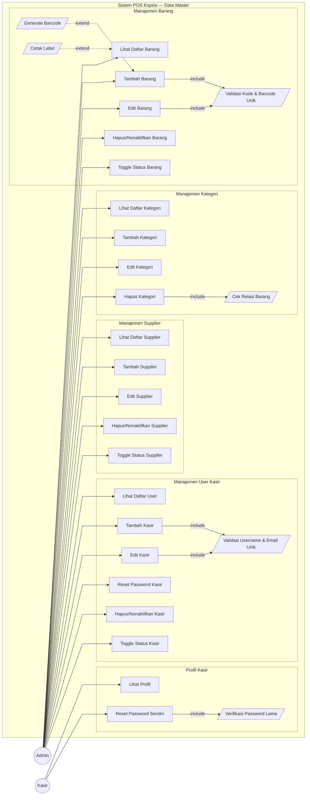
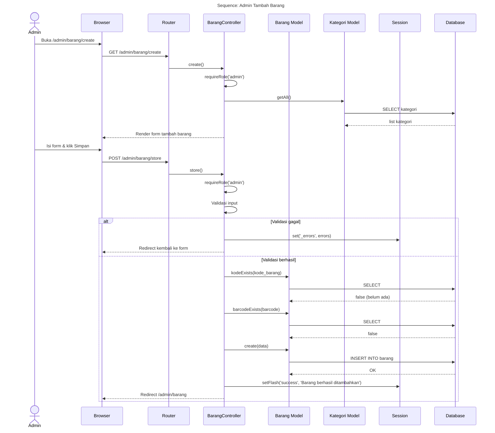
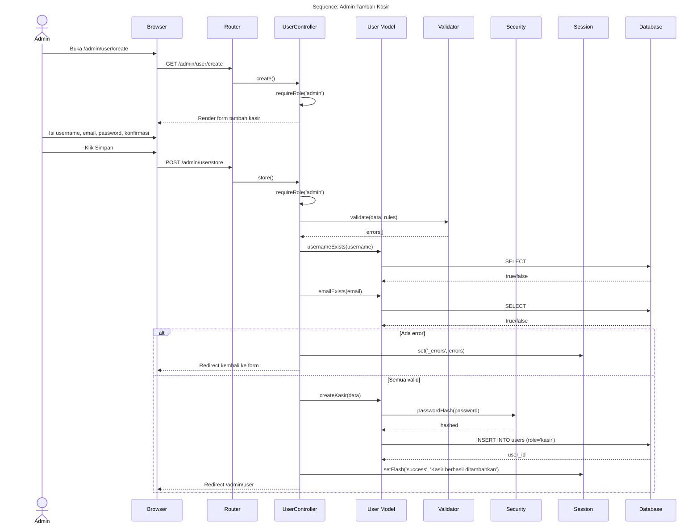
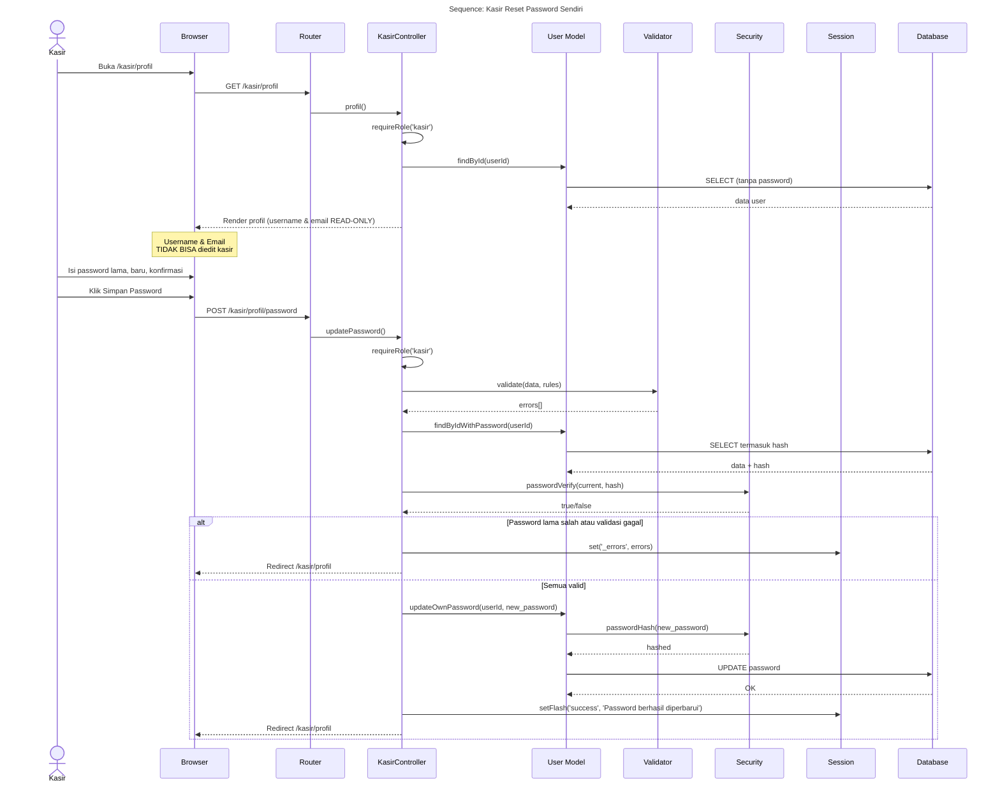
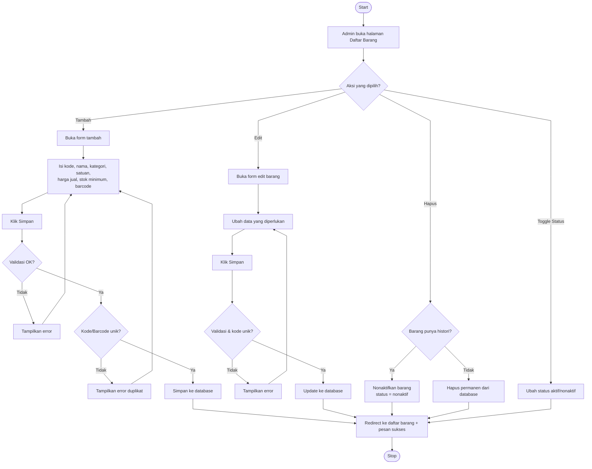
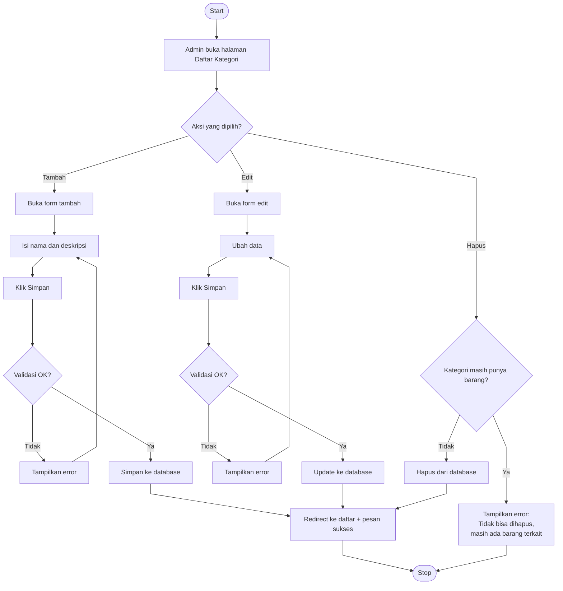
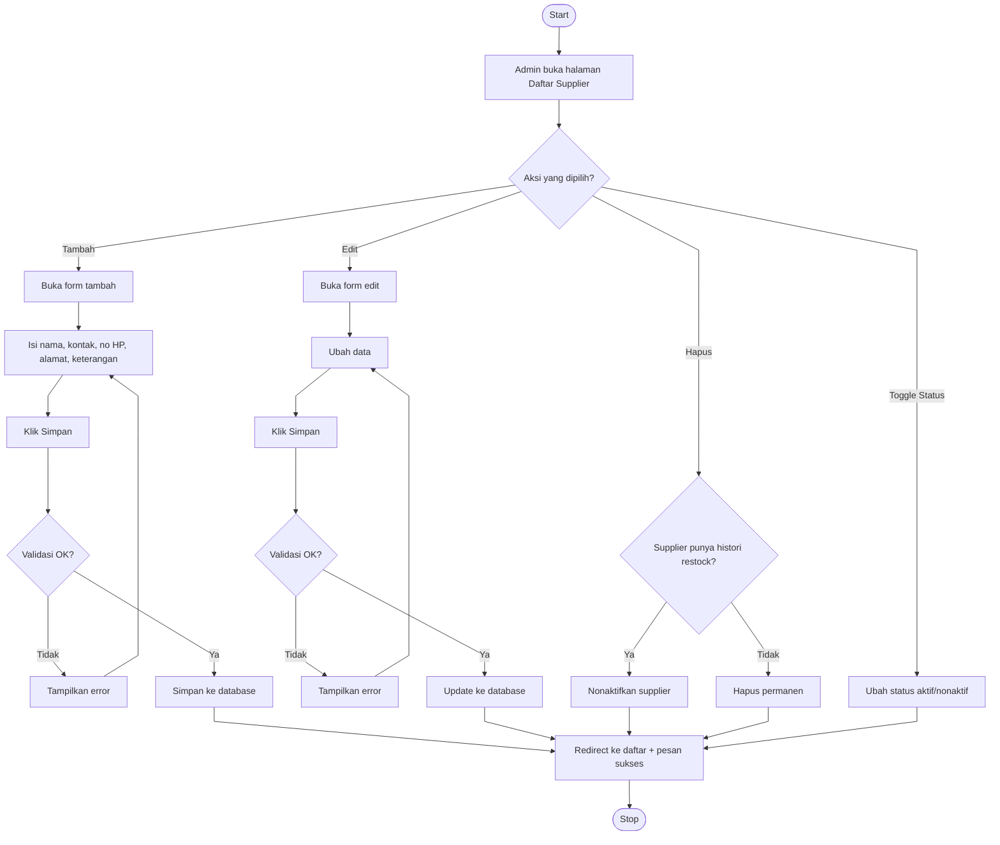
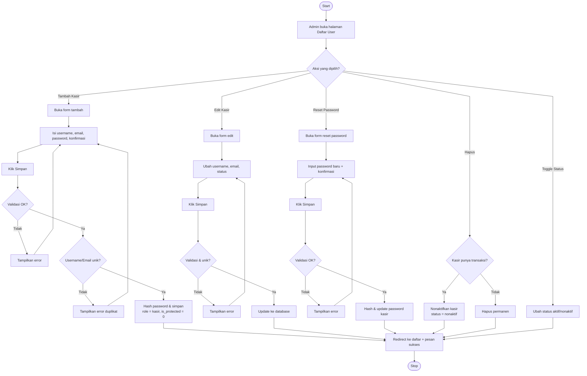
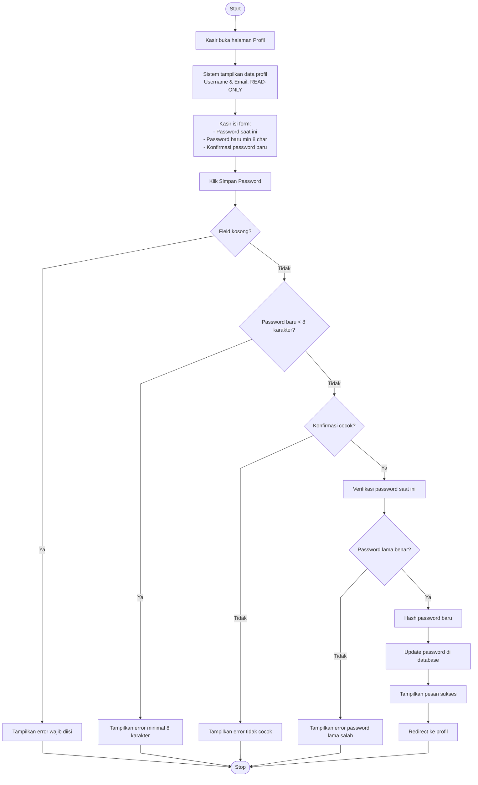

# Data Master — Barang, Kategori, User (Kasir), Supplier

---

## 1. Use Case Diagram

---

## 2. Sequence Diagram — Tambah Barang

---

## 3. Sequence Diagram — Tambah Kasir (User)

---

## 4. Sequence Diagram — Kasir Reset Password (Profil)

---

## 5. Activity Diagram — CRUD Barang

---

## 6. Activity Diagram — CRUD Kategori

---

## 7. Activity Diagram — CRUD Supplier

---

## 8. Activity Diagram — Kelola User Kasir

---

## 9. Activity Diagram — Kasir Reset Password (Profil)

> **Catatan**: Kasir **TIDAK BISA** mengubah username maupun email. Hanya Admin yang bisa via menu User Management.
