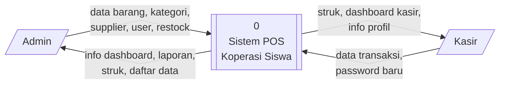

# Data Flow Diagram (DFD) — Kopsis POS

---

## DFD Level 0 (Context Diagram)

### Keterangan DFD Level 0

| External Entity | Data Masuk ke Sistem | Data Keluar dari Sistem |
|----------------|---------------------|------------------------|
| **Admin** | Data barang, kategori, supplier, user kasir, restock, filter laporan, pembatalan/edit transaksi | Dashboard admin, daftar data master, laporan (view/CSV), struk, riwayat transaksi |
| **Kasir** | Data transaksi (keranjang, metode bayar, nominal), password baru | Struk transaksi, dashboard kasir, info profil |

---

## DFD Level 1

```mermaid
%%{ init: { 'flowchart': { 'curve': 'linear' } } }%%
flowchart TD
    %% External Entities
    ADMIN[/Admin/]
    KASIR[/Kasir/]

    %% Data Stores
    DS_USER[(D1: users)]
    DS_BARANG[(D2: barang)]
    DS_KATEGORI[(D3: kategori)]
    DS_SUPPLIER[(D4: supplier)]
    DS_RESTOCK[(D5: restock)]
    DS_TRANSAKSI[(D6: transaksi)]
    DS_DETAIL[(D7: detail_transaksi)]

    %% Processes
    P1[["1.0\nManajemen\nData Master"]]
    P2[["2.0\nManajemen\nRestock"]]
    P3[["3.0\nTransaksi\nPenjualan"]]
    P4[["4.0\nRiwayat\nTransaksi"]]
    P5[["5.0\nLaporan"]]
    P6[["6.0\nAutentikasi\n& Profil"]]

    %% === PROSES 1: DATA MASTER ===
    ADMIN -->|data barang| P1
    ADMIN -->|data kategori| P1
    ADMIN -->|data supplier| P1
    ADMIN -->|data user kasir| P1
    P1 -->|simpan/update/hapus| DS_BARANG
    P1 -->|simpan/update/hapus| DS_KATEGORI
    P1 -->|simpan/update/hapus| DS_SUPPLIER
    P1 -->|simpan/update/hapus| DS_USER
    P1 -->|daftar data| ADMIN

    %% === PROSES 2: RESTOCK ===
    ADMIN -->|data restock<br/>tipe, qty, harga| P2
    P2 -->|cek barang aktif| DS_BARANG
    P2 -->|cek supplier aktif| DS_SUPPLIER
    P2 -->|simpan record| DS_RESTOCK
    P2 -->|update stok| DS_BARANG
    P2 -->|info restock| ADMIN

    %% === PROSES 3: TRANSAKSI ===
    ADMIN -->|keranjang, metode bayar| P3
    KASIR -->|keranjang, metode bayar| P3
    P3 -->|cek stok & harga| DS_BARANG
    P3 -->|ambil harga beli| DS_RESTOCK
    P3 -->|simpan transaksi| DS_TRANSAKSI
    P3 -->|simpan detail| DS_DETAIL
    P3 -->|kurangi stok| DS_BARANG
    P3 -->|struk transaksi| ADMIN
    P3 -->|struk transaksi| KASIR

    %% === PROSES 4: RIWAYAT TRANSAKSI ===
    ADMIN -->|edit/batalkan transaksi| P4
    P4 -->|baca transaksi| DS_TRANSAKSI
    P4 -->|baca detail| DS_DETAIL
    P4 -->|update status/total| DS_TRANSAKSI
    P4 -->|update detail| DS_DETAIL
    P4 -->|kembalikan/kurangi stok| DS_BARANG
    P4 -->|info riwayat| ADMIN

    %% === PROSES 5: LAPORAN ===
    ADMIN -->|filter periode| P5
    P5 -->|query transaksi| DS_TRANSAKSI
    P5 -->|query detail| DS_DETAIL
    P5 -->|query restock| DS_RESTOCK
    P5 -->|query barang| DS_BARANG
    P5 -->|laporan + export CSV| ADMIN

    %% === PROSES 6: AUTH & PROFIL ===
    ADMIN -->|username, password| P6
    KASIR -->|username, password| P6
    KASIR -->|password baru| P6
    P6 -->|verifikasi login| DS_USER
    P6 -->|update password| DS_USER
    P6 -->|session login, info profil| ADMIN
    P6 -->|session login, info profil| KASIR
```

---

## Penjelasan Proses DFD Level 1

| No | Proses | Deskripsi | Aktor |
|----|--------|-----------|-------|
| 1.0 | Manajemen Data Master | CRUD barang, kategori, supplier, user kasir | Admin |
| 2.0 | Manajemen Restock | Input stok masuk (dari supplier) dan stok keluar (penyesuaian) | Admin |
| 3.0 | Transaksi Penjualan | Proses POS: pilih barang → bayar → cetak struk | Admin, Kasir |
| 4.0 | Riwayat Transaksi | Lihat, edit, dan batalkan (refund) transaksi yang sudah selesai | Admin |
| 5.0 | Laporan | View & export laporan penjualan, laba, barang terlaris, restock | Admin |
| 6.0 | Autentikasi & Profil | Login, logout, reset password sendiri (kasir) | Admin, Kasir |

---

## Penjelasan Data Store

| ID | Nama | Deskripsi |
|----|------|-----------|
| D1 | users | Data admin dan kasir (username, email, password, role, status) |
| D2 | barang | Master barang (kode, nama, harga, stok, barcode, status) |
| D3 | kategori | Kategori/klasifikasi barang |
| D4 | supplier | Data pemasok barang |
| D5 | restock | Riwayat stok masuk dan keluar |
| D6 | transaksi | Header transaksi penjualan |
| D7 | detail_transaksi | Detail item per transaksi |
