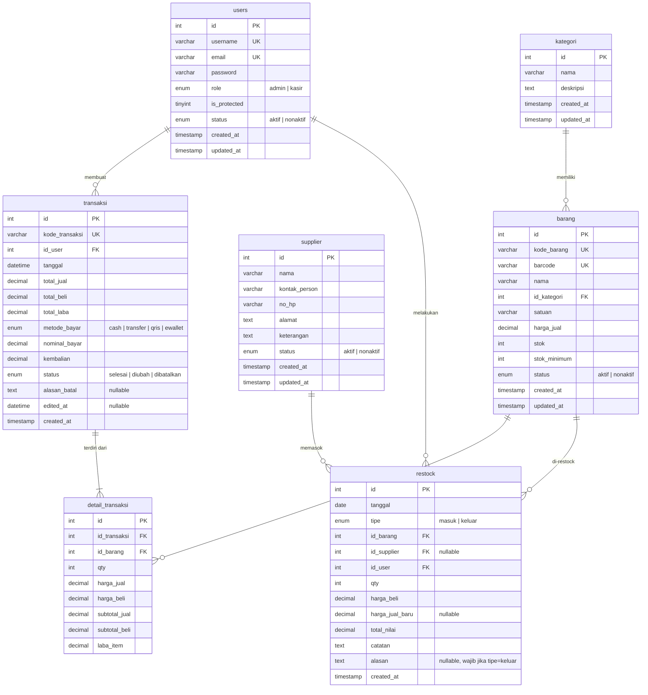

# Entity Relationship Diagram (ERD) - Kopsis POS

## Mermaid ERD

## Penjelasan Relasi

| Relasi | Keterangan |
|--------|------------|
| `users` → `transaksi` | Satu user (admin/kasir) bisa membuat banyak transaksi |
| `users` → `restock` | Admin yang melakukan restock tercatat sebagai pelaku |
| `kategori` → `barang` | Satu kategori memiliki banyak barang |
| `barang` → `detail_transaksi` | Satu barang bisa muncul di banyak detail transaksi |
| `barang` → `restock` | Satu barang bisa di-restock berkali-kali |
| `supplier` → `restock` | Satu supplier bisa memasok banyak kali (nullable untuk tipe keluar) |
| `transaksi` → `detail_transaksi` | Satu transaksi terdiri dari satu atau lebih item detail |

## Constraint Penting

- `barang.id_kategori` → RESTRICT ON DELETE (kategori tidak bisa dihapus kalau masih punya barang)
- `detail_transaksi.id_transaksi` → CASCADE ON DELETE (hapus transaksi = hapus detailnya)
- `restock.id_supplier` → RESTRICT ON DELETE (supplier tidak bisa dihapus kalau ada histori restock)
- `transaksi.id_user` → RESTRICT ON DELETE (user tidak bisa dihapus kalau punya transaksi)
