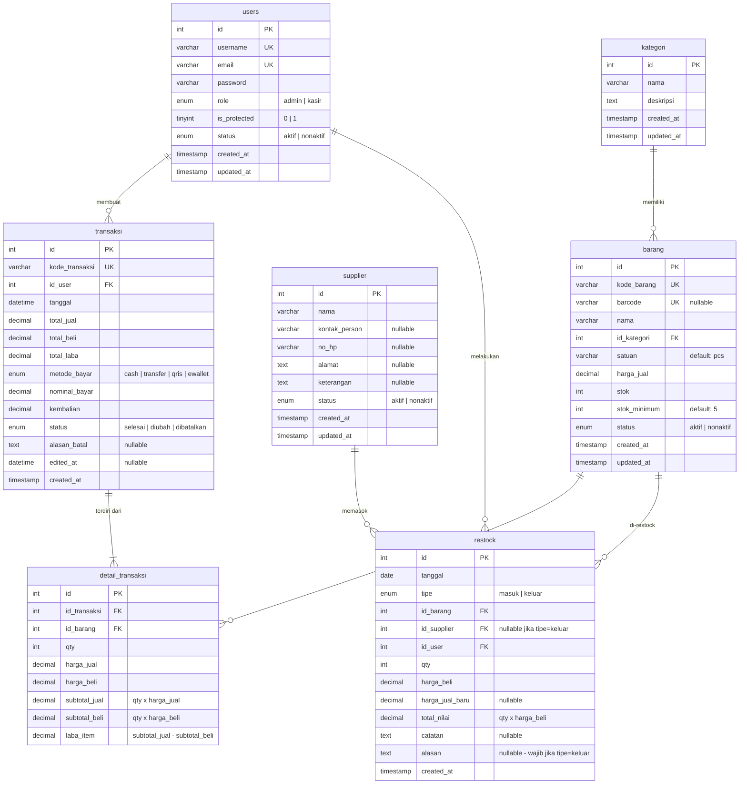

# Entity Relationship Diagram (ERD) — Kopsis POS

---

## Diagram

---

## Penjelasan Relasi

| No | Relasi | Kardinalitas | Keterangan |
|----|--------|-------------|------------|
| 1 | `users` → `transaksi` | 1:N | Satu user (admin/kasir) bisa membuat banyak transaksi |
| 2 | `users` → `restock` | 1:N | Admin yang melakukan restock tercatat sebagai pelaku |
| 3 | `kategori` → `barang` | 1:N | Satu kategori memiliki banyak barang |
| 4 | `barang` → `detail_transaksi` | 1:N | Satu barang bisa muncul di banyak detail transaksi |
| 5 | `barang` → `restock` | 1:N | Satu barang bisa di-restock berkali-kali |
| 6 | `supplier` → `restock` | 1:N | Satu supplier bisa memasok banyak kali (nullable untuk tipe keluar) |
| 7 | `transaksi` → `detail_transaksi` | 1:N | Satu transaksi terdiri dari satu atau lebih item detail |

---

## Foreign Key Constraints

| Tabel | FK Column | References | ON DELETE | ON UPDATE |
|-------|-----------|-----------|-----------|-----------|
| `barang` | `id_kategori` | `kategori(id)` | RESTRICT | CASCADE |
| `detail_transaksi` | `id_transaksi` | `transaksi(id)` | CASCADE | CASCADE |
| `detail_transaksi` | `id_barang` | `barang(id)` | RESTRICT | CASCADE |
| `restock` | `id_barang` | `barang(id)` | RESTRICT | CASCADE |
| `restock` | `id_supplier` | `supplier(id)` | RESTRICT | CASCADE |
| `restock` | `id_user` | `users(id)` | RESTRICT | CASCADE |
| `transaksi` | `id_user` | `users(id)` | RESTRICT | CASCADE |

---

## Catatan Constraint

- **Kategori** tidak bisa dihapus jika masih punya barang (RESTRICT)
- **Barang** tidak bisa dihapus jika ada di detail_transaksi atau restock (RESTRICT)
- **Supplier** tidak bisa dihapus jika ada histori restock (RESTRICT)
- **User** tidak bisa dihapus jika punya transaksi (RESTRICT)
- **Transaksi** dihapus → semua detail_transaksi ikut terhapus (CASCADE)
- **Admin utama** (is_protected=1) tidak bisa diedit/dihapus dari menu user
