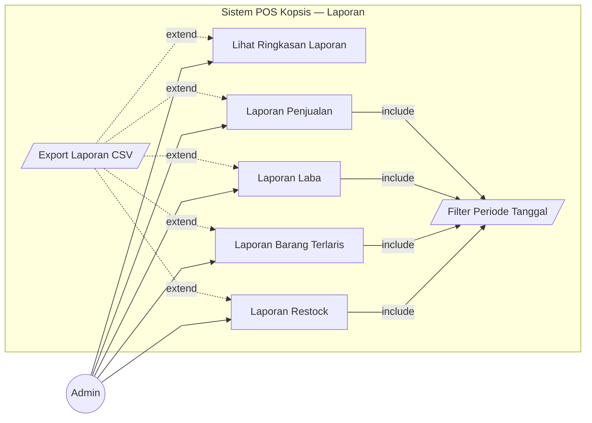
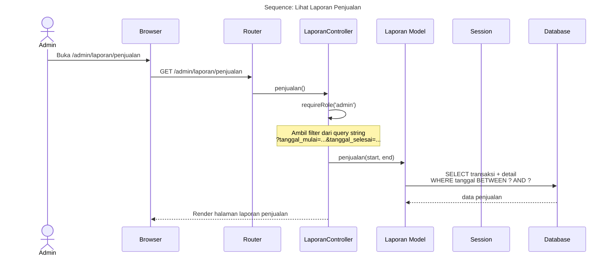
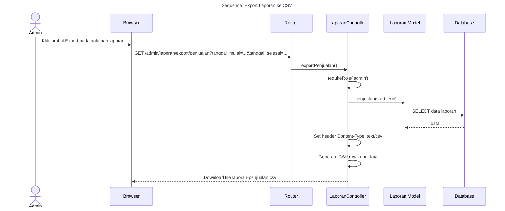
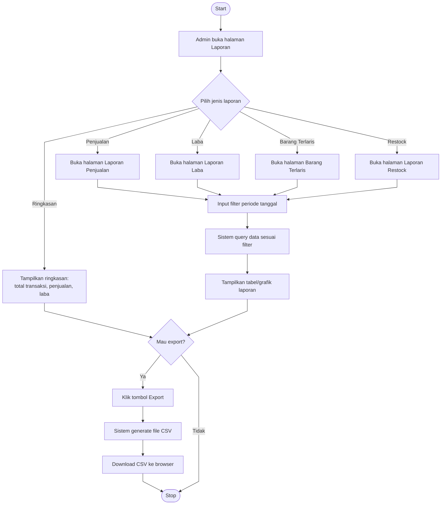
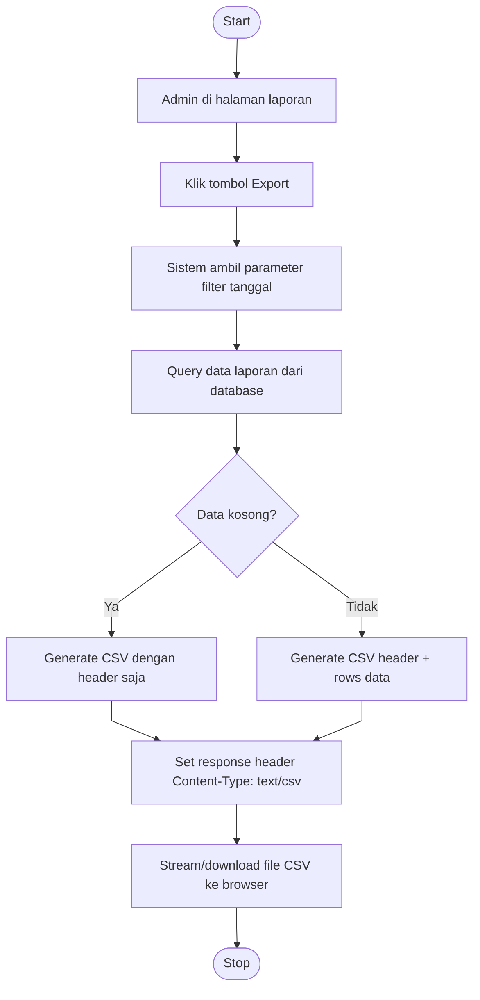

# Laporan

---

## 1. Use Case Diagram

### Keterangan Relasi

| Tipe | Use Case Utama | Target | Penjelasan |
|------|---------------|--------|------------|
| include | Semua laporan detail | Filter Periode | Wajib filter tanggal mulai & selesai |
| extend | Export CSV | Semua laporan | Opsional, jika admin klik tombol export |

---

## 2. Sequence Diagram — Lihat Laporan Penjualan

---

## 3. Sequence Diagram — Export Laporan CSV

---

## 4. Activity Diagram — Lihat Laporan

---

## 5. Activity Diagram — Export CSV

---

## Catatan

- Laporan **hanya bisa diakses Admin**
- Jenis laporan yang tersedia:
  - **Ringkasan**: overview total transaksi, penjualan, modal, laba
  - **Penjualan**: detail per transaksi dalam periode
  - **Laba**: laba per transaksi/per hari
  - **Barang Terlaris**: ranking barang berdasarkan qty terjual
  - **Restock**: riwayat stok masuk/keluar dalam periode
- Export tersedia untuk **semua jenis laporan** dalam format CSV
- Filter periode menggunakan `tanggal_mulai` dan `tanggal_selesai`
