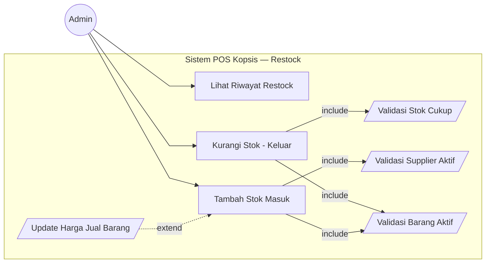
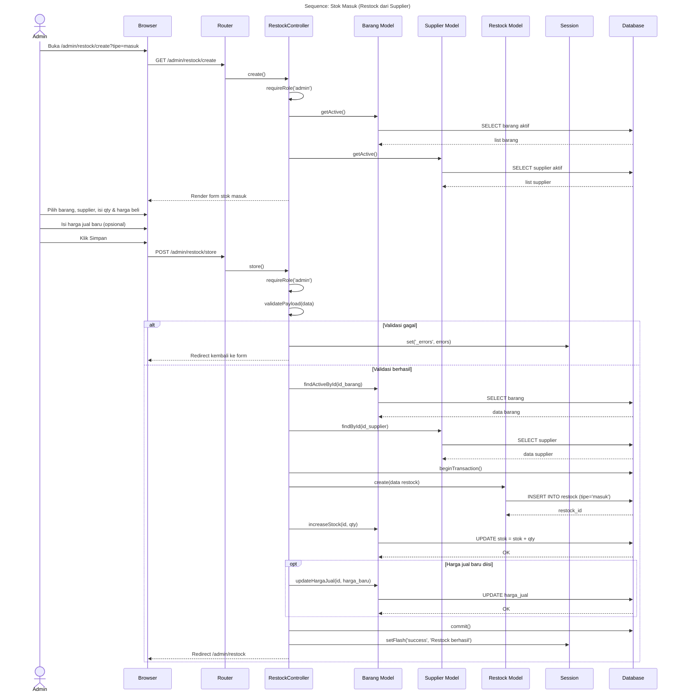
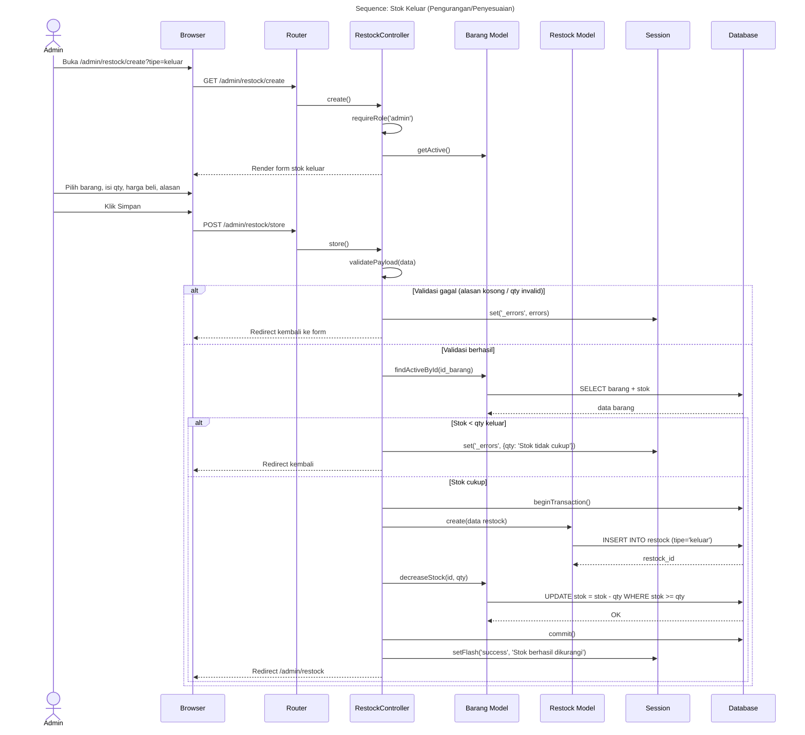
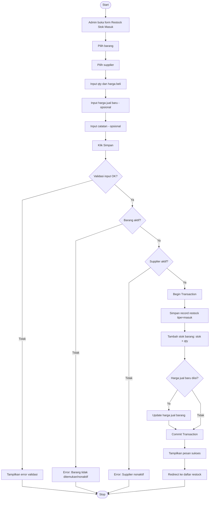
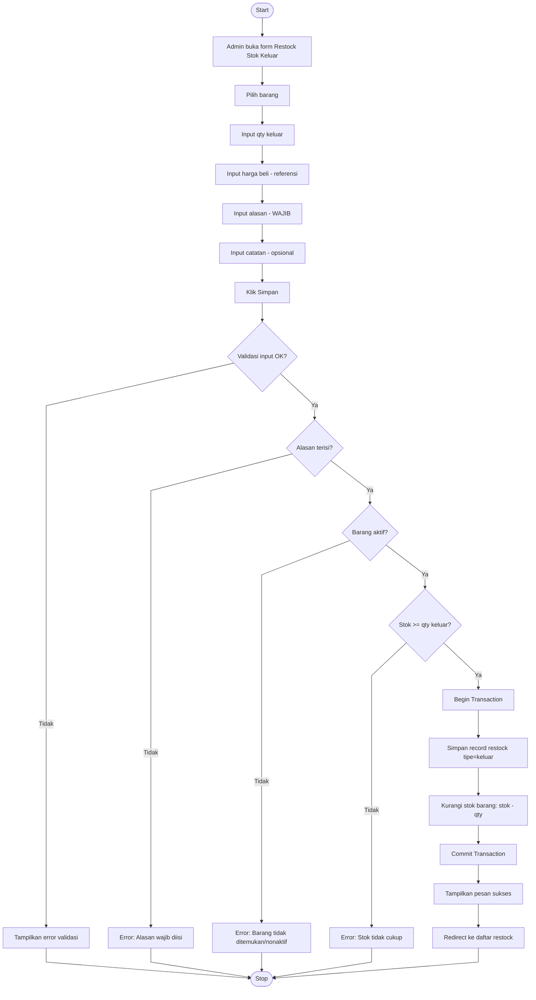

# Restock — Stok Masuk & Stok Keluar

---

## 1. Use Case Diagram

### Keterangan Relasi

| Tipe | Use Case Utama | Target | Penjelasan |
|------|---------------|--------|------------|
| include | Stok Masuk | Validasi Barang Aktif | Wajib cek barang aktif |
| include | Stok Masuk | Validasi Supplier Aktif | Wajib cek supplier aktif |
| include | Stok Keluar | Validasi Barang Aktif | Wajib cek barang aktif |
| include | Stok Keluar | Validasi Stok Cukup | Stok harus >= qty keluar |
| extend | Update Harga Jual | Stok Masuk | Opsional, hanya jika admin isi harga jual baru |

---

## 2. Sequence Diagram — Stok Masuk

---

## 3. Sequence Diagram — Stok Keluar

---

## 4. Activity Diagram — Stok Masuk

---

## 5. Activity Diagram — Stok Keluar

---

## Catatan

- **Stok Masuk**: Supplier wajib dipilih, harga jual baru opsional
- **Stok Keluar**: Supplier opsional, alasan WAJIB diisi
- Semua operasi stok menggunakan **database transaction** untuk menjamin konsistensi
- Field `total_nilai` dihitung otomatis = `qty × harga_beli`
