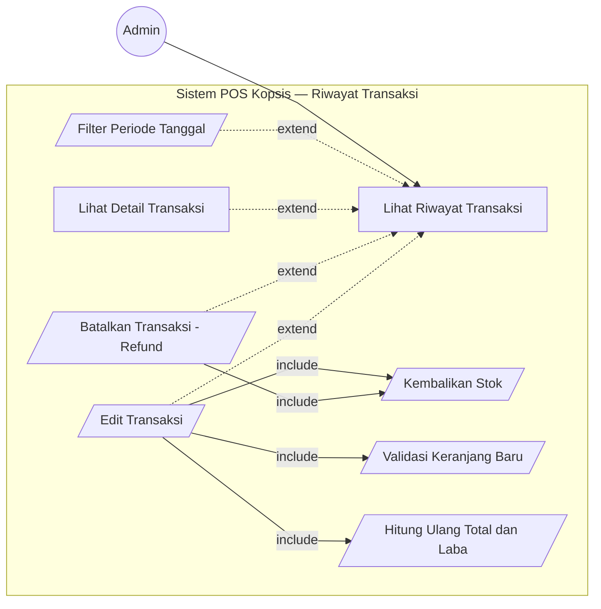
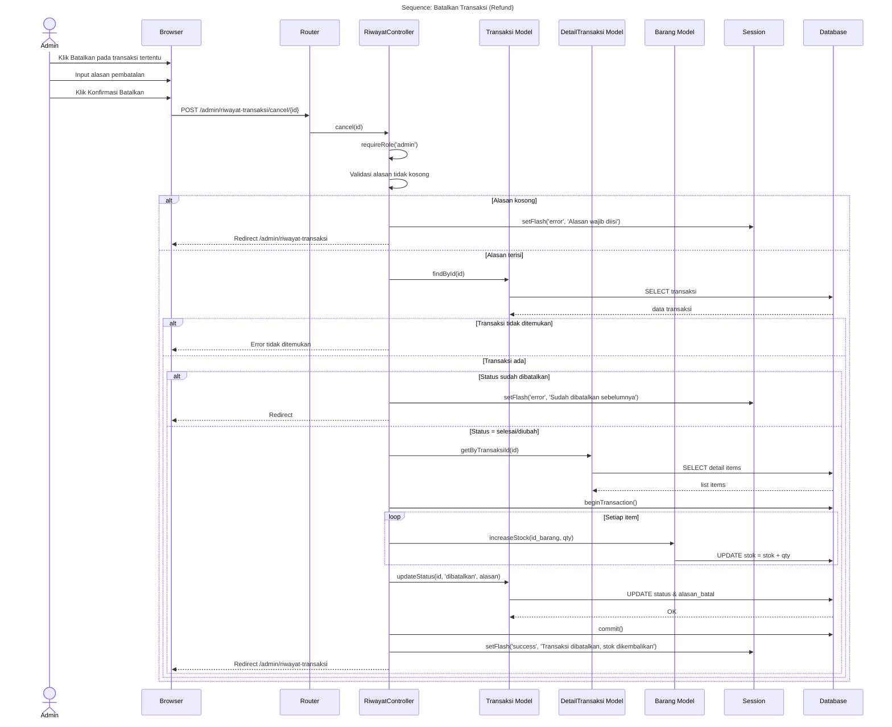
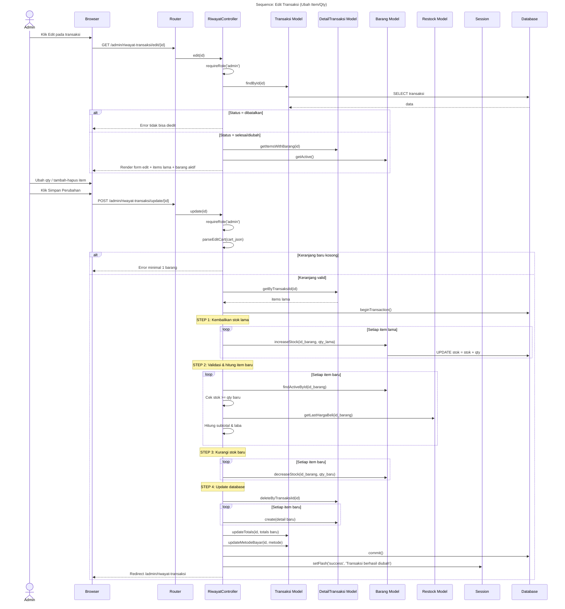
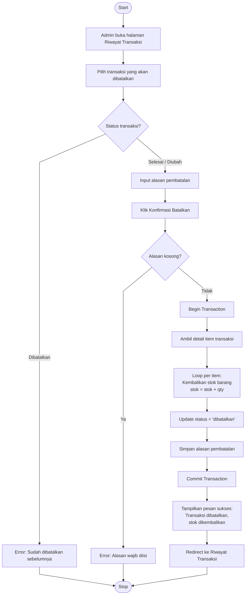
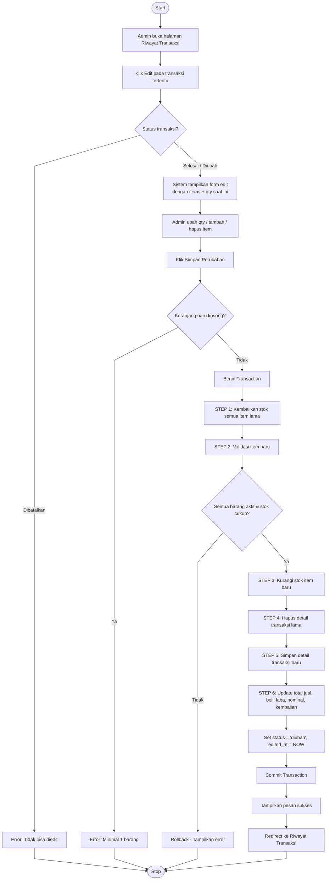

# Riwayat Transaksi — Refund & Edit Transaksi

---

## 1. Use Case Diagram

### Keterangan Relasi

| Tipe | Use Case Utama | Target | Penjelasan |
|------|---------------|--------|------------|
| include | Batalkan Transaksi | Kembalikan Stok | Stok otomatis dikembalikan saat refund |
| include | Edit Transaksi | Kembalikan Stok | Stok lama dikembalikan dulu |
| include | Edit Transaksi | Validasi Keranjang Baru | Keranjang edit harus valid |
| include | Edit Transaksi | Hitung Ulang Total dan Laba | Recalculate dari DB |
| extend | Edit Transaksi | Riwayat | Opsional, hanya jika status = selesai |
| extend | Batalkan Transaksi | Riwayat | Opsional, hanya jika status = selesai |
| extend | Detail | Riwayat | Opsional, klik untuk detail |
| extend | Filter Periode | Riwayat | Opsional filter tanggal |

---

## 2. Sequence Diagram — Batalkan Transaksi (Refund)

---

## 3. Sequence Diagram — Edit Transaksi

---

## 4. Activity Diagram — Batalkan Transaksi (Refund)

---

## 5. Activity Diagram — Edit Transaksi

---

## Catatan

- **Hanya Admin** yang bisa melihat riwayat, edit, dan batalkan transaksi
- **Pembatalan (Refund)**:
  - Wajib input alasan
  - Stok otomatis dikembalikan ke semua barang terkait
  - Transaksi yang sudah dibatalkan tidak bisa dibatalkan lagi
- **Edit Transaksi**:
  - Stok lama dikembalikan dulu, baru stok baru dikurangi
  - Harga dihitung ulang dari database (bukan input manual)
  - Status berubah jadi `diubah`, field `edited_at` ter-set
  - Transaksi yang sudah dibatalkan tidak bisa diedit
- Semua operasi menggunakan **database transaction** (atomik)
