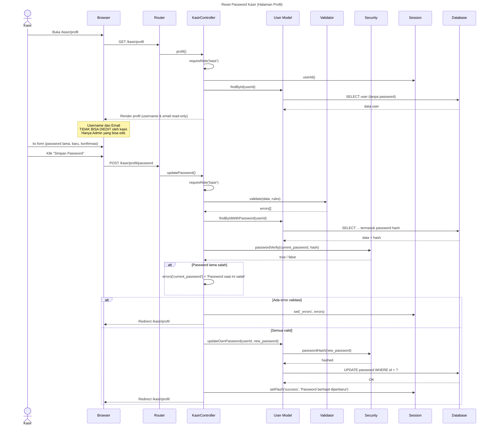

# Sequence Diagram - Reset Password Kasir (Halaman Profil)

```mermaid
sequenceDiagram
    title Reset Password Kasir (Halaman Profil)

    actor Kasir
    participant Browser
    participant Router
    participant KasirCtrl as KasirController
    participant UserModel as User Model
    participant Validator
    participant Security
    participant Session
    participant DB as Database

    %% === Lihat Profil ===
    Kasir->>Browser: Buka /kasir/profil
    Browser->>Router: GET /kasir/profil
    Router->>KasirCtrl: profil()
    KasirCtrl->>KasirCtrl: requireRole('kasir')
    KasirCtrl->>Session: userId()
    KasirCtrl->>UserModel: findById(userId)
    UserModel->>DB: SELECT user (tanpa password)
    DB-->>UserModel: data user
    KasirCtrl-->>Browser: Render profil (username & email read-only)

    Note over Browser: Username dan Email<br/>TIDAK BISA DIEDIT oleh kasir.<br/>Hanya Admin yang bisa edit.

    %% === Reset Password ===
    Kasir->>Browser: Isi form (password lama, baru, konfirmasi)
    Kasir->>Browser: Klik "Simpan Password"

    Browser->>Router: POST /kasir/profil/password
    Router->>KasirCtrl: updatePassword()
    KasirCtrl->>KasirCtrl: requireRole('kasir')

    KasirCtrl->>Validator: validate(data, rules)
    Validator-->>KasirCtrl: errors[]

    KasirCtrl->>UserModel: findByIdWithPassword(userId)
    UserModel->>DB: SELECT ... termasuk password hash
    DB-->>UserModel: data + hash

    KasirCtrl->>Security: passwordVerify(current_password, hash)
    Security-->>KasirCtrl: true / false

    alt Password lama salah
        KasirCtrl->>KasirCtrl: errors['current_password'] = 'Password saat ini salah'
    end

    alt Ada error validasi
        KasirCtrl->>Session: set('_errors', errors)
        KasirCtrl-->>Browser: Redirect /kasir/profil
    else Semua valid
        KasirCtrl->>UserModel: updateOwnPassword(userId, new_password)
        UserModel->>Security: passwordHash(new_password)
        Security-->>UserModel: hashed
        UserModel->>DB: UPDATE password WHERE id = ?
        DB-->>UserModel: OK

        KasirCtrl->>Session: setFlash('success', 'Password berhasil diperbarui')
        KasirCtrl-->>Browser: Redirect /kasir/profil
    end
```
