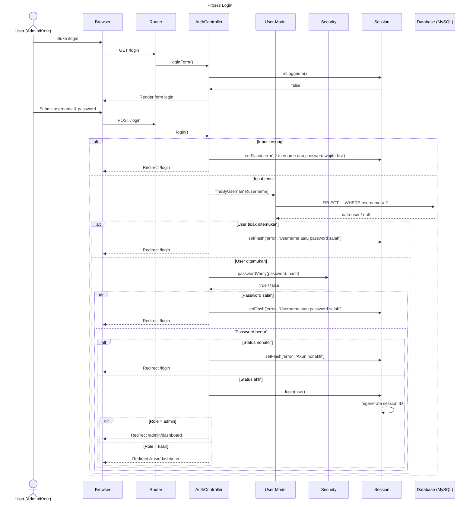

# Sequence Diagram - Proses Login

```mermaid
sequenceDiagram
    title Proses Login

    actor User as User (Admin/Kasir)
    participant Browser
    participant Router
    participant AuthController as AuthController
    participant UserModel as User Model
    participant Security
    participant Session
    participant DB as Database (MySQL)

    %% === Tampilkan Form ===
    User->>Browser: Buka /login
    Browser->>Router: GET /login
    Router->>AuthController: loginForm()
    AuthController->>Session: isLoggedIn()
    Session-->>AuthController: false
    AuthController-->>Browser: Render form login

    %% === Submit Login ===
    User->>Browser: Submit username & password
    Browser->>Router: POST /login
    Router->>AuthController: login()

    alt Input kosong
        AuthController->>Session: setFlash('error', 'Username dan password wajib diisi')
        AuthController-->>Browser: Redirect /login
    else Input terisi
        AuthController->>UserModel: findByUsername(username)
        UserModel->>DB: SELECT ... WHERE username = ?
        DB-->>UserModel: data user / null

        alt User tidak ditemukan
            AuthController->>Session: setFlash('error', 'Username atau password salah')
            AuthController-->>Browser: Redirect /login
        else User ditemukan
            AuthController->>Security: passwordVerify(password, hash)
            Security-->>AuthController: true / false

            alt Password salah
                AuthController->>Session: setFlash('error', 'Username atau password salah')
                AuthController-->>Browser: Redirect /login
            else Password benar
                alt Status nonaktif
                    AuthController->>Session: setFlash('error', 'Akun nonaktif')
                    AuthController-->>Browser: Redirect /login
                else Status aktif
                    AuthController->>Session: login(user)
                    Session->>Session: regenerate session ID

                    alt Role = admin
                        AuthController-->>Browser: Redirect /admin/dashboard
                    else Role = kasir
                        AuthController-->>Browser: Redirect /kasir/dashboard
                    end
                end
            end
        end
    end
```
