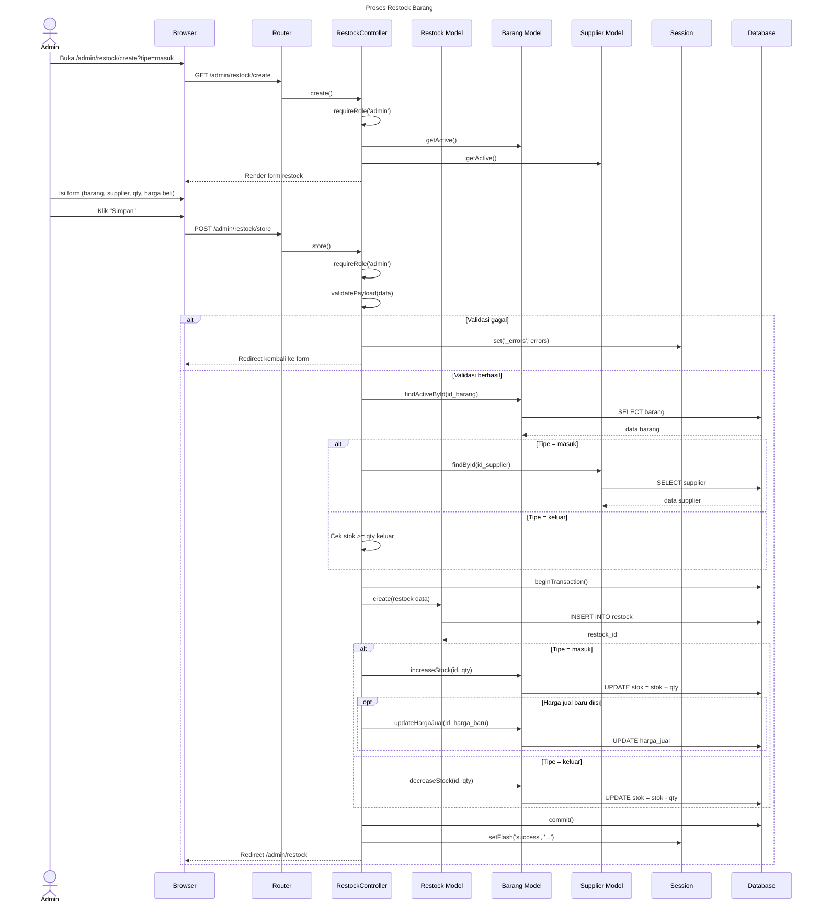

# Sequence Diagram - Proses Restock (Stok Masuk/Keluar)

```mermaid
sequenceDiagram
    title Proses Restock Barang

    actor Admin
    participant Browser
    participant Router
    participant RstCtrl as RestockController
    participant RstModel as Restock Model
    participant BrgModel as Barang Model
    participant SupModel as Supplier Model
    participant Session
    participant DB as Database

    %% === Form Restock ===
    Admin->>Browser: Buka /admin/restock/create?tipe=masuk
    Browser->>Router: GET /admin/restock/create
    Router->>RstCtrl: create()
    RstCtrl->>RstCtrl: requireRole('admin')
    RstCtrl->>BrgModel: getActive()
    RstCtrl->>SupModel: getActive()
    RstCtrl-->>Browser: Render form restock

    %% === Proses Simpan ===
    Admin->>Browser: Isi form (barang, supplier, qty, harga beli)
    Admin->>Browser: Klik "Simpan"

    Browser->>Router: POST /admin/restock/store
    Router->>RstCtrl: store()
    RstCtrl->>RstCtrl: requireRole('admin')
    RstCtrl->>RstCtrl: validatePayload(data)

    alt Validasi gagal
        RstCtrl->>Session: set('_errors', errors)
        RstCtrl-->>Browser: Redirect kembali ke form
    else Validasi berhasil
        RstCtrl->>BrgModel: findActiveById(id_barang)
        BrgModel->>DB: SELECT barang
        DB-->>BrgModel: data barang

        alt Tipe = masuk
            RstCtrl->>SupModel: findById(id_supplier)
            SupModel->>DB: SELECT supplier
            DB-->>SupModel: data supplier
        else Tipe = keluar
            RstCtrl->>RstCtrl: Cek stok >= qty keluar
        end

        RstCtrl->>DB: beginTransaction()

        RstCtrl->>RstModel: create(restock data)
        RstModel->>DB: INSERT INTO restock
        DB-->>RstModel: restock_id

        alt Tipe = masuk
            RstCtrl->>BrgModel: increaseStock(id, qty)
            BrgModel->>DB: UPDATE stok = stok + qty

            opt Harga jual baru diisi
                RstCtrl->>BrgModel: updateHargaJual(id, harga_baru)
                BrgModel->>DB: UPDATE harga_jual
            end
        else Tipe = keluar
            RstCtrl->>BrgModel: decreaseStock(id, qty)
            BrgModel->>DB: UPDATE stok = stok - qty
        end

        RstCtrl->>DB: commit()
        RstCtrl->>Session: setFlash('success', '...')
        RstCtrl-->>Browser: Redirect /admin/restock
    end
```
