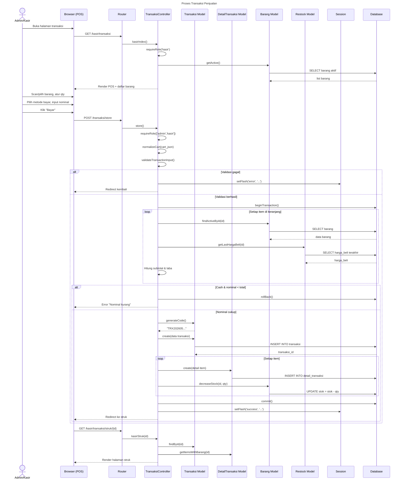

# Sequence Diagram - Proses Transaksi Penjualan (POS)

```mermaid
sequenceDiagram
    title Proses Transaksi Penjualan

    actor User as Admin/Kasir
    participant Browser as Browser (POS)
    participant Router
    participant TrxCtrl as TransaksiController
    participant TrxModel as Transaksi Model
    participant DetModel as DetailTransaksi Model
    participant BrgModel as Barang Model
    participant RstModel as Restock Model
    participant Session
    participant DB as Database

    %% === Halaman POS ===
    User->>Browser: Buka halaman transaksi
    Browser->>Router: GET /kasir/transaksi
    Router->>TrxCtrl: kasirIndex()
    TrxCtrl->>TrxCtrl: requireRole('kasir')
    TrxCtrl->>BrgModel: getActive()
    BrgModel->>DB: SELECT barang aktif
    DB-->>BrgModel: list barang
    TrxCtrl-->>Browser: Render POS + daftar barang

    %% === Checkout ===
    User->>Browser: Scan/pilih barang, atur qty
    User->>Browser: Pilih metode bayar, input nominal
    User->>Browser: Klik "Bayar"

    Browser->>Router: POST /transaksi/store
    Router->>TrxCtrl: store()
    TrxCtrl->>TrxCtrl: requireRole(['admin','kasir'])
    TrxCtrl->>TrxCtrl: normalizeCart(cart_json)
    TrxCtrl->>TrxCtrl: validateTransactionInput()

    alt Validasi gagal
        TrxCtrl->>Session: setFlash('error', '...')
        TrxCtrl-->>Browser: Redirect kembali
    else Validasi berhasil
        TrxCtrl->>DB: beginTransaction()

        loop Setiap item di keranjang
            TrxCtrl->>BrgModel: findActiveById(id)
            BrgModel->>DB: SELECT barang
            DB-->>BrgModel: data barang
            TrxCtrl->>RstModel: getLastHargaBeli(id)
            RstModel->>DB: SELECT harga_beli terakhir
            DB-->>RstModel: harga_beli
            TrxCtrl->>TrxCtrl: Hitung subtotal & laba
        end

        alt Cash & nominal < total
            TrxCtrl->>DB: rollBack()
            TrxCtrl-->>Browser: Error "Nominal kurang"
        else Nominal cukup
            TrxCtrl->>TrxModel: generateCode()
            TrxModel-->>TrxCtrl: "TRX202605..."
            TrxCtrl->>TrxModel: create(data transaksi)
            TrxModel->>DB: INSERT INTO transaksi
            DB-->>TrxModel: transaksi_id

            loop Setiap item
                TrxCtrl->>DetModel: create(detail item)
                DetModel->>DB: INSERT INTO detail_transaksi
                TrxCtrl->>BrgModel: decreaseStock(id, qty)
                BrgModel->>DB: UPDATE stok = stok - qty
            end

            TrxCtrl->>DB: commit()
            TrxCtrl->>Session: setFlash('success', '...')
            TrxCtrl-->>Browser: Redirect ke struk
        end
    end

    %% === Struk ===
    Browser->>Router: GET /kasir/transaksi/struk/{id}
    Router->>TrxCtrl: kasirStruk(id)
    TrxCtrl->>TrxModel: findById(id)
    TrxCtrl->>DetModel: getItemsWithBarang(id)
    TrxCtrl-->>Browser: Render halaman struk
```
