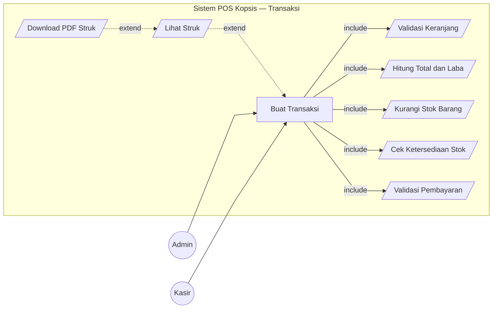
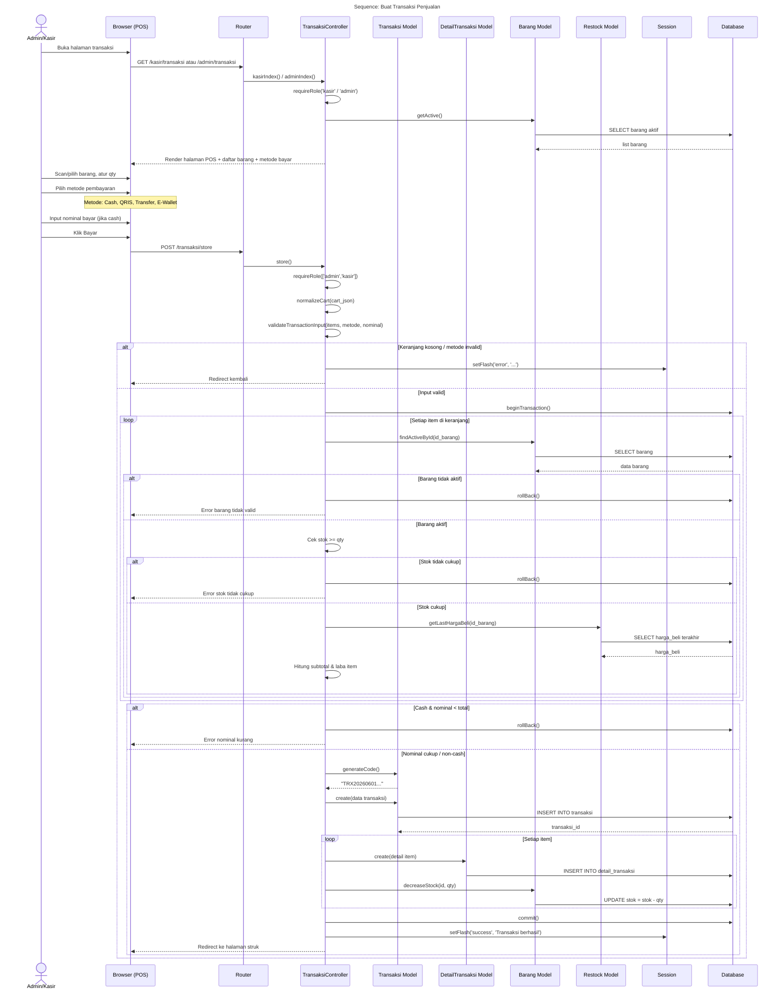
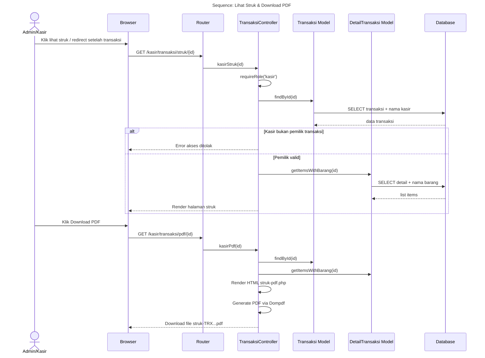
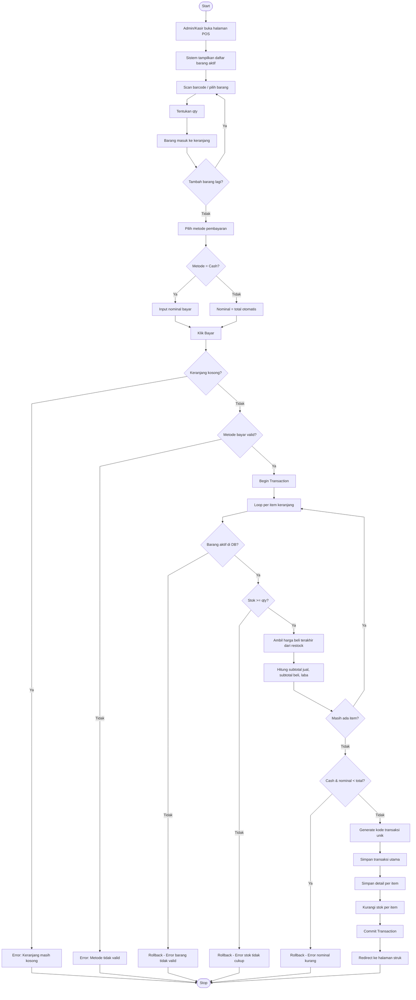

# Transaksi Penjualan (POS)

---

## 1. Use Case Diagram

### Keterangan Relasi

| Tipe | Use Case Utama | Target | Penjelasan |
|------|---------------|--------|------------|
| include | Buat Transaksi | Validasi Keranjang | Keranjang tidak boleh kosong |
| include | Buat Transaksi | Cek Ketersediaan Stok | Stok harus >= qty tiap item |
| include | Buat Transaksi | Hitung Total dan Laba | Hitung dari harga DB, bukan dari input |
| include | Buat Transaksi | Validasi Pembayaran | Cek metode valid & nominal cukup (cash) |
| include | Buat Transaksi | Kurangi Stok Barang | Stok dikurangi setelah transaksi valid |
| extend | Lihat Struk | Buat Transaksi | Opsional setelah transaksi berhasil |
| extend | Download PDF | Lihat Struk | Opsional jika user klik download |

---

## 2. Sequence Diagram — Buat Transaksi

---

## 3. Sequence Diagram — Lihat & Download Struk

---

## 4. Activity Diagram — Buat Transaksi

---

## Catatan

- **Kedua role** (Admin & Kasir) bisa membuat transaksi
- Harga dihitung ulang dari **database** (bukan dari input user) untuk keamanan
- Harga beli diambil dari **restock terakhir** untuk perhitungan laba
- Metode pembayaran: `cash`, `qris`, `transfer`, `ewallet`
- Kasir hanya bisa lihat struk transaksi **miliknya sendiri**
- Admin bisa lihat struk **semua transaksi**
- Semua operasi dalam **1 database transaction** (atomik)
