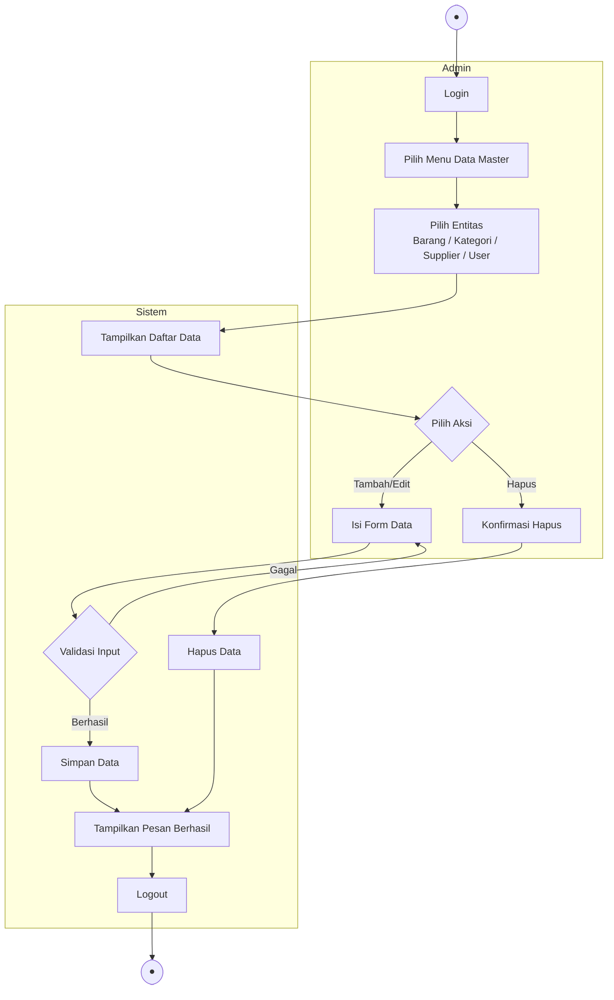

# Activity Diagram: Data Master

> Mencakup: Barang, Kategori, Supplier, User

```mermaid
flowchart TD
    Start([●]) --> Login

    subgraph Admin
        Login[Login]
        PilihMenu[Pilih Menu Data Master]
        PilihEntitas[Pilih Entitas\nBarang / Kategori / Supplier / User]
        PilihAksi{Pilih Aksi}
        IsiForm[Isi Form Data]
        Konfirmasi[Konfirmasi Hapus]
    end

    subgraph Sistem
        TampilList[Tampilkan Daftar Data]
        ValidasiInput{Validasi Input}
        SimpanData[Simpan Data]
        TampilPesan[Tampilkan Pesan Berhasil]
        HapusData[Hapus Data]
        Logout[Logout]
    end

    Login --> PilihMenu
    PilihMenu --> PilihEntitas
    PilihEntitas --> TampilList
    TampilList --> PilihAksi

    PilihAksi -- Tambah/Edit --> IsiForm
    IsiForm --> ValidasiInput
    ValidasiInput -- Gagal --> IsiForm
    ValidasiInput -- Berhasil --> SimpanData
    SimpanData --> TampilPesan

    PilihAksi -- Hapus --> Konfirmasi
    Konfirmasi --> HapusData
    HapusData --> TampilPesan

    TampilPesan --> Logout
    Logout --> End([●])
```
