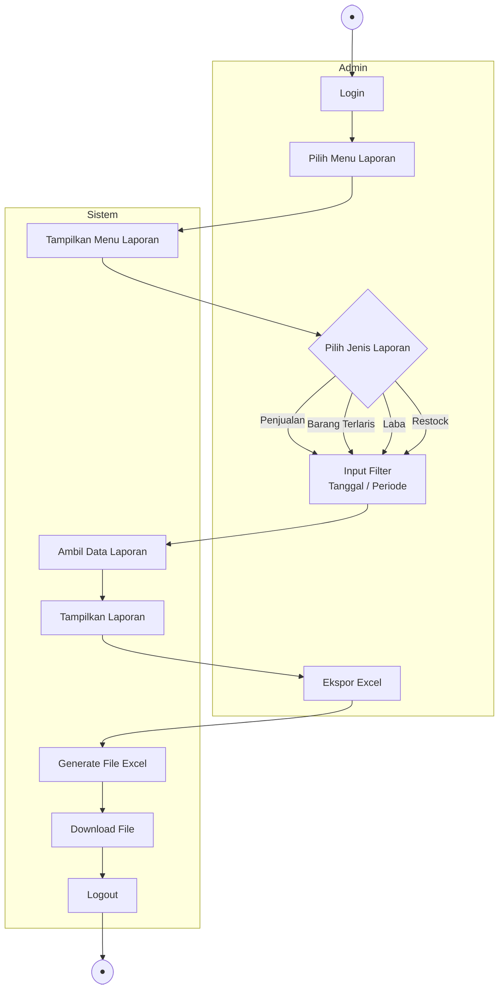

# Activity Diagram: Laporan

```mermaid
flowchart TD
    Start([●]) --> Login

    subgraph Admin
        Login[Login]
        PilihMenu[Pilih Menu Laporan]
        PilihJenis{Pilih Jenis Laporan}
        InputFilter[Input Filter\nTanggal / Periode]
        PilihEkspor[Ekspor Excel]
    end

    subgraph Sistem
        TampilMenu[Tampilkan Menu Laporan]
        ProsesFetch[Ambil Data Laporan]
        TampilLaporan[Tampilkan Laporan]
        GenerateExcel[Generate File Excel]
        DownloadFile[Download File]
        Logout[Logout]
    end

    Login --> PilihMenu
    PilihMenu --> TampilMenu
    TampilMenu --> PilihJenis

    PilihJenis -- Penjualan --> InputFilter
    PilihJenis -- Barang Terlaris --> InputFilter
    PilihJenis -- Laba --> InputFilter
    PilihJenis -- Restock --> InputFilter

    InputFilter --> ProsesFetch
    ProsesFetch --> TampilLaporan
    TampilLaporan --> PilihEkspor
    PilihEkspor --> GenerateExcel
    GenerateExcel --> DownloadFile
    DownloadFile --> Logout
    Logout --> End([●])
```
