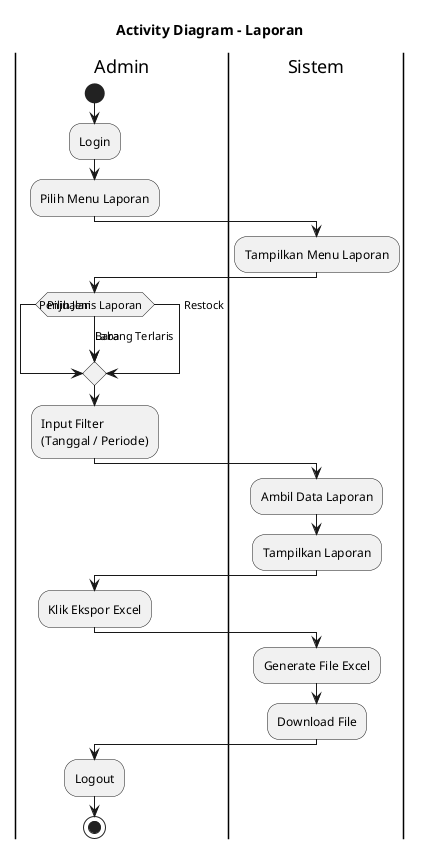

# Activity Diagram: Laporan

```plantuml
@startuml
title Activity Diagram - Laporan

|Admin|
start
:Login;
:Pilih Menu Laporan;

|Sistem|
:Tampilkan Menu Laporan;

|Admin|
switch (Pilih Jenis Laporan)
case (Penjualan)
case (Barang Terlaris)
case (Laba)
case (Restock)
endswitch
:Input Filter\n(Tanggal / Periode);

|Sistem|
:Ambil Data Laporan;
:Tampilkan Laporan;

|Admin|
:Klik Ekspor Excel;

|Sistem|
:Generate File Excel;
:Download File;

|Admin|
:Logout;
stop
@enduml
```
