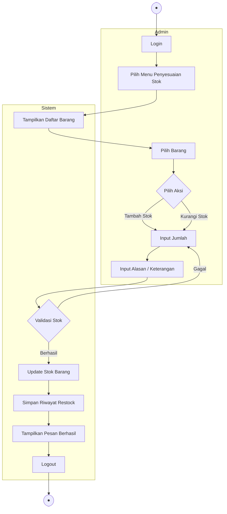

# Activity Diagram: Penyesuaian Stok

```mermaid
flowchart TD
    Start([●]) --> Login

    subgraph Admin
        Login[Login]
        PilihMenu[Pilih Menu Penyesuaian Stok]
        PilihBarang[Pilih Barang]
        PilihAksi{Pilih Aksi}
        InputJumlah[Input Jumlah]
        InputAlasan[Input Alasan / Keterangan]
    end

    subgraph Sistem
        TampilDaftar[Tampilkan Daftar Barang]
        ValidasiStok{Validasi Stok}
        UpdateStok[Update Stok Barang]
        SimpanRiwayat[Simpan Riwayat Restock]
        TampilPesan[Tampilkan Pesan Berhasil]
        Logout[Logout]
    end

    Login --> PilihMenu
    PilihMenu --> TampilDaftar
    TampilDaftar --> PilihBarang
    PilihBarang --> PilihAksi

    PilihAksi -- Tambah Stok --> InputJumlah
    PilihAksi -- Kurangi Stok --> InputJumlah

    InputJumlah --> InputAlasan
    InputAlasan --> ValidasiStok
    ValidasiStok -- Gagal --> InputJumlah
    ValidasiStok -- Berhasil --> UpdateStok
    UpdateStok --> SimpanRiwayat
    SimpanRiwayat --> TampilPesan
    TampilPesan --> Logout
    Logout --> End([●])
```
