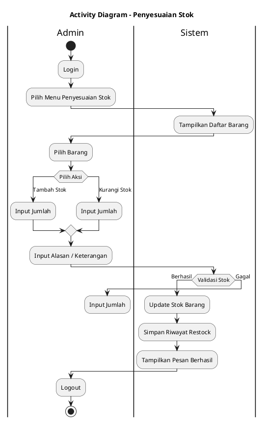

# Activity Diagram: Penyesuaian Stok

```plantuml
@startuml
title Activity Diagram - Penyesuaian Stok

|Admin|
start
:Login;
:Pilih Menu Penyesuaian Stok;

|Sistem|
:Tampilkan Daftar Barang;

|Admin|
:Pilih Barang;
switch (Pilih Aksi)
case (Tambah Stok)
  :Input Jumlah;
case (Kurangi Stok)
  :Input Jumlah;
endswitch
:Input Alasan / Keterangan;

|Sistem|
if (Validasi Stok) then (Berhasil)
  :Update Stok Barang;
  :Simpan Riwayat Restock;
  :Tampilkan Pesan Berhasil;
else (Gagal)
  |Admin|
  :Input Jumlah;
  detach
endif

|Admin|
:Logout;
stop
@enduml
```
