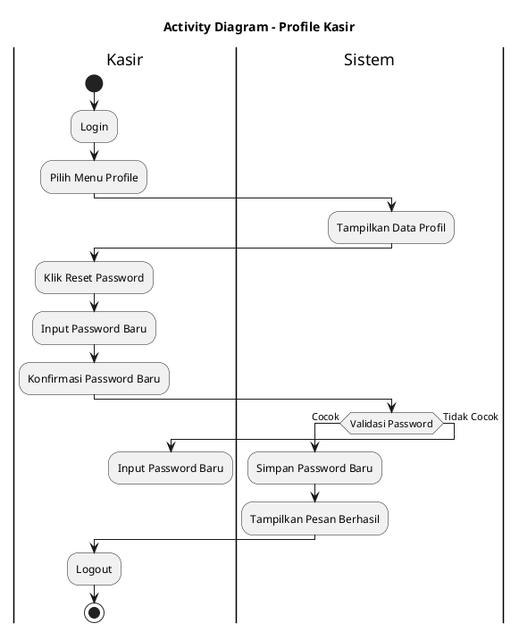

# Activity Diagram: Profile Kasir

```plantuml
@startuml
title Activity Diagram - Profile Kasir

|Kasir|
start
:Login;
:Pilih Menu Profile;

|Sistem|
:Tampilkan Data Profil;

|Kasir|
:Klik Reset Password;
:Input Password Baru;
:Konfirmasi Password Baru;

|Sistem|
if (Validasi Password) then (Cocok)
  :Simpan Password Baru;
  :Tampilkan Pesan Berhasil;
else (Tidak Cocok)
  |Kasir|
  :Input Password Baru;
  detach
endif

|Kasir|
:Logout;
stop
@enduml
```
