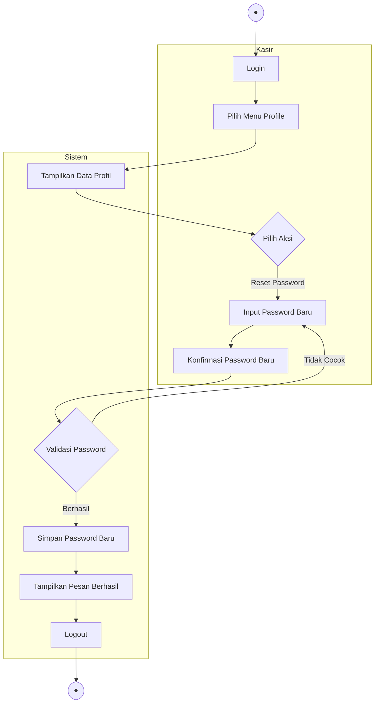

# Activity Diagram: Profile Kasir

```mermaid
flowchart TD
    Start([●]) --> Login

    subgraph Kasir
        Login[Login]
        PilihMenu[Pilih Menu Profile]
        PilihAksi{Pilih Aksi}
        InputPassword[Input Password Baru]
        KonfirmasiPassword[Konfirmasi Password Baru]
    end

    subgraph Sistem
        TampilProfil[Tampilkan Data Profil]
        ValidasiPassword{Validasi Password}
        SimpanPassword[Simpan Password Baru]
        TampilPesan[Tampilkan Pesan Berhasil]
        Logout[Logout]
    end

    Login --> PilihMenu
    PilihMenu --> TampilProfil
    TampilProfil --> PilihAksi

    PilihAksi -- Reset Password --> InputPassword
    InputPassword --> KonfirmasiPassword
    KonfirmasiPassword --> ValidasiPassword
    ValidasiPassword -- Tidak Cocok --> InputPassword
    ValidasiPassword -- Berhasil --> SimpanPassword
    SimpanPassword --> TampilPesan
    TampilPesan --> Logout
    Logout --> End([●])
```
