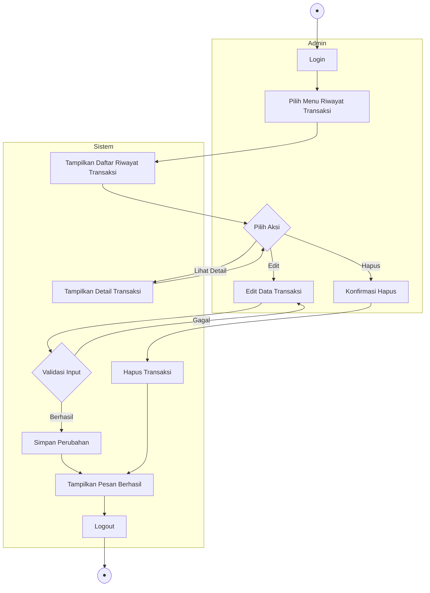

# Activity Diagram: Riwayat Transaksi

```mermaid
flowchart TD
    Start([●]) --> Login

    subgraph Admin
        Login[Login]
        PilihMenu[Pilih Menu Riwayat Transaksi]
        PilihAksi{Pilih Aksi}
        EditData[Edit Data Transaksi]
        Konfirmasi[Konfirmasi Hapus]
    end

    subgraph Sistem
        TampilRiwayat[Tampilkan Daftar Riwayat Transaksi]
        TampilDetail[Tampilkan Detail Transaksi]
        ValidasiEdit{Validasi Input}
        SimpanEdit[Simpan Perubahan]
        HapusTransaksi[Hapus Transaksi]
        TampilPesan[Tampilkan Pesan Berhasil]
        Logout[Logout]
    end

    Login --> PilihMenu
    PilihMenu --> TampilRiwayat
    TampilRiwayat --> PilihAksi

    PilihAksi -- Lihat Detail --> TampilDetail
    TampilDetail --> PilihAksi

    PilihAksi -- Edit --> EditData
    EditData --> ValidasiEdit
    ValidasiEdit -- Gagal --> EditData
    ValidasiEdit -- Berhasil --> SimpanEdit
    SimpanEdit --> TampilPesan

    PilihAksi -- Hapus --> Konfirmasi
    Konfirmasi --> HapusTransaksi
    HapusTransaksi --> TampilPesan

    TampilPesan --> Logout
    Logout --> End([●])
```
