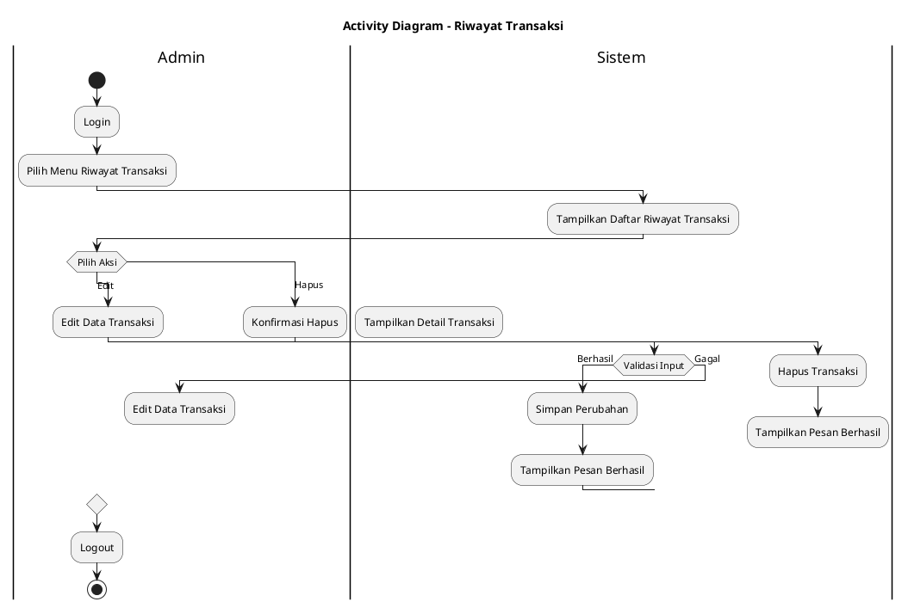

# Activity Diagram: Riwayat Transaksi

```plantuml
@startuml
title Activity Diagram - Riwayat Transaksi

|Admin|
start
:Login;
:Pilih Menu Riwayat Transaksi;

|Sistem|
:Tampilkan Daftar Riwayat Transaksi;

|Admin|
switch (Pilih Aksi)
case (Lihat Detail)
  |Sistem|
  :Tampilkan Detail Transaksi;
case (Edit)
  |Admin|
  :Edit Data Transaksi;
  |Sistem|
  if (Validasi Input) then (Berhasil)
    :Simpan Perubahan;
    :Tampilkan Pesan Berhasil;
  else (Gagal)
    |Admin|
    :Edit Data Transaksi;
    detach
  endif
case (Hapus)
  |Admin|
  :Konfirmasi Hapus;
  |Sistem|
  :Hapus Transaksi;
  :Tampilkan Pesan Berhasil;
endswitch

|Admin|
:Logout;
stop
@enduml
```
