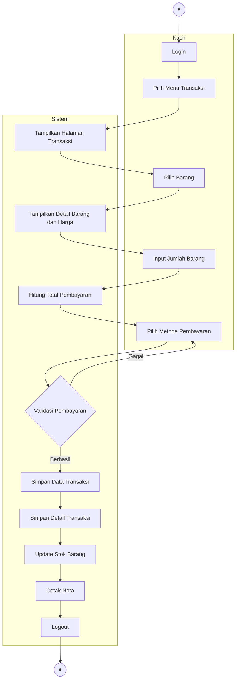

# Activity Diagram: Transaksi

```mermaid
flowchart TD
    Start([●]) --> Login

    subgraph Kasir
        Login[Login]
        PilihMenu[Pilih Menu Transaksi]
        PilihBarang[Pilih Barang]
        InputJumlah[Input Jumlah Barang]
        PilihMetode[Pilih Metode Pembayaran]
    end

    subgraph Sistem
        TampilHalaman[Tampilkan Halaman Transaksi]
        TampilDetail[Tampilkan Detail Barang dan Harga]
        HitungTotal[Hitung Total Pembayaran]
        Validasi{Validasi Pembayaran}
        SimpanTransaksi[Simpan Data Transaksi]
        SimpanDetail[Simpan Detail Transaksi]
        UpdateStok[Update Stok Barang]
        CetakNota[Cetak Nota]
        Logout[Logout]
    end

    Login --> PilihMenu
    PilihMenu --> TampilHalaman
    TampilHalaman --> PilihBarang
    PilihBarang --> TampilDetail
    TampilDetail --> InputJumlah
    InputJumlah --> HitungTotal
    HitungTotal --> PilihMetode
    PilihMetode --> Validasi
    Validasi -- Gagal --> PilihMetode
    Validasi -- Berhasil --> SimpanTransaksi
    SimpanTransaksi --> SimpanDetail
    SimpanDetail --> UpdateStok
    UpdateStok --> CetakNota
    CetakNota --> Logout
    Logout --> End([●])
```
