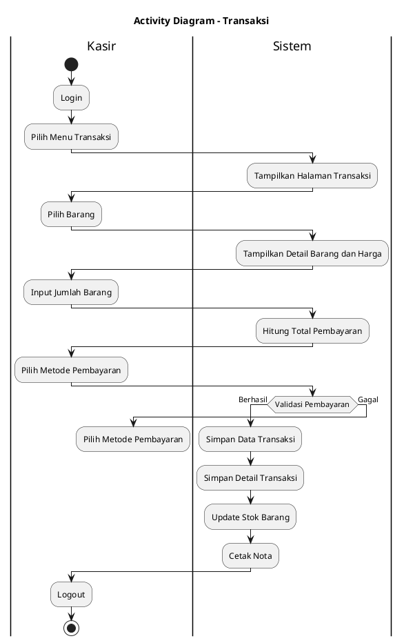

# Activity Diagram: Transaksi

```plantuml
@startuml
title Activity Diagram - Transaksi

|Kasir|
start
:Login;
:Pilih Menu Transaksi;

|Sistem|
:Tampilkan Halaman Transaksi;

|Kasir|
:Pilih Barang;

|Sistem|
:Tampilkan Detail Barang dan Harga;

|Kasir|
:Input Jumlah Barang;

|Sistem|
:Hitung Total Pembayaran;

|Kasir|
:Pilih Metode Pembayaran;

|Sistem|
if (Validasi Pembayaran) then (Berhasil)
  :Simpan Data Transaksi;
  :Simpan Detail Transaksi;
  :Update Stok Barang;
  :Cetak Nota;
else (Gagal)
  |Kasir|
  :Pilih Metode Pembayaran;
  detach
endif

|Kasir|
:Logout;
stop
@enduml
```
