# Class Diagram

> Scope: Core (parent class) + Models + Controllers utama. Method ditulis ringkas tanpa parameter detail biar gak penuh.

```plantuml
@startuml
title Class Diagram - Sistem POS Koperasi

skinparam linetype ortho
skinparam shadowing false
skinparam nodesep 20
skinparam ranksep 35
skinparam padding 2
skinparam classFontSize 11
skinparam classAttributeIconSize 0

' =====================================
' CORE
' =====================================
package "Core" {
    class Model {
        # db: PDO
        + db(): PDO
        # query()
        # fetchAll()
        # fetch()
        # execute()
        # transaction()
    }

    class Controller {
        # view(path, data)
        # model(name): Model
        # redirect(url)
        # requireLogin()
        # requireRole(roles)
    }

    class Router {
        + get(path, handler)
        + post(path, handler)
        + dispatch()
    }

    class Session {
        + {static} start()
        + {static} login(user)
        + {static} logout()
        + {static} user(): array
        + {static} isLoggedIn(): bool
    }
}

' =====================================
' MODELS
' =====================================
package "Models" {
    class User {
        + getAll()
        + findById(id)
        + findByUsername(u)
        + create(data)
        + update(id, data)
        + updatePassword(id, pass)
        + deleteOrDeactivate(id)
    }

    class Barang {
        + getAll()
        + getActive()
        + findById(id)
        + create(data)
        + update(id, data)
        + updateStok(id, qty)
        + deleteOrDeactivate(id)
    }

    class Kategori {
        + getAll()
        + findById(id)
        + create(data)
        + update(id, data)
        + deleteOrDeactivate(id)
    }

    class Supplier {
        + getAll()
        + findById(id)
        + create(data)
        + update(id, data)
        + deleteOrDeactivate(id)
    }

    class Transaksi {
        + getAllPaginated()
        + findById(id)
        + create(data)
        + updateStatus(id, status)
        + cancel(id, alasan)
        + getRecent(limit)
    }

    class DetailTransaksi {
        + create(data)
        + getByTransaksiId(id)
        + getItemsWithBarang(id)
        + deleteByTransaksiId(id)
    }

    class Restock {
        + getAll()
        + findById(id)
        + create(data)
        + getByPeriode(start, end)
    }

    class Laporan {
        + summary(start, end)
        + penjualanHarian(start, end)
        + barangTerlaris(start, end)
        + laba(start, end)
        + restock(start, end)
    }

    class Dashboard {
        + adminSummary()
        + kasirSummary(userId)
    }
}

' =====================================
' CONTROLLERS
' =====================================
package "Controllers" {
    class AuthController {
        + login()
        + authenticate()
        + logout()
    }

    class AdminController {
        + dashboard()
    }

    class KasirController {
        + dashboard()
        + profil()
        + updatePassword()
    }

    class BarangController {
        + index()
        + create()
        + store()
        + edit(id)
        + update(id)
        + destroy(id)
        + label(id)
    }

    class KategoriController {
        + index()
        + create()
        + store()
        + edit(id)
        + update(id)
        + destroy(id)
    }

    class SupplierController {
        + index()
        + create()
        + store()
        + edit(id)
        + update(id)
        + destroy(id)
    }

    class UserController {
        + index()
        + create()
        + store()
        + edit(id)
        + update(id)
        + resetPassword(id)
        + destroy(id)
    }

    class TransaksiController {
        + pos()
        + checkout()
        + struk(id)
    }

    class RestockController {
        + index()
        + create()
        + store()
    }

    class LaporanController {
        + index()
        + penjualan()
        + barangTerlaris()
        + laba()
        + restock()
        + exportExcel()
    }

    class RiwayatController {
        + adminIndex()
        + adminDetail(id)
        + edit(id)
        + update(id)
        + cancel(id)
    }
}

' =====================================
' INHERITANCE: semua Models extends Model
' =====================================
Model <|-- User
Model <|-- Barang
Model <|-- Kategori
Model <|-- Supplier
Model <|-- Transaksi
Model <|-- DetailTransaksi
Model <|-- Restock
Model <|-- Laporan
Model <|-- Dashboard

' =====================================
' INHERITANCE: semua Controllers extends Controller
' =====================================
Controller <|-- AuthController
Controller <|-- AdminController
Controller <|-- KasirController
Controller <|-- BarangController
Controller <|-- KategoriController
Controller <|-- SupplierController
Controller <|-- UserController
Controller <|-- TransaksiController
Controller <|-- RestockController
Controller <|-- LaporanController
Controller <|-- RiwayatController

' =====================================
' DEPENDENCY: Controller pakai Model
' =====================================
AuthController ..> User
BarangController ..> Barang
BarangController ..> Kategori
KategoriController ..> Kategori
SupplierController ..> Supplier
UserController ..> User
TransaksiController ..> Transaksi
TransaksiController ..> DetailTransaksi
TransaksiController ..> Barang
RestockController ..> Restock
RestockController ..> Barang
RestockController ..> Supplier
LaporanController ..> Laporan
RiwayatController ..> Transaksi
RiwayatController ..> DetailTransaksi
AdminController ..> Dashboard
KasirController ..> Dashboard
KasirController ..> User

@enduml
```

## Ringkasan

| Layer | Jumlah Class |
|---|---|
| Core | 4 (Model, Controller, Router, Session) |
| Models | 9 |
| Controllers | 11 |
| **Total** | **24** |

Semua Models extends `Model`, semua Controllers extends `Controller`. Garis putus-putus (`..>`) artinya dependency (Controller pakai Model).
