# DFD Level 0 (Context Diagram) - Notasi Yourdon/DeMarco

> Notasi Yourdon: Process = lingkaran, External Entity = kotak, Data Store = open rectangle.
> PlantUML pakai `()` (use case oval) untuk lingkaran proses, `rectangle` untuk external entity.

```plantuml
@startuml
title DFD Level 0 - Sistem POS Koperasi

skinparam linetype ortho
skinparam shadowing false
skinparam nodesep 30
skinparam ranksep 50
skinparam padding 2

skinparam rectangle {
    BackgroundColor #E0FFFF
    BorderColor #333
    FontSize 12
}
skinparam usecase {
    BackgroundColor #FFF8DC
    BorderColor #333
    FontSize 13
}

' ============================
' EXTERNAL ENTITIES (kotak)
' ============================
rectangle "Admin" as Admin
rectangle "Kasir" as Kasir

' ============================
' PROSES (lingkaran/oval)
' ============================
usecase "Sistem POS\nKoperasi" as Sistem

' ============================
' ARUS DATA - Admin
' ============================
Admin --> Sistem : Data User\nData Barang\nData Kategori\nData Supplier\nData Restock\nFilter Laporan
Sistem --> Admin : Daftar Master\nLaporan\nRiwayat Transaksi\nFile Excel

' ============================
' ARUS DATA - Kasir
' ============================
Kasir --> Sistem : Login\nItem & Qty Barang\nMetode Pembayaran\nData Profil
Sistem --> Kasir : Halaman Transaksi\nTotal & Kembalian\nStruk / Nota

@enduml
```

## Penjelasan

| Komponen | Bentuk | Keterangan |
|---|---|---|
| **Admin** | Kotak | Entitas eksternal — mengelola master data, restock, dan laporan |
| **Kasir** | Kotak | Entitas eksternal — melakukan transaksi penjualan |
| **Sistem POS Koperasi** | Lingkaran/oval | Proses tunggal yang menerima dan memberikan data |

## Arus Data

| Dari | Ke | Data |
|---|---|---|
| Admin | Sistem | Data master (user, barang, kategori, supplier), restock, filter laporan |
| Sistem | Admin | Daftar master, laporan, riwayat transaksi, file Excel |
| Kasir | Sistem | Login, pemilihan barang & qty, metode pembayaran, data profil |
| Sistem | Kasir | Halaman transaksi, total & kembalian, struk |
