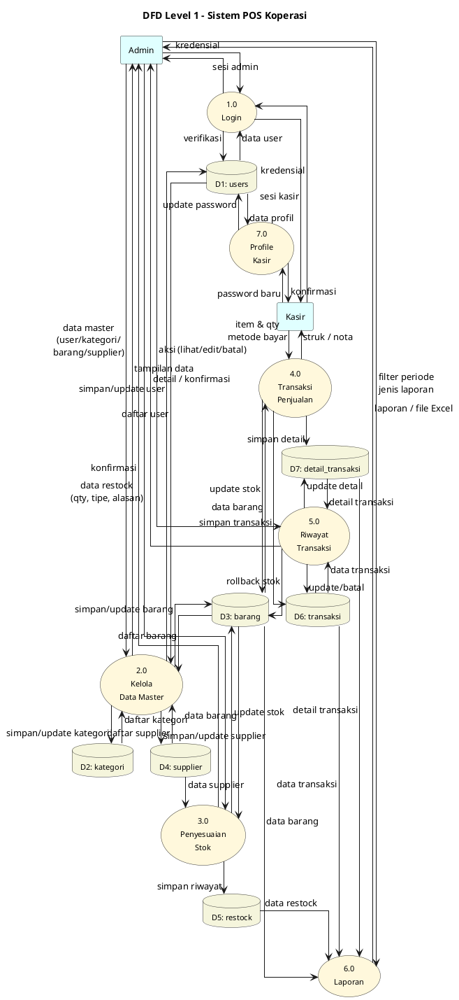

# DFD Level 1 - Notasi Yourdon/DeMarco

> Pecahan dari proses tunggal "Sistem POS Koperasi" di DFD Level 0 menjadi sub-proses utama.

## Daftar Sub-Proses

| Kode | Nama Proses | Aktor |
|---|---|---|
| 1.0 | Login | Admin, Kasir |
| 2.0 | Kelola Data Master (User, Kategori, Barang, Supplier) | Admin |
| 3.0 | Penyesuaian Stok (Restock In/Out) | Admin |
| 4.0 | Transaksi Penjualan | Kasir |
| 5.0 | Riwayat Transaksi (Lihat/Edit/Batal) | Admin |
| 6.0 | Laporan (Penjualan, Laba, Terlaris, Restock) | Admin |
| 7.0 | Profile Kasir (Reset Password) | Kasir |

## Daftar Data Store

| Kode | Tabel | Keterangan |
|---|---|---|
| D1 | users | Data akun pengguna |
| D2 | kategori | Kategori barang |
| D3 | barang | Master barang & stok |
| D4 | supplier | Data supplier |
| D5 | restock | Riwayat tambah/kurang stok |
| D6 | transaksi | Header transaksi |
| D7 | detail_transaksi | Item per transaksi |
