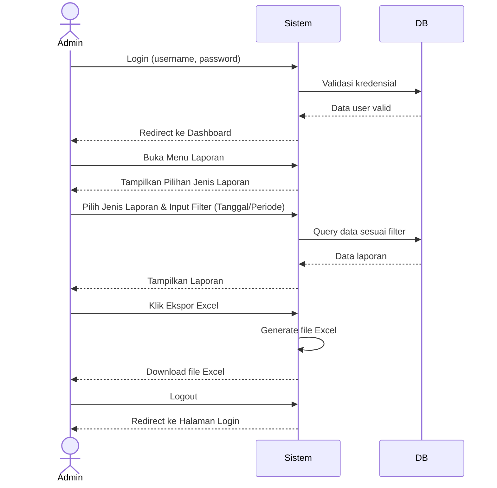

# Sequence Diagram: Laporan

```mermaid
sequenceDiagram
    actor Admin
    participant Sistem
    participant DB

    Admin->>Sistem: Login (username, password)
    Sistem->>DB: Validasi kredensial
    DB-->>Sistem: Data user valid
    Sistem-->>Admin: Redirect ke Dashboard

    Admin->>Sistem: Buka Menu Laporan
    Sistem-->>Admin: Tampilkan Pilihan Jenis Laporan

    Admin->>Sistem: Pilih Jenis Laporan & Input Filter (Tanggal/Periode)
    Sistem->>DB: Query data sesuai filter
    DB-->>Sistem: Data laporan
    Sistem-->>Admin: Tampilkan Laporan

    Admin->>Sistem: Klik Ekspor Excel
    Sistem->>Sistem: Generate file Excel
    Sistem-->>Admin: Download file Excel

    Admin->>Sistem: Logout
    Sistem-->>Admin: Redirect ke Halaman Login
```
