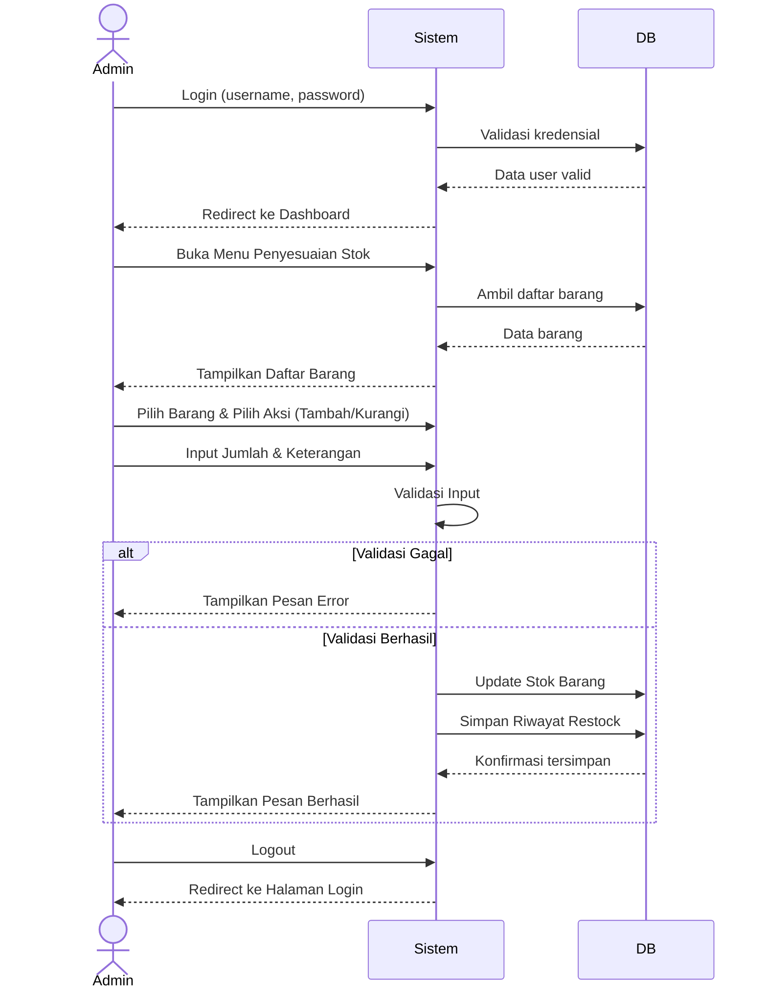

# Sequence Diagram: Penyesuaian Stok

```mermaid
sequenceDiagram
    actor Admin
    participant Sistem
    participant DB

    Admin->>Sistem: Login (username, password)
    Sistem->>DB: Validasi kredensial
    DB-->>Sistem: Data user valid
    Sistem-->>Admin: Redirect ke Dashboard

    Admin->>Sistem: Buka Menu Penyesuaian Stok
    Sistem->>DB: Ambil daftar barang
    DB-->>Sistem: Data barang
    Sistem-->>Admin: Tampilkan Daftar Barang

    Admin->>Sistem: Pilih Barang & Pilih Aksi (Tambah/Kurangi)
    Admin->>Sistem: Input Jumlah & Keterangan
    Sistem->>Sistem: Validasi Input

    alt Validasi Gagal
        Sistem-->>Admin: Tampilkan Pesan Error
    else Validasi Berhasil
        Sistem->>DB: Update Stok Barang
        Sistem->>DB: Simpan Riwayat Restock
        DB-->>Sistem: Konfirmasi tersimpan
        Sistem-->>Admin: Tampilkan Pesan Berhasil
    end

    Admin->>Sistem: Logout
    Sistem-->>Admin: Redirect ke Halaman Login
```
