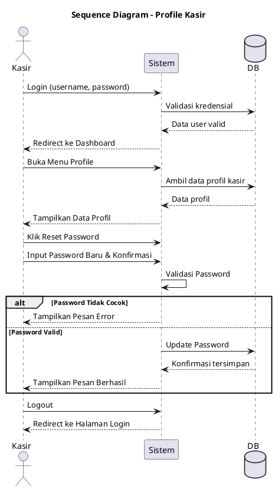

# Sequence Diagram: Profile Kasir

```plantuml
@startuml
title Sequence Diagram - Profile Kasir

actor Kasir
participant Sistem
database DB

Kasir -> Sistem: Login (username, password)
Sistem -> DB: Validasi kredensial
DB --> Sistem: Data user valid
Sistem --> Kasir: Redirect ke Dashboard

Kasir -> Sistem: Buka Menu Profile
Sistem -> DB: Ambil data profil kasir
DB --> Sistem: Data profil
Sistem --> Kasir: Tampilkan Data Profil

Kasir -> Sistem: Klik Reset Password
Kasir -> Sistem: Input Password Baru & Konfirmasi
Sistem -> Sistem: Validasi Password

alt Password Tidak Cocok
  Sistem --> Kasir: Tampilkan Pesan Error
else Password Valid
  Sistem -> DB: Update Password
  DB --> Sistem: Konfirmasi tersimpan
  Sistem --> Kasir: Tampilkan Pesan Berhasil
end

Kasir -> Sistem: Logout
Sistem --> Kasir: Redirect ke Halaman Login
@enduml
```
