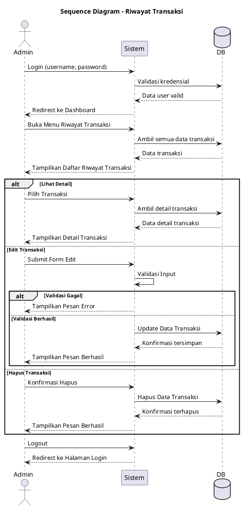

# Sequence Diagram: Riwayat Transaksi

```plantuml
@startuml
title Sequence Diagram - Riwayat Transaksi

actor Admin
participant Sistem
database DB

Admin -> Sistem: Login (username, password)
Sistem -> DB: Validasi kredensial
DB --> Sistem: Data user valid
Sistem --> Admin: Redirect ke Dashboard

Admin -> Sistem: Buka Menu Riwayat Transaksi
Sistem -> DB: Ambil semua data transaksi
DB --> Sistem: Data transaksi
Sistem --> Admin: Tampilkan Daftar Riwayat Transaksi

alt Lihat Detail
  Admin -> Sistem: Pilih Transaksi
  Sistem -> DB: Ambil detail transaksi
  DB --> Sistem: Data detail transaksi
  Sistem --> Admin: Tampilkan Detail Transaksi
else Edit Transaksi
  Admin -> Sistem: Submit Form Edit
  Sistem -> Sistem: Validasi Input
  alt Validasi Gagal
    Sistem --> Admin: Tampilkan Pesan Error
  else Validasi Berhasil
    Sistem -> DB: Update Data Transaksi
    DB --> Sistem: Konfirmasi tersimpan
    Sistem --> Admin: Tampilkan Pesan Berhasil
  end
else Hapus Transaksi
  Admin -> Sistem: Konfirmasi Hapus
  Sistem -> DB: Hapus Data Transaksi
  DB --> Sistem: Konfirmasi terhapus
  Sistem --> Admin: Tampilkan Pesan Berhasil
end

Admin -> Sistem: Logout
Sistem --> Admin: Redirect ke Halaman Login
@enduml
```
