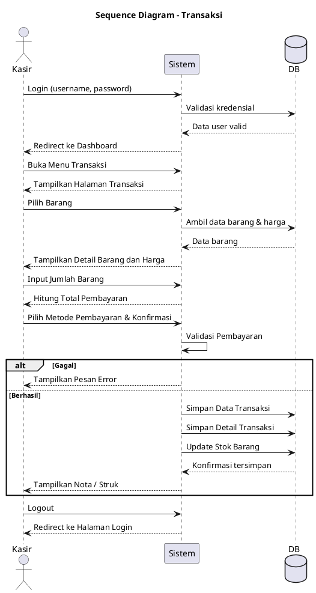

# Sequence Diagram: Transaksi

```plantuml
@startuml
title Sequence Diagram - Transaksi

actor Kasir
participant Sistem
database DB

Kasir -> Sistem: Login (username, password)
Sistem -> DB: Validasi kredensial
DB --> Sistem: Data user valid
Sistem --> Kasir: Redirect ke Dashboard

Kasir -> Sistem: Buka Menu Transaksi
Sistem --> Kasir: Tampilkan Halaman Transaksi

Kasir -> Sistem: Pilih Barang
Sistem -> DB: Ambil data barang & harga
DB --> Sistem: Data barang
Sistem --> Kasir: Tampilkan Detail Barang dan Harga

Kasir -> Sistem: Input Jumlah Barang
Sistem --> Kasir: Hitung Total Pembayaran

Kasir -> Sistem: Pilih Metode Pembayaran & Konfirmasi
Sistem -> Sistem: Validasi Pembayaran

alt Gagal
  Sistem --> Kasir: Tampilkan Pesan Error
else Berhasil
  Sistem -> DB: Simpan Data Transaksi
  Sistem -> DB: Simpan Detail Transaksi
  Sistem -> DB: Update Stok Barang
  DB --> Sistem: Konfirmasi tersimpan
  Sistem --> Kasir: Tampilkan Nota / Struk
end

Kasir -> Sistem: Logout
Sistem --> Kasir: Redirect ke Halaman Login
@enduml
```
