# Use Case Diagram - Kopsis POS

## Diagram

```mermaid
flowchart LR
    %% === ACTORS ===
    Admin((Admin))
    Kasir((Kasir))

    %% === AUTH ===
    subgraph AUTH["Autentikasi"]
        UC_LOGIN[Login]
        UC_LOGOUT[Logout]
        UC_VALIDASI_CRED[/Validasi Credential/]
        UC_CEK_STATUS[/Cek Status Akun/]
    end

    %% === DASHBOARD ===
    subgraph DASHBOARD["Dashboard"]
        UC_DASH_ADMIN[Lihat Dashboard Admin]
        UC_DASH_KASIR[Lihat Dashboard Kasir]
    end

    %% === BARANG ===
    subgraph BARANG["Manajemen Barang"]
        UC_BARANG_KELOLA[Kelola Barang]
        UC_BARANG_ADD[Tambah Barang]
        UC_BARANG_EDIT[Edit Barang]
        UC_BARANG_DEL[Hapus/Nonaktifkan Barang]
        UC_BARANG_TOGGLE[Toggle Status Barang]
        UC_BARANG_BARCODE[/Generate Barcode/]
        UC_BARANG_LABEL[/Cetak Label Barang/]
        UC_BARANG_VALIDASI[/Validasi Kode & Barcode Unik/]
    end

    %% === KATEGORI ===
    subgraph KATEGORI["Manajemen Kategori"]
        UC_KAT_KELOLA[Kelola Kategori]
        UC_KAT_ADD[Tambah Kategori]
        UC_KAT_EDIT[Edit Kategori]
        UC_KAT_DEL[Hapus Kategori]
        UC_KAT_CEK_RELASI[/Cek Relasi Barang/]
    end

    %% === SUPPLIER ===
    subgraph SUPPLIER["Manajemen Supplier"]
        UC_SUP_KELOLA[Kelola Supplier]
        UC_SUP_ADD[Tambah Supplier]
        UC_SUP_EDIT[Edit Supplier]
        UC_SUP_DEL[Hapus/Nonaktifkan Supplier]
        UC_SUP_TOGGLE[Toggle Status Supplier]
    end

    %% === RESTOCK ===
    subgraph RESTOCK["Manajemen Restock"]
        UC_RESTOCK_KELOLA[Kelola Restock]
        UC_RESTOCK_IN[Tambah Stok Masuk]
        UC_RESTOCK_OUT[Kurangi Stok - Keluar]
        UC_RESTOCK_HARGA[/Update Harga Jual/]
        UC_RESTOCK_CEK_STOK[/Validasi Stok Cukup/]
    end

    %% === USER ===
    subgraph USERMGMT["Manajemen User Kasir"]
        UC_USER_KELOLA[Kelola User]
        UC_USER_ADD[Tambah Kasir]
        UC_USER_EDIT[Edit Kasir]
        UC_USER_RESET[Reset Password Kasir]
        UC_USER_DEL[Hapus/Nonaktifkan Kasir]
        UC_USER_TOGGLE[Toggle Status Kasir]
        UC_USER_VALIDASI[/Validasi Username & Email Unik/]
    end

    %% === TRANSAKSI ===
    subgraph TRANSAKSI["Transaksi Penjualan"]
        UC_TRX_CREATE[Buat Transaksi]
        UC_TRX_STRUK[/Lihat Struk/]
        UC_TRX_PDF[/Download PDF Struk/]
        UC_TRX_VALIDASI[/Validasi Keranjang/]
        UC_TRX_KURANGI_STOK[/Kurangi Stok Barang/]
        UC_TRX_HITUNG[/Hitung Total & Laba/]
    end

    %% === RIWAYAT ===
    subgraph RIWAYAT["Riwayat Transaksi"]
        UC_RIW_KELOLA[Kelola Riwayat Transaksi]
        UC_RIW_DETAIL[Lihat Detail Transaksi]
        UC_RIW_EDIT[/Edit Transaksi/]
        UC_RIW_CANCEL[/Batalkan Transaksi/]
        UC_RIW_RETURN_STOK[/Kembalikan Stok/]
    end

    %% === LAPORAN ===
    subgraph LAPORAN["Laporan"]
        UC_LAP_INDEX[Lihat Laporan]
        UC_LAP_JUAL[Laporan Penjualan]
        UC_LAP_LABA[Laporan Laba]
        UC_LAP_TOP[Laporan Barang Terlaris]
        UC_LAP_RESTOCK[Laporan Restock]
        UC_LAP_EXPORT[/Export Laporan CSV/]
    end

    %% === PROFIL ===
    subgraph PROFIL["Profil Kasir"]
        UC_PROFIL_VIEW[Lihat Profil]
        UC_PROFIL_PW[Reset Password Sendiri]
        UC_PROFIL_VERIF[/Verifikasi Password Lama/]
    end

    %% ===================================================================
    %% INCLUDE (garis solid + label include)
    %% ===================================================================
    UC_LOGIN -->|include| UC_VALIDASI_CRED
    UC_LOGIN -->|include| UC_CEK_STATUS
    UC_BARANG_ADD -->|include| UC_BARANG_VALIDASI
    UC_BARANG_EDIT -->|include| UC_BARANG_VALIDASI
    UC_KAT_DEL -->|include| UC_KAT_CEK_RELASI
    UC_USER_ADD -->|include| UC_USER_VALIDASI
    UC_USER_EDIT -->|include| UC_USER_VALIDASI
    UC_TRX_CREATE -->|include| UC_TRX_VALIDASI
    UC_TRX_CREATE -->|include| UC_TRX_HITUNG
    UC_TRX_CREATE -->|include| UC_TRX_KURANGI_STOK
    UC_RESTOCK_OUT -->|include| UC_RESTOCK_CEK_STOK
    UC_RIW_CANCEL -->|include| UC_RIW_RETURN_STOK
    UC_PROFIL_PW -->|include| UC_PROFIL_VERIF

    %% ===================================================================
    %% EXTEND (garis putus-putus + label extend)
    %% ===================================================================
    UC_TRX_STRUK -.->|extend| UC_TRX_CREATE
    UC_TRX_PDF -.->|extend| UC_TRX_STRUK
    UC_RESTOCK_HARGA -.->|extend| UC_RESTOCK_IN
    UC_LAP_EXPORT -.->|extend| UC_LAP_JUAL
    UC_LAP_EXPORT -.->|extend| UC_LAP_LABA
    UC_LAP_EXPORT -.->|extend| UC_LAP_TOP
    UC_LAP_EXPORT -.->|extend| UC_LAP_RESTOCK
    UC_BARANG_BARCODE -.->|extend| UC_BARANG_KELOLA
    UC_BARANG_LABEL -.->|extend| UC_BARANG_KELOLA
    UC_RIW_EDIT -.->|extend| UC_RIW_KELOLA
    UC_RIW_CANCEL -.->|extend| UC_RIW_KELOLA

    %% ===================================================================
    %% ACTOR RELATIONS
    %% ===================================================================
    Admin --> UC_LOGIN
    Admin --> UC_LOGOUT
    Admin --> UC_DASH_ADMIN
    Admin --> UC_BARANG_KELOLA
    Admin --> UC_BARANG_ADD
    Admin --> UC_BARANG_EDIT
    Admin --> UC_BARANG_DEL
    Admin --> UC_BARANG_TOGGLE
    Admin --> UC_KAT_KELOLA
    Admin --> UC_KAT_ADD
    Admin --> UC_KAT_EDIT
    Admin --> UC_KAT_DEL
    Admin --> UC_SUP_KELOLA
    Admin --> UC_SUP_ADD
    Admin --> UC_SUP_EDIT
    Admin --> UC_SUP_DEL
    Admin --> UC_SUP_TOGGLE
    Admin --> UC_RESTOCK_KELOLA
    Admin --> UC_RESTOCK_IN
    Admin --> UC_RESTOCK_OUT
    Admin --> UC_USER_KELOLA
    Admin --> UC_USER_ADD
    Admin --> UC_USER_EDIT
    Admin --> UC_USER_RESET
    Admin --> UC_USER_DEL
    Admin --> UC_USER_TOGGLE
    Admin --> UC_TRX_CREATE
    Admin --> UC_RIW_KELOLA
    Admin --> UC_RIW_DETAIL
    Admin --> UC_LAP_INDEX
    Admin --> UC_LAP_JUAL
    Admin --> UC_LAP_LABA
    Admin --> UC_LAP_TOP
    Admin --> UC_LAP_RESTOCK

    Kasir --> UC_LOGIN
    Kasir --> UC_LOGOUT
    Kasir --> UC_DASH_KASIR
    Kasir --> UC_TRX_CREATE
    Kasir --> UC_PROFIL_VIEW
    Kasir --> UC_PROFIL_PW
```

## Keterangan Relasi

### `<<include>>` — Wajib terjadi (bagian dari proses utama)

| Use Case Utama | Include | Keterangan |
|---|---|---|
| Login | Validasi Credential | Selalu cek username + password |
| Login | Cek Status Akun | Pastikan akun aktif |
| Tambah/Edit Barang | Validasi Kode & Barcode Unik | Cek duplikasi kode |
| Hapus Kategori | Cek Relasi Barang | Tidak bisa hapus jika masih punya barang |
| Tambah/Edit User | Validasi Username & Email Unik | Cek duplikasi |
| Buat Transaksi | Validasi Keranjang, Hitung Total, Kurangi Stok | Semua dalam 1 DB transaction |
| Restock Keluar | Validasi Stok Cukup | Stok harus >= qty keluar |
| Batalkan Transaksi | Kembalikan Stok | Stok otomatis dikembalikan |
| Reset Password Kasir | Verifikasi Password Lama | Wajib input password saat ini |

### `<<extend>>` — Opsional (terjadi dalam kondisi tertentu)

| Use Case Dasar | Extend | Kondisi |
|---|---|---|
| Buat Transaksi | Lihat Struk | Setelah transaksi berhasil |
| Lihat Struk | Download PDF Struk | Jika user klik download |
| Restock Masuk | Update Harga Jual | Hanya jika admin mengisi harga jual baru |
| Laporan | Export CSV | Jika user klik export |
| Kelola Barang | Generate Barcode, Cetak Label | Opsional per barang |
| Kelola Riwayat | Edit/Batalkan Transaksi | Hanya jika status masih "selesai" |

## Catatan Penting

> **Kasir** hanya bisa: Login, Logout, Buat Transaksi, Lihat Struk, Download PDF, Lihat Profil, dan Reset Password sendiri.
> Username & Email kasir **TIDAK bisa diedit** oleh kasir — hanya Admin via menu User Management.
